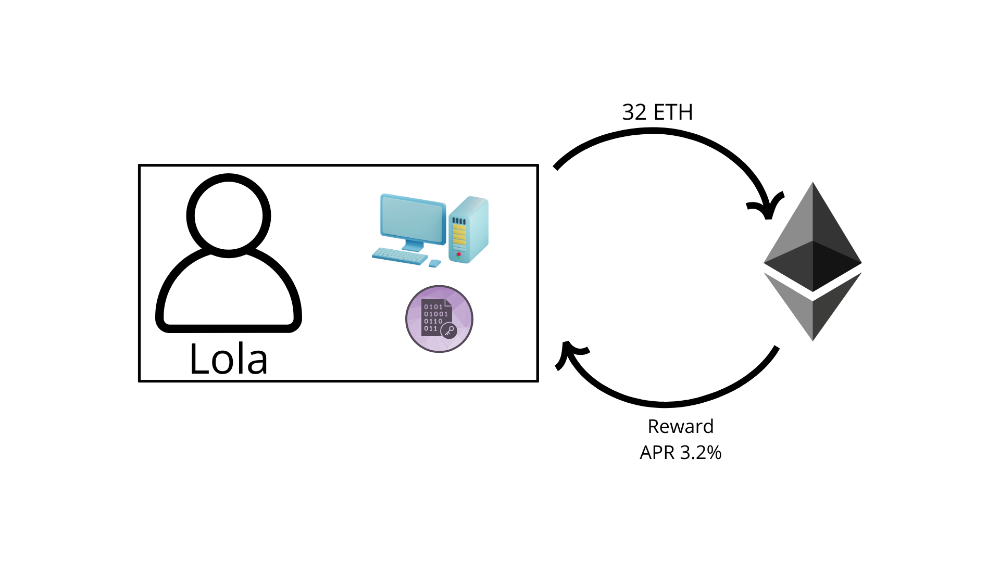
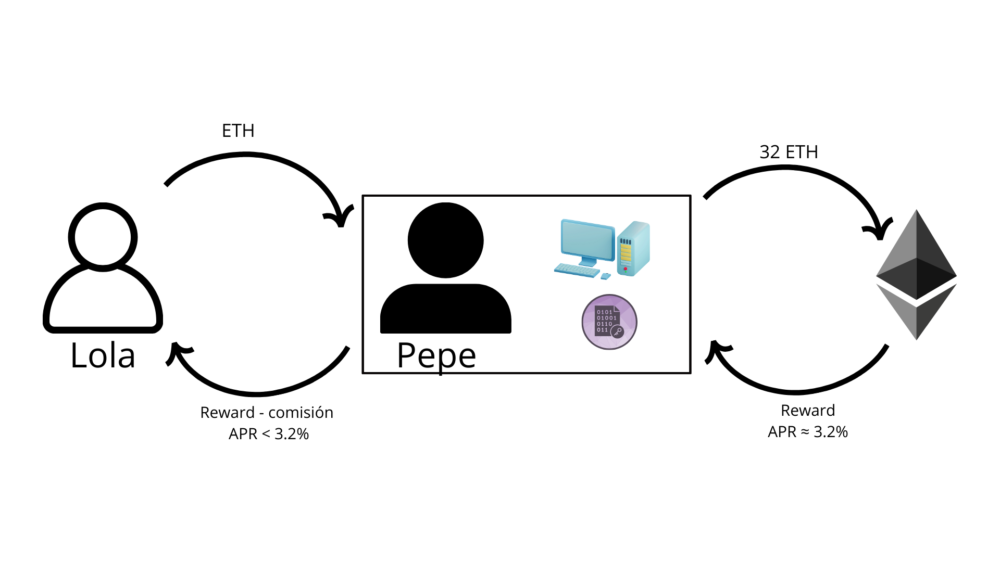
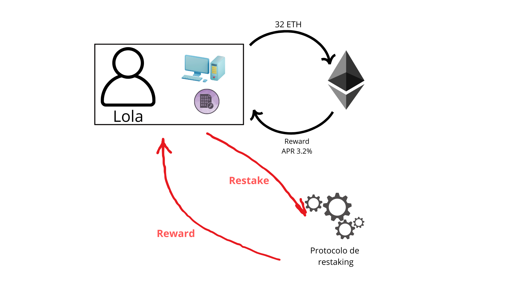
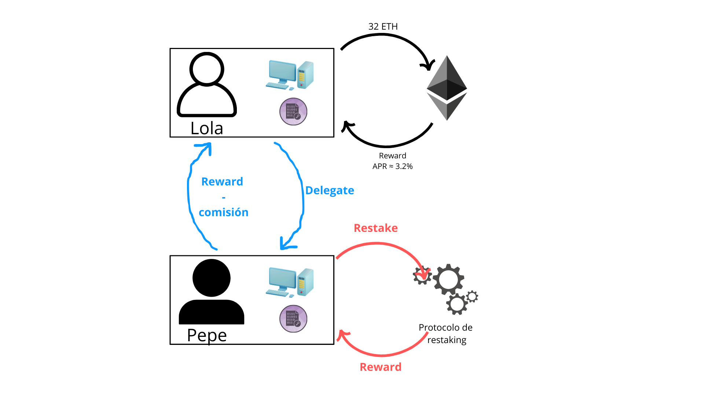
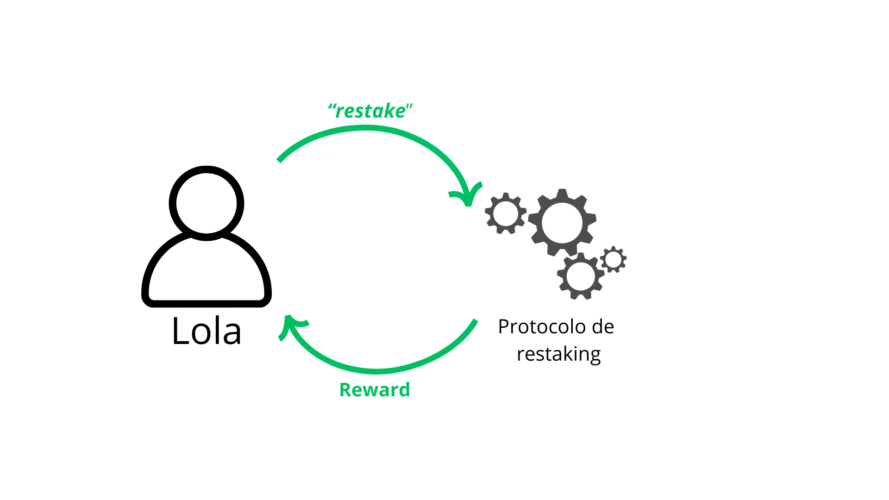
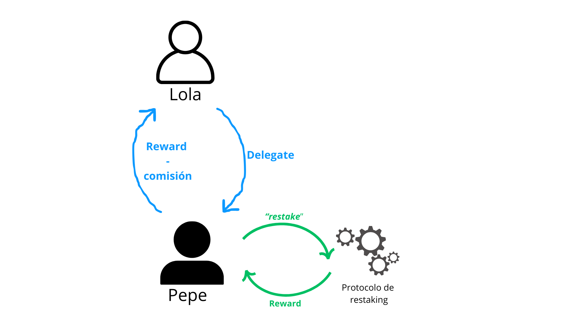
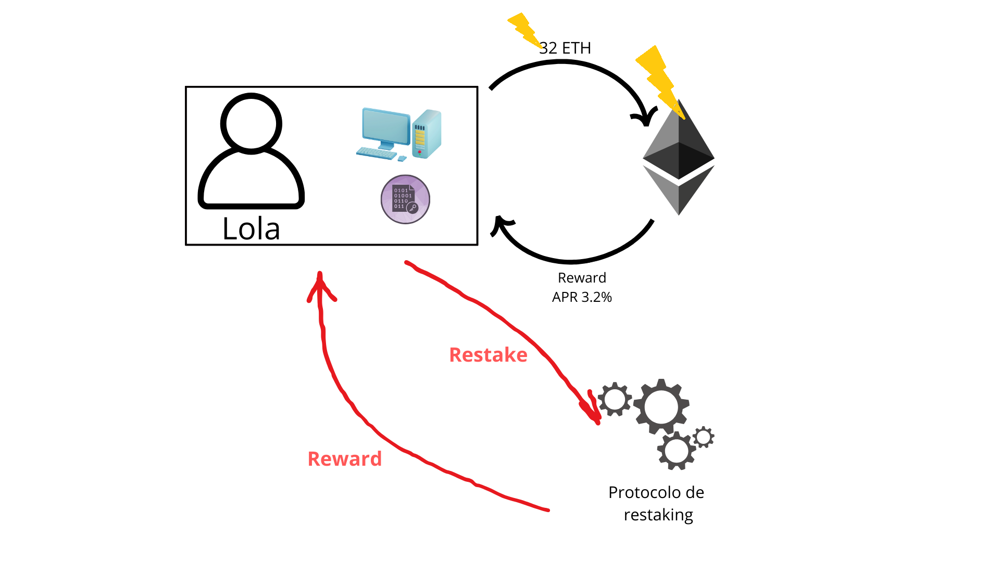
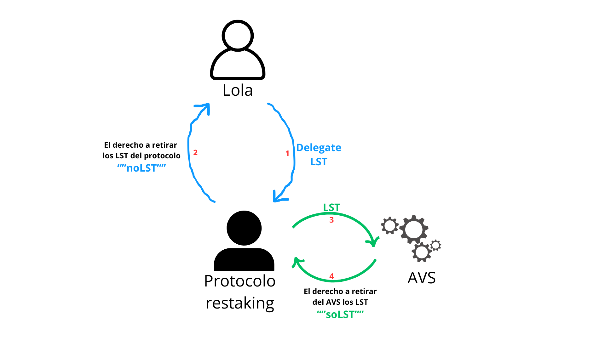

# Conceptos generales del restaking y los LRTs.

<aside>
📖

Este artículo es el primero de una serie dedicada al *restaking* en Ethereum. A lo largo de estos artículos exploraremos su funcionamiento, sus riesgos y las oportunidades que presenta en el ecosistema cripto. En esta primera entrega, nos enfocaremos en comprender *qué* es el *restaking*, sin entrar en los aspectos técnicos de *cómo* se implementa.

</aside>

# 1. Introducción

Históricamente se ha buscado formas de optimizar la seguridad y eficiencia de las blockchain. Uno de los primeros intentos en esta dirección fue el *merge mining*, un concepto que permitía a los mineros de Bitcoin (o Ethereum pre-Merge) reutilizar su *hash power* (poder de computo) para asegurar otras redes. 

Esto implicaba que los mismos *hashes* generados para minar BTC podían emplearse para “proteger” otra cadena. Sin embargo, este enfoque presentaba una limitación significativa: si un minero decidía utilizar su  *hash power* para minar otra moneda y luego atacaba esa otra cadena, no enfrentaba ninguna penalización.

Este desequilibrio en los incentivos se debía a que, aunque los mineros invertían considerablemente en hardware y arriesgaban el valor de sus equipos si atacaban la red principal, no existía una transferencia de incentivos al atacar la otra red. Por lo tanto, el *merge mining* carecía de un mecanismo criptoeconómico sostenible, funcionando bajo una estructura de incentivos desbalanceada: solo recompensas, sin castigos.

La transición hacia Proof of Stake (PoS) abordó este desafío al introducir penalizaciones explicitas. En PoS, los validadores que actúan de manera deshonesta pueden perder su *stake*, proporcionando una herramienta poderosa para mantener la integridad de la red.

En este contexto, surge gracias a **Eigen Layer** el concepto de *restaking*, que busca reutilizar el *stake* existente para asegurar múltiples protocolos, ofreciendo una solución más equilibrada y segura en comparación con los intentos anteriores como el *merge mining*.

Es importante destacar que EigenLayer fue la primera implementación de un protocolo de restaking y la principal referencia en este campo. Si bien este artículo aborda el *restaking* como concepto general, utilizaremos la terminología introducida por EigenLayer, ya que es el estándar más adoptado en la industria.

Esta nueva infraestructura del restaking permite que la confianza, aplicada en Ethereum a través de su capa de consenso, se extienda de manera flexible a nuevas aplicaciones, fomentando un ecosistema más seguro y diversificado. Debido a esto se suele escuchar que “el restaking es un mercado para la confianza descentralizada”.

A continuación, repasaremos brevemente el staking tradicional, examinando sus modalidades más comunes, para luego contrastarlas con las prácticas posibles para el restaking. Además, analizaremos aspectos clave como las penalizaciones (*slashing*),  los  Actively Validated Services (AVS), LRTs y los riesgos asociados,  proporcionando una visión integral en alto nivel de este ecosistema. 

# 2. Staking tradicional:

<aside>
📎

Para profundizar en el consenso de Ethereum:
[https://seednodes.gitbook.io/club-de-nodos/guias/ethereum/consenso-en-ethereum-opciones-de-staking](https://seednodes.gitbook.io/club-de-nodos/guias/ethereum/consenso-en-ethereum-opciones-de-staking)

</aside>

Para comprender los conceptos que desarrollaremos más adelante, es esencial familiarizarnos con el funcionamiento del *staking* tradicional. En particular, analizaremos dos modalidades principales: el *self-staking* y el staking delegado (*delegated staking*).

### 2.1. Self-staking

Pongamos el ejemplo del usuario  “Lola”, quien interactúa directamente con el protocolo, deposita su *stake* y es recompensada por hacerlo a través de la emisión monetaria de la red.

En el caso de Ethereum, Lola deposita 32 ETH y recibe recompensas en ETH por participar en el consenso.

Figura 1

Pero acá hay un detalle importante: para participar directamente, Lola necesita ejecutar un nodo validador que esté conectado a la red 24/7. No es solo cuestión de poner ETH y olvidarse. Su nodo tiene que estar operativo y en buen estado, porque su rendimiento afecta directamente las recompensas. Si el nodo se desconecta con frecuencia o tiene problemas de latencia, las recompensas bajan. 

El staking cumple dos funciones esenciales. Por un lado, actúa como un mecanismo anti-Sybil, ya que no se puede engañar a la red fingiendo múltiples identidades sin un costo real en tokens. Cada identidad requiere 32 ETH en *stake*, lo que limita los intentos de manipulación.

Por otro lado, el staking implica riesgo. Si Lola  se comporta de manera incorrecta según las reglas del protocolo, puede perder parte o la totalidad de su *stake*. Este proceso se llama *slashing* y es una forma de garantizar que los validadores actúen de manera honesta, ya que cualquier desviación de las reglas establecidas puede llevar a una penalización económica.

Hasta acá, todo bien. Pero ¿qué pasa si Lola no quiere o no puede hacer staking directamente? Bueno, ahí entra en juego el ***delegated staking***.

### 2.2. Delegated staking

El *staking* delegado agrega otra capa entre *Lola* y el protocolo. Ahora aparece *Pepe* en escena.

Figura 2

Lola delega su *stake* a Pepe, quien lo deposita en el protocolo de Ethereum. Las recompensas ahora van a Pepe, quien luego las distribuye a Lola después de descontar su comisión.

Este es el caso más simple de *staking* delegado: Lola no quiere ejecutar el software por sí misma, quizás no tiene los 32 ETH completos o simplemente no cuenta con el hardware y los conocimientos técnicos necesarios para correr un validador. Entonces, delega ese servicio a Pepe a cambio de una comisión.

Existen varios niveles de confianza en esta delegación.

El modelo más popular es el **custodial**, donde Lola simplemente envía su ETH a Coinbase/Binance (u otro) y deja que "*Hagan staking por ella*". Lola confía completamente en Coinbase/Binance y ellos custodian sus activos.

Además, existe la delegación **no custodial pero gobernada por una DAO**. En este caso, Lola delega su *stake* a un operador seleccionado por votación dentro de una DAO. Un ejemplo de este modelo es **Lido**. Cuando Lola deposita sus ETH en Lido, estos se agrupan en un contrato inteligente gestionado por la DAO.  Aunque los ETH están en el contrato, Lido no tiene acceso directo a ellos, lo que lo hace en cierta forma **no custodial**. La DAO supervisa el proceso y toma decisiones clave para garantizar la seguridad y eficiencia del sistema.

Figura 3

Por último, tenemos la delegación **minimizada en confianza**. Aquí, tanto Lola como Pepe aportan colateral. Este enfoque es utilizado por plataformas como **Rocket Pool**. Lola puede unirse al *staking* con una cantidad menor de ETH, mientras que Pepe, como operador del nodo, también aporta su propio colateral. Si Pepe comete un error y es penalizado (*slashing*), su colateral es el primero en cubrir las pérdidas, protegiendo así la inversión de Lola. Este sistema incentiva a los operadores a actuar de manera correcta y reduce la necesidad de que Lola confíe ciegamente en Pepe.

Figura 4

<aside>
🔒

La fortaleza de la seguridad criptoeconómica de Ethereum depende en gran medida de cuánto capital esté involucrado en el stake. La magnitud de este capital nos da una medida de cuán difícil es atacarlo.

Sin embargo esto por sí solo no es suficiente. Si solo importara la cantidad de ETH en stake, no tendríamos tantas preocupaciones sobre la descentralización. Incluso cuando grandes actores concentran sumas enormes, el verdadero desafío es cuidar a los home stakers y operadores de nodos individuales. El modelo de confianza de Ethereum no se basa únicamente en el capital en stake, sino también en una combinación de dinero y resistencia a la concentración.

</aside>

# **3. Restaking – Conceptos Generales**

Volvamos al caso de **Lola**, quien ya ha realizado *staking* en Ethereum y ahora evalúa diferentes formas de aprovechar su participación a través del *restaking*.

En esta sección, exploraremos los enfoques principales:

### 3.1 Self-restaking *Nativo*

Hasta ahora, Lola con su **self-staking** depositaba ETH en Ethereum y recibía recompensas por participar en el consenso. Nada nuevo.

Pero ahora entra en escena un nuevo protocolo, el protocolo de **restaking**. Este protocolo le permite a Lola reutilizar su *stake* ya depositado en Ethereum para asegurar un segundo protocolo.

¿Y qué obtiene a cambio? Más recompensas.

Con la misma cantidad de *stake*, Lola ahora puede recibir mayor rendimiento.

No es magia: Ese mismo *stake* que ahora protege dos protocolos diferentes también está sujeto a las reglas de ambos.

Si Lola comete un error en Ethereum, puede perder su *stake* por *slashing*.

Si comete un error en el protocolo de *restaking*, también puede ser penalizada allí.

Es decir, como en cualquier inversión que exista hasta el momento, a mayor rendimiento, mayor riesgo.

Cuando decides *re-stakear*, tus tokens ya no están bajo una única regla de juego, sino que quedan sujetos a múltiples protocolos y sus respectivas penalizaciones.

El caso más simple de *restaking* es el **self-restaking**. En este caso Lola ejecuta ambos protocolos en su propia máquina, con su propio capital.

Figura 5

Pero esto es solo el punto de partida. En las siguientes secciones veremos cómo se expanden estos modelos y qué implicaciones tienen en términos de seguridad y riesgos.

<aside>
📌

Aunque puede parecer un juego de palabras, el self-staking y el self-restaking son procesos que, a simple vista, lucen similares. En ambos casos, un participante como Lola deposita sus tokens y recibe recompensas. La diferencia clave radica en dónde se aplican y se hacen cumplir las reglas:

- En el self-staking, el cumplimiento está garantizado por la capa de consenso de Ethereum.
- En el self-restaking, el cumplimiento se asegura mediante un contrato inteligente desplegado sobre Ethereum.

Esta distinción es fundamental para comprender cómo se gestionan las responsabilidades y los riesgos en cada método.

</aside>

### 3.2. Delegated restaking *Nativo*

Hasta ahora vimos el caso más simple de *restaking*, donde Lola maneja todo por su cuenta. Pero ¿qué pasa si Lola no quiere o no puede hacerlo sola? Ahí entra en juego el **restaking delegado**.

En este modelo, Lola sigue partiendo del *staking* tradicional en Ethereum, pero en lugar de gestionar su participación directamente, decide delegar su *stake* a Pepe, quien se encargará de hacer *re-staking* en su nombre en el protocolo de restaking.

El proceso es simple:

1. Lola delega su *stake* a Pepe.
2. Pepe utiliza ese stake para hacer *re-staking* en el protocolo de restaking.
3. El protocolo de restaking otorga recompensas a Pepe.
4. Pepe entrega a Lola su parte de las recompensas, **descontando una comisión por sus servicios**.

Figura 6

Hasta acá parece un trato justo: Lola no tiene que preocuparse por la infraestructura del restaking y Pepe se lleva una comisión por hacer el trabajo.

Ahora bien, **esto introduce un nuevo riesgo**:

El *stake* que Lola puso en Ethereum ahora **está sujeto a las acciones de Pepe**.

Si Pepe comete un error en el protocolo de restaking, el *stake* que Lola le delegó **también podría ser penalizado**.

Esto nos deja con dos implicaciones clave:

- Ahora **hay dos personas que pueden causar penalizaciones** sobre esos ETH: Lola (si falla en Ethereum) y Pepe (si falla en el protocolo de restaking).

Es el mismo concepto que vimos antes, pero con una gran diferencia: Pepe **es quien intermedia la ejecución del segundo protocolo**, agregando una capa más de complejidad y posibles riesgos.

<aside>
📌

Estos dos casos de *restaking* se denominan **nativos** porque, en ambos, el usuario interactúa directamente con la red principal de Ethereum. Es decir, utiliza unicamente sus **ETH** para participar en protocolos adicionales sin necesidad de convertirlos en otros tokens o derivados. 

</aside>

### **3.3. Self-restaking No Nativo**

Hasta ahora, hemos hablado del *restaking* en Ethereum, donde se utiliza ETH como único token de garantía. Pero, para quienes están atentos a las dApps de *restaking*, habrán notado que se puede participar en estos protocolos con otros tokens. Aquí es donde entra en juego el **self-restaking no nativo**.
En este caso, Lola no interactúa con Ethereum en absoluto. No tiene un nodo validando la red, no le interesa el consenso de Ethereum, y su participación está completamente separada de la blockchain principal.

Entonces, ¿cómo hace *restaking* si ni siquiera tiene ETH en staking en Ethereum?

Bueno, en realidad, no está restakeando nada. Más bien, está haciendo un *staking* desde cero en otro protocolo, como si fuera un sistema paralelo.

Lola deposita sus activos en el protocolo de restaking y recibe recompensas por participar.

Figura 7

La única razón por la que a esto se le llama *restaking* es porque el protocolo de restaking también permite las otras formas de restaking, pero técnicamente, lo que Lola está haciendo aquí se parece más a un *staking* normal que a un *restaking*.

Ahora, lo interesante es que, en lugar de usar ETH como colateral, Lola puede depositar activos no nativos, como USDC,  Wrapped Bitcoin (WBTC) o cualquier otro activo tokenizado.

Estos activos no nativos se utilizan como seguridad económica y como protección contra ataques Sybil dentro del protocolo de restaking. A cambio, Lola recibe recompensas, pero sin la conexión directa con Ethereum.

Desde esta perspectiva, el *restaking* en este modelo se redefine como un mercado de confianza descentralizada. Cuando hablamos de confianza descentralizada, nos referimos a que la seguridad del sistema no viene del consenso de Ethereum, sino del valor económico del capital en riesgo que Lola y otros depositantes han puesto en el protocolo.

En resumen, en el modelo no nativo, Lola está comprometiendo su capital dentro de un sistema independiente, donde la seguridad y las reglas dependen exclusivamente del protocolo en el que participa.

Esto plantea preguntas importantes: ¿qué tan seguro es realmente este tipo de restaking? ¿Quién garantiza que estos sistemas sean confiables? Esos son temas que exploraremos a  lo largo de este y los siguientes articulos.

### 3.4. Delegated restaking No nativo

Hasta ahora, hemos explorado cómo participar en el *restaking* utilizando diferentes activos, ya sea directamente en Ethereum o en otros protocolos. Pero, ¿qué sucede si Lola prefiere no involucrarse directamente y, en su lugar, desea delegar esta tarea a alguien más? Aquí es donde entra en juego el restaking delegado no nativo.

Imaginemos que Lola posee activos que no son ETH, como USDC o WBTC. Ella quiere aprovechar estos activos para obtener recompensas adicionales mediante *restaking*, pero no desea gestionar todo el proceso por sí misma. Entonces, decide delegar sus activos a Pepe, un operador experimentado en el protocolo de *restaking*.

El proceso sería el siguiente:

1. Delegación de activos: Lola delega sus tokens no nativos a Pepe.
2. Restaking por parte de Pepe: Pepe utiliza estos activos para participar en el protocolo de *restaking*, asegurando servicios adicionales y, a cambio, obteniendo recompensas.
3. Distribución de recompensas: Pepe recibe las recompensas del protocolo y, después de descontar una comisión por sus servicios, transfiere el resto de las ganancias a Lola.

Figura 8

Este enfoque permite a Lola beneficiarse del *restaking* sin tener que involucrarse en los aspectos técnicos u operativos. Sin embargo, es crucial destacar que este modelo introduce una capa adicional de confianza. Lola debe confiar en que Pepe manejará sus activos de manera responsable y eficiente. Además, dado que se están utilizando tokens no nativos, las reglas y riesgos asociados pueden diferir de los que se aplican al *restaking* con ETH en la red principal de Ethereum.

En resumen, el restaking delegado no nativo ofrece una vía para que los poseedores de diversos tokens participen en oportunidades de *restaking* a través de operadores especializados, ampliando así las posibilidades de obtener rendimientos en el ecosistema cripto.

# **4. Restaking y Slashing**

Hay algo que no hemos analizado y que es fundamental para entender el riesgo de todo este modelo: el slashing.

El *slashing* es el mecanismo con el que un protocolo puede castigar a un validador que no cumple con las reglas. Imaginemos que Lola ha hecho *staking* en el protocolo de Ethereum. Hasta ahí, todo normal. Pero ahora, cometió una falta.

Una de las más simples de analizar puede ser cuando por una “equivocación” Lola usó sus clave de validador para firmar dos mensajes contradictorios al mismo tiempo. Esto es una falta objetiva porque cualquiera puede verificar su firma y notar la inconsistencia.

Este error es suficiente para que el protocolo active un *slashing* y confisque parte o la totalidad del *stake* de Lola. 

En otras palabras, cuando un usuario bloquea fondos para validar o asegurar Ethereum, lo está haciendo bajo la condición de que, si actúa de manera maliciosa o incorrecta, puede perder su capital.

### 4.1.“***Reslashing”***

<aside>
📖

Este termino es tomado de algunas charlas de Mike Neuder de la EF. 

</aside>

Pensemos en el caso más simple: Lola hace staking en Ethereum y, al mismo tiempo, hace restaking en otro protocolo. Con esto, está obteniendo recompensas en ambas plataformas.

Pero ahora imaginemos que el tiempo avanza y algo pasa: Lola sigue operando bien en el protocolo de *restaking*, pero en Ethereum comete un error. Supongamos que firma mensajes contradictorios y el protocolo lo detecta. Esto significa que su *stake* en Ethereum recibe un slashing, es decir, pierde parte o la totalidad de su capital.

Figura 9

Y aquí es donde empiezan los problemas.

Desde el punto de vista del protocolo de *restaking*, Lola no ha hecho nada malo. Entonces, ¿cómo se entera el segundo protocolo de que los fondos de Lola ya no existen?

La respuesta es simple: tiene que haber algún tipo de comunicación entre ambos protocolos.

Por suerte, si el protocolo de *restaking* está construido como un contrato inteligente sobre Ethereum, puede simplemente leer el estado de la red y darse cuenta de que el *stake* de Lola desapareció. En ese caso, el segundo protocolo puede aplicar también un *slashing* o tomar medidas para ajustar su seguridad.

Pero el problema se vuelve más complicado en la otra dirección.

¿Qué pasa si el *slashing* ocurre primero en el protocolo de *restaking* y no en Ethereum? 

Figura 10

En ese caso, Ethereum no tiene una forma nativa de enterarse. Y esto es un problema porque la capa de consenso de Ethereum no fue diseñada para depender de contratos inteligentes o de información externa.

En otras palabras, Ethereum no consulta lo que está pasando en el resto del ecosistema. No importa si el protocolo de *restaking* le dice que Lola ya no tiene fondos, Ethereum seguirá creyendo que su *stake* está ahí hasta que haya una acción dentro de su propio sistema que lo modifique.

Este es el verdadero desafío del *restaking*: el capital se multiplica en varios protocolos, pero si se pierde en uno, los demás tienen que enterarse de alguna manera.

Si no se soluciona este problema, podríamos terminar en una situación donde alguien pierde sus fondos en un protocolo pero sigue actuando como si aún los tuviera en otro. Y eso rompe completamente la premisa del staking, que es tener capital en riesgo para garantizar seguridad.

Es como si alguien estuviera usando el mismo dinero para dos cosas diferentes al mismo tiempo. Si lo pierde en una, la otra tiene que enterarse de que ese dinero ya no está disponible.

Esto plantea muchas preguntas sobre cómo deben comunicarse los protocolos y cómo se pueden diseñar sistemas para evitar que alguien use su *stake* más allá de lo que realmente tiene disponible.

Y aquí es donde entra en juego la liquidez y la tokenización del *restaking*, que exploraremos mas adelante a lo largo de los artículos.

# **5. AVS -  Actively Validated Services**

Hasta ahora hemos hablado del *protocolo de restaking*, explicando cómo permite reutilizar el stake de Ethereum para asegurar nuevos sistemas. Sin embargo, para ser más precisos y usando la terminologia de Eigen Layer, lo que hemos llamado *protocolo de restaking* en realidad se apoya en un conjunto de sistemas conocidos como **Actively Validated Services (AVS)** dentro de la infraestructura de restaking.
En otras palabras, un AVS no es más que un sistema que necesita validadores para garantizar su seguridad y funcionamiento. Lo interesante del restaking es que permite que estos AVS no tengan que construir su propia red de confianza desde cero, sino que puedan aprovechar directamente el stake ya existente en Ethereum. La presencia de este stake permite que el servicio haga un **compromiso creíble** con su correcto funcionamiento, ya que el stake puede **ser penalizado (slashed)** si no se cumple adecuadamente.

Los AVS pueden tomar muchas formas, dependiendo del tipo de servicio que necesitan validar. Algunos ejemplos comunes incluyen:

- **Redes de oráculos**: Sistemas que proporcionan datos del mundo real a Ethereum, como precios de activos o eventos fuera de la blockchain. Un ejemplo de esto es Chainlink, donde los nodos que alimentan la red pueden ser un AVS dentro de la infraestructura de restaking.
- **Bridges o puentes entre cadenas**: Mecanismos que permiten transferir activos y datos entre distintas blockchains. Estos puentes requieren validadores para monitorear transacciones y garantizar que no haya manipulaciones o doble gasto.
- **Capas de disponibilidad de datos (Data Availability Layers - DA Layers)**: Redes que garantizan que los datos de transacciones sean accesibles para su verificación. Un ejemplo es EigenDA, que busca mejorar la disponibilidad de datos sin sobrecargar Ethereum.
- **Sidechains con nuevos protocolos de consenso**: Sistemas paralelos a Ethereum que implementan su propia validación y luego reportan resultados a la red principal.
- **Esquemas de criptografía umbral (Threshold Cryptography)**: Sistemas donde múltiples partes colaboran para generar firmas o desencriptar información sin que ninguna tenga acceso total a la clave privada.
- **Redes de Keeper y bots de mantenimiento**: Servicios automatizados que ejecutan tareas específicas, como liquidaciones en protocolos DeFi o ajustes de colateralización en stablecoins algorítmicas.

Estos son solo algunos ejemplos, pero en general, cualquier sistema que necesite validadores para operar de manera segura sin depender exclusivamente de Ethereum puede beneficiarse de la infraestructura de restaking. La cantidad de servicios que podrían beneficiarse de esta infraestructura es enorme, y en teoría, no hay un límite real.

El *restaker* no está obligado a participar en todos los AVS disponibles, sino que puede **elegir en cuáles involucrarse** en función del riesgo y el rendimiento que ofrecen. Algunos AVS pueden ser más seguros y ofrecer retornos más bajos, mientras que otros pueden ser más experimentales y prometer mayores recompensas, pero con riesgos asociados. En última instancia, esta decisión recae en el propio *restaker*, quien tiene el control sobre su participación y exposición dentro del ecosistema.

## 5.1. Interacción entre AVSs y restakers (nativos y no nativos)

Un **AVS** requiere colateral para ofrecer su servicio. En otras palabras, un AVS puede hacer una afirmación creíble de que, si es atacado, una fracción del colateral bajo su control se perderá como penalización (*slashing*).

Podemos diferenciar dos formas en las que los *restakers* interactúan con un AVS:

- **5.1.1. Restakers como operadores de AVS:** En este caso, el AVS es un protocolo que requiere operadores, y los *node operators* que hacen *restaking* con su *stake* se convierten directamente en operadores del AVS. Estos son los casos analizados en *3.1* y *3.2*.
- **5.1.2. Restakers como proveedores de capital para un operador de AVS:** Aquí, un operador de AVS acepta diferente tipos de activos para ejecutar su función en nombre de los delegadores que proporcionan el capital. En este modelo, el *restaker* delega sus activos al operador del AVS, quien realiza la validación en su nombre. Estos son los casos analizados en *3.3* y *3.4*.

Sin entrar en detalles, se puede ver que los riesgos en estos casos no son los mismos. En los casos **no nativos**, se generan más delegaciones de confianza, lo que introduce nuevas capas de riesgo.

## 5.2. Re-Re-Restaking

Una de las características más llamativas (y riesgosas) del *restaking* es que un *restaker* puede seguir asumiendo **nuevos compromisos** de validación sobre el mismo colateral. Es decir, una vez que el **stake ha sido restakeado, puede volver a restakearse una y otra vez**, ampliando su exposición a diferentes servicios.

En la práctica, esto significa que el *restaker* puede inscribirse en **múltiples AVSs**, sumando más capas de compromiso sobre su stake original.

# 6. De los LSTs a los LRTs

## 6.1. LSTs (Liquid Staking Tokens)

Para repasar esto, retomemos el caso del **staking delegado**.

Figura 11

- **Lola** → La *staker*.
- **Pepe** → El Proveedor de Servicios de Staking (SSP).

### **6.1.1.Flujo del staking delegado:**

En la siguiente animación se puede ver un *modelo de ejemplo* de como es el flujo del staking delegado:

.gif)

Figura 12

<aside>
⚠️

Es importante destacar que *noETH* y *soETH* **no son tokens reales** que existan en la blockchain. Son simplemente **figuras teóricas** que nos permiten visualizar de manera más clara el flujo de activos dentro del proceso de staking, pero en la práctica, no existen contratos ni balances en la red con esos nombres.

</aside>

1. Lola deposita ETH nativo en el SSP, con el propósito de que sea *stakeado* en Ethereum.
2. A cambio, el SSP le entrega un “*activo*”, que en este ejemplo llamamos noETH.
    - Este *noETH* representa el ETH que Lola ha delegado mas las recompensas que va generando.
    - No es transferible ni fungible, es decir, solo sirve para que Lola pueda redimir su ETH en el futuro.
    - El término "redimir" (*redeemable*) introduce cierta incertidumbre. ¿Es segura una tasa 1:1 de *noETH* por ETH?   En general, no. Si ocurre un *slashing*, el saldo del validador del SSP se reduce, y como *noETH* representa una fracción de ese saldo, Lola podría recibir menos ETH del que delegó.
3. El SSP stakea el ETH el Ethereum.
4. El SSP obtiene control sobre lo que llamamos en este ejemplo *soETH*. 
    - *soETH* y *noETH* no son identicos, ya que el SSP cobra una comisión por sus servicios.

### **6.1.2. Liquidez del staking delegado  “LSTs”:**

Acabamos de hablar de *noETH* como el derecho que tiene Lola sobre su ETH delegado en el SSP, pero en esta explicación, este activo **no es ni transferible ni fungible**. Es simplemente un registro interno que le dice a Lola cuántos ETH tiene en *staking* bajo la gestión del SSP.

Un buen ejemplo de esto es lo que ocurría antes de que existiera [cbETH](https://coinmarketcap.com/currencies/coinbase-wrapped-staked-eth/). Cuando alguien hacía *staking* delegado en Coinbase, obtenía una reclamación virtual (noETH) representada por una línea en el libro contable interno de la base de datos de Coinbase, pero esa reclamación no existía en la blockchain.

Ahora bien, si queremos que Lola pueda hacer algo con su *stake* sin esperar a retirarlo, necesitamos hacer *líquida* esta posición. Esto se logra emitiendo en la blockchain un token que represente su derecho sobre *noETH*, un proceso que convierte el *stake* en un activo líquido.

Al convertir *noETH* en un Liquid Staking Token (LST), este activo pasa a ser fungible y transferible, lo que significa que Lola puede venderlo, usarlo como colateral en DeFi o intercambiarlo libremente. Esta es la idea detrás de tokens como stETH, cbETH, o cualquier otro LST que conocemos en el ecosistema. 

El caso estudiado del flujo de staking delegado que brinda un LST puede verse en la siguiente animación:

.gif)

Figura 13

Algunos  ejemplos de uso de LST:

- En el dashboard de AAVE podemos ver que se pueden usar de colateral.

Figura 14

- En Uniswap podemos ver como convertir LSTs en ETH nativo o cualquier otro token.
    
    <aside>
    📖
    
    stETH es el LST de Lido. Para poder operar en DEFI con estos tokens es usual verlos en su forma wrapped, de ahí la letra “w” de wstETH. 
    
    </aside>
    

Figura 15

Figura 16

## 6.2. Restaking de un LST:

Desde su creación, **EigenLayer** ha permitido que un titular de LST deposite su LST y lo coloque en *stake* dentro de su protocolo. Este es uno de los casos del restaking delegado no nativo explicado en 3.4. Analizamos este caso particular:

Figura 17

<aside>
📖

*noLST* y *soLST* **no son tokens reales** que existan en la blockchain. Son simplemente **figuras teóricas** que nos permiten visualizar de manera más clara el flujo de activos dentro del proceso de restaking, pero en la práctica, no existen contratos ni balances en la red con esos nombres.

</aside>

En este caso, Lola quiere utilizar para el restaking los LSTs que están en su poder para participar del restaking. 

El hecho de que Lola coloque el LST en *staking* dentro del protocolo de restaking no obliga al SSP que emitió el LST a participar en la provisión de servicios para los **AVS**. De hecho el **SSP**  ni siquiera es consciente de que sus tokens han sido *stakeados* en un protocolo de restaking.

Como dijimos ya anteriormente en la seccion 3.4.:

<aside>
📖

La única razón por la que a esto se le llama *restaking* es porque el AVS también permite las otras las formas de restaking, pero técnicamente, lo que Lola está haciendo aquí se parece más a un *staking* normal de sus LST que a un *restaking*.

</aside>

Lola esta actuando como proveedor de capital para el AVS (ver 5.1.2). Analicemos el paso a paso:

1. Lola deposita LST en el protocolo de restaking, con el propósito de que sea re*stakeado*.
2. A cambio, el protocolo le entrega un “*activo*”, que en este ejemplo llamamos noLST.
    - Este *noLST* representa el LST que Lola ha delegado mas las recompensas que va generando.
    - No es transferible ni fungible, es decir, solo sirve para que Lola pueda redimir su LST en el futuro.
    - La tasa noLST y LST no es 1:1. Si ocurre una penalización en el protocolo del AVS el saldo  del protocolo de restaking se reduce, y como *noLST* representa una fracción de ese saldo, Lola podría recibir menos LST del que delegó.
3. El protocolo de restaking delega el LST al AVS quien lo utilizara en nombre de Lola en la red X (usamos el nombre X para dejar en claro que no es Ethereum, es la red que segura el AVS)
4. El protocolo de restaking obtiene control sobre lo que llamamos en este ejemplo *soLST*. El valor de soLST  puede aumentar a medida que la red **X** remunera los servicios de validación del operador del AVS. 
    - *soLST* y *noLST* no son identicos, ya que el protocolo de restaking cobra una comisión por sus servicios.

Concluimos destacando que, en el caso de un **LST restakeado**, existen dos entidades lógicamente distintas:

1. **El SSP**, que emite el LST.
2. **El AVS**, que realiza la validación.

Esta separación de roles podría, en el futuro, impulsar una mayor descentralización. Sin embargo, en la actualidad, esto se logra a costa de introducir múltiples delegaciones de confianza.

## 6.3. LRTs

Ahora podemos adentrarnos en *algunas* de las distintas formas en las que pueden existir activos líquidos que representen ETH en *restaking*: los **Liquid Restaking Tokens (LRTs)**. En esencia, el objetivo de los *LRTs* es el mismo que el de los *LSTs*: contar con activos fungibles y transferibles que generen recompensas, pero esta vez provenientes del *restaking*.

### 6.3.1. LRTs a partir de delegated restaking:

En esta primera construcción consideramos un SSP haciendo *re-staking* con el *stake* que tiene actualmente bajo su control. Veamos el siguiente flujo:

<aside>
⚠️

*soETH* y r*soETH* **no son tokens reales** que existan en la blockchain. Son simplemente **figuras teóricas** que nos permiten visualizar de manera más clara el flujo de activos dentro del proceso de restaking, pero en la práctica, no existen contratos ni balances en la red con esos nombres.

</aside>

.gif)

Figura 18

1. Lola deposita ETH nativo en el SSP, con el propósito de que sea re/*stakeado* en Ethereum.
2. A cambio, el SSP le entrega el LRT 
3. Dado que todo queda registrado *on-chain*, sería muy fácil detectar si un SSP hizo *restaking o no* con el ETH. ****El LRT entonces representa el derecho a reclamar el ETH inicial mas la doble recompensa siendo además transferible y fungible.
4. El SSP stakea el ETH el Ethereum (IDEM 6.1.1.)
5. El SSP obtiene control sobre *soETH (*IDEM 6.1.1.)
6. El SSP restakea el soETH al AVS (protocolo de restaking).
7. El SSP recibe lo que llamamos rsoETH que es el “activo” que se va a utilizar en caso de querer reclamar sobre el ETH *restakeado*.

Vemos que la utilidad de los *LRTs* es similar a la de los *LSTs*, pero, como mencionamos antes, más recompensa implica más riesgo. Ahora, el *LRT* no solo está expuesto a los riesgos del *staking*, sino también a los del *restaking*.

Además, al ser un sistema más complejo, podrían darse situaciones atípicas de mal comportamiento. Por ejemplo, el SSP podría tener acuerdos *off-chain* con algún AVS, generando recompensas que no llegan al poseedor del LRT, pero sin embargo si lo exponen a los riesgos asociados al *restaking*.

### 6.3.2. LRT a partir del restaking de LSTs:

Es una extensión de lo que analizamos en el restaking de los LSTs en 7.2.

Podemos sumar un participante nuevo a la escena, el agregador. 

<aside>
⚠️

*aLSTs, noaLSTs* y *soaLSTs* **no son tokens reales** que existan en la blockchain. Son simplemente **figuras teóricas** que nos permiten visualizar de manera más clara el flujo de activos dentro del proceso de restaking, pero en la práctica, no existen contratos ni balances en la red con esos nombres.

</aside>

Figura 19

1. Lola y Alice que son LSTs holders, depositan en el agregador sus LSTs.
2. Lola y Alice reciben los LRTs emitidos por el agregador. 
3. El agregador deposita en el Protocolo de Restaking los tokens que recibió de Alice y Lola, lo llamamos aLSTs.
4. A cambio, el protocolo le entrega un “*activo*”, que en este ejemplo llamamos noaLSTs.
    - Este *noaLST* representa el aLST que el agregador ha delegado mas las recompensas que va generando.
    - No es transferible ni fungible, es decir, solo sirve para que el agregador pueda redimir su aLSTs en el futuro.
    - La tasa noaLSTs y aLSTs no es 1:1. Si ocurre una penalización en el protocolo del AVS el saldo  del agregador se reduce, y como *noaLSTs* representa una fracción de ese saldo, el agregador podría recibir menos aLSTs del que delegó.
5. El protocolo de restaking delega el aLSTs al AVS quien lo utilizara en nombre del agregador en la red X (usamos el nombre X para dejar en claro que no es Ethereum, es la red que segura el AVS)
6. El protocolo de restaking obtiene control sobre lo que llamamos en este ejemplo *soaLSTs*. El valor de soaLSTs  puede aumentar a medida que la red **X** remunera los servicios de validación del operador del AVS. 
    - *soaLSTs* y *noaLSTs* no son idénticos, ya que el protocolo de restaking cobra una comisión por sus servicios.

# 7. Conclusiones

En este artículo, exploramos de manera general los métodos más utilizados de *restaking*, centrándonos en qué son y cómo se relacionan entre sí, sin entrar en los detalles técnicos sobre cómo se implementan. Analizamos los flujos de *staking* y *restaking*, distinguiendo las distintas formas en que los activos pueden ser utilizados para proporcionar seguridad a múltiples protocolos. También examinamos las diferencias fundamentales entre los LSTs y los LRTs, resaltando sus similitudes en términos de utilidad, pero también sus diferencias en cuanto a riesgos y exposición a múltiples niveles de validación.

Al revisar estos esquemas, vimos que muchos de estos mecanismos funcionan de manera similar entre sí. Es decir, aunque los nombres y estructuras puedan variar, en esencia, cumplen funciones equivalentes dentro del ecosistema. Por lo tanto, lo más importante no es conocer todas las variantes posibles, sino comprender quién tiene el control final de los activos utilizados en *restaking* y cómo esto afecta la seguridad y descentralización de los sistemas que dependen de ellos.

También discutimos los riesgos asociados, como la delegación de confianza en actores específicos, la posibilidad de acuerdos *off-chain* que afectan a los poseedores de LRTs y la creciente complejidad de los sistemas basados en *restaking*.

En el próximo artículo, daremos un paso más allá y nos enfocaremos en las implementaciones reales de *restaking*. Explicaremos cómo funcionan en la práctica y analizaremos su estructura técnica, apoyándonos en los conceptos que desarrollamos aquí.

# 8. Referencias

[Semantics of Staking 1: Liquefaction](https://mirror.xyz/barnabe.eth/v7W2CsSVYW6I_9bbHFDqvqShQ6gTX3weAtwkaVAzAL4)

[Semantics of Staking 2: Re-staking](https://mirror.xyz/barnabe.eth/96MD_A194uXLLjcOWePW3O2N3P-JG-SHtNxU0b40o50)

[Semantics of Staking 3: Advanced Constructions](https://mirror.xyz/barnabe.eth/62E79gUSqiwS9NEbbfdwTdy7G9Hh098fcV38vWv8VQo)

[EigenLayer Will Change Ethereum Forever](https://www.youtube.com/watch?v=HcEGXoC57Rw&t=2s)

[The risks of LRTs](https://ethresear.ch/t/the-risks-of-lrts/18799)

[Explanation of Restaking](https://www.youtube.com/watch?v=rOJo7VwPh7I&t=1s)
