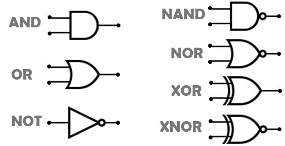

# BitVM

## Introducción

Para entender qué novedades aporta BitVM al ecosistema es interesante recapitular qué es Bitcoin hoy en día y cómo ha llegado hasta aquí.

### Bitcoin el producto

Bitcoin surgió como una red de "[cash](https://bitcoin.org/bitcoin.pdf)", pero desde el principio ha habido intentos de ir más allá.

Los motivos detrás de estos intentos pueden analizarse si pensamos en la necesidad de las personas en eficientizarlo todo. ¿Y qué es lo que se busca optimizar en Bitcoin? Bueno, prácticamente todo. Pero enfoquémonos en un aspecto clave: la **criptoeconomía** de la red.

En Bitcoin hay muchísimo capital invertido en la industria de la minería, y por lo tanto, en la seguridad criptoeconómica de la red. Esta seguridad criptoeconómica sirve como base para el **producto Bitcoin** que se encuentra sobre ella: el registro publico contable de Bitcoin. Este es el producto final que realmente interesa a los usuarios. El registro publico permite a los usuarios tener Bitcoin, enviarlo y recibirlo. Actualmente, este registro publico opera a una velocidad de 5 a 7 transacciones por segundo. Todo el capital invertido en la infraestructura de la red de minería está destinado a sostener esta funcionalidad.

Durante la misma creación y activación de Bitcoin surgió el deseo de realizar más transacciones por segundo y agregar más funcionalidad, escalando sus usos y optimizando la criptoeconomía de la red. Sin embargo, la forma en que Bitcoin fue concebido e implementado no permite la ejecución de programas complejos dentro de su sistema (hablaremos más sobre esto en el artículo).

Entonces, la manera más sencilla de lograr “escalar”, por supuesto, es crear un nuevo sistema independiente, como lo hicieron Litecoin, Dogecoin y otras redes. Sin embargo, el problema aquí es que se debe construir desde cero una nueva seguridad criptoeconómica, es decir, crear una nueva industria. Y, en general, esa industria minera será mucho más pequeña si la moneda, como Dogecoin, es \[entre otras muchas cosas] menos popular que Bitcoin. Esta no es una forma eficiente.

Otra alternativa es agregar capas encima de este sistema, en este caso sobre el registro publico contable, y esto es lo que se hizo, por ejemplo, en Bitcoin con los _colored coins_ y _Mastercoin_. Si bien no vamos a entrar en detalles sobre la historia antigua de Bitcoin, podemos decir que este tipo de protocolos desbloquea cierta funcionalidad, pero no resultan realmente prácticos.

Por último, tenemos la actual Lightning Network, la herramienta más difundida y conocida para eficientizar y escalar Bitcoin. Si bien es una **GRAN HERRAMIENTA**, la tecnología de canales de pago requiere gestión a través de la capa 1 (L1). Esto significa que los usuarios deben realizar transacciones en L1 para gestionar sus canales en la capa 2 (L2). Por lo tanto, L2 está limitada por L1. Además, es importante mencionar que desarrollar funcionalidades distintas a los pagos en Lightning Network varía entre ser muy difícil e imposible \[al menos por ahora].

Así que, más allá de los intentos de Lightning Network, con el tiempo la función de Bitcoin se fue volviendo más específica, consolidándose como un "store of value" o almacenamiento de valor.

Esta tendencia se reafirmó después de las famosas "block size wars" y el hard fork de 2018, lo que reforzó la idea de usar Bitcoin principalmente como reserva de valor en lugar de realizar transacciones frecuentes, como pagar, por ejemplo, "un café".

Vitalik Buterin, quien trabajó escribiendo acerca del protocolo Bitcoin \[y en el mencionado Mastercoin xD], reconoció este desafío. Propuso incorporar un lenguaje de programación de propósito general, Turing-completo, en la blockchain. Esto permitiría a los desarrolladores escribir sus propios programas o contratos inteligentes, capaces de gestionar cualquier funcionalidad que desearan, sin necesidad de actualizar el protocolo.

Este concepto llevó a la creación de Ethereum, donde un lenguaje Turing-completo permite una gama casi infinita de posibilidades, desbloqueando un gran potencial para las aplicaciones descentralizadas. Así, **Ethereum representa otro nivel de eficiencia criptoeconómica**, utilizando un lenguaje de programación de propósito general para satisfacer todas las necesidades posibles.

Por lo tanto, la seguridad criptoeconómica en Ethereum, es decir, el capital invertido, se está utilizando de manera más eficiente que en Bitcoin, ya que el rango de actividades que permite y asegura es teóricamente infinito.

Con Ethereum se logró implementar un lenguaje de programación de propósito general y Turing-completo en la plataforma, y no hay nada más allá de eso: el lenguaje puede hacer cualquier cosa que cualquier otro lenguaje pueda hacer, por lo que no se puede mejorar más en esa dirección. Sin embargo, sigue existiendo la limitación de las pocas transacciones por segundo.

El siguiente hito en la eficiencia son los rollups, donde se logró que cientos de versiones de "clones de Ethereum" funcionen sobre el verdadero Ethereum. Con el mismo capital y la misma seguridad criptoeconómica, se pueden asegurar muchas otras versiones de Ethereum, representando un **gran avance en la eficiencia del capital.**

#### Bitcoin y la política

Hoy en día, sabemos que el cómputo en Bitcoin está muy limitado. Esto se debe a dos razones principales: el espacio disponible en los bloques y la ausencia de un lenguaje Turing-completo (_**Bitcoin Script**_ no permite bucles ni funciones recursivas).

La posibilidad de realizar un soft fork en Bitcoin para incluir más funcionalidad es un tema altamente debatido y politizado. Aún hoy, gran parte de la comunidad más conservadora de Bitcoin teme que modificar el protocolo pueda comprometer su función principal como reserva de valor.

Cualquier intento de proyecto que asuma un cambio futuro en Bitcoin parte de una premisa equivocada. Cambiar el protocolo de Bitcoin no es solo un desafío técnico, sino también político, con opiniones y debates que pueden no tener el desenlace esperado.

En consecuencia, hasta hace muy poco, Bitcoin se encontraba en una especie de estancamiento, donde no ocurrían grandes innovaciones, ya que cualquier intento de cambio desembocaba en un debate político.

Sin embargo, al mismo tiempo, en Ethereum, desarrolladores de todo el mundo continuaron optimizando su propia criptoeconomía bajo la atenta mirada de todo el ecosistema.

#### 🎡Bitcoin hoy

Bitcoin dista mucho de ser un producto final que no se intente mejorar. _Builders_ en todo el mundo están convencidos de que, para que Bitcoin cumpla verdaderamente una función social, no debe ser solo un medio de almacenamiento de dinero para unos pocos; debe brindar la posibilidad de que todas las personas puedan acceder a su propuesta de valor.

Hablar de escalar, **eficientizar el capital criptoeconómico** o darle una funcionalidad social a Bitcoin es parte de lo mismo. Solo cambia la perspectiva desde la cual se lo analiza.

El objetivo de este artículo es explorar uno de los nichos en los que se está trabajando hoy en día en Bitcoin: **BitVM**, y cómo Bitcoin podría dar un salto cuantitativo en la eficiencia de su capital criptoeconómico.

## Aspectos técnicos

### **¿Qué es Bitcoin Script?**

El [script](https://en.bitcoin.it/wiki/Script) de Bitcoin es un lenguaje de contratos inteligentes muy simple que permite expresar firmas, multifirmas, _time locks_ y otras primitivas básicas de los contratos inteligentes. Este script es el que permite implementar, por ejemplo, la Lightning Network o las multifirmas en Bitcoin.

Es importante destacar que este lenguaje es intencionalmente limitado (no es Turing completo). Esta limitación se implementó para evitar la creación de una superficie de ataque "innecesaria".

Aunque Bitcoin Script siempre fue limitado, al principio era más expresivo. Sin embargo, en algún momento, Satoshi descubrió un error en una implementación y desactivó muchos códigos operativos de una sola vez \[no se andaba con rodeos].

Un aspecto que destacaremos en este artículo es que una de las cosas que Satoshi dejó habilitadas fue la lógica booleana, que podríamos considerar como la primitiva básica utilizada en la creación de circuitos lógicos.

De hecho, cada microchip es una serie de diminutas unidades llamadas compuertas lógicas booleanas.

<figure><figcaption></figcaption></figure>

Y dado que el script de Bitcoin admite todas las compuertas lógicas, adquiere una propiedad llamada universalidad: podemos implementar cualquier programa que se pueda ejecutar en una computadora física real \[donde, llevado al nivel más bajo, es un circuito de compuertas lógicas por el que pasa corriente eléctrica xD].

Al dejar estas funciones dentro de Bitcoin, Satoshi hizo posible recrear muchas de las funciones que él mismo eliminó, lo cual es fundamental para la creación de BitVM.

Otro aspecto fundamental es que el script de Bitcoin está diseñado para ser completamente sin estado, lo que significa que cada UTXO que se gasta no lleva ninguna información del bloque, la transacción o los _outputs_ previos; no tiene memoria, no sabe nada de la transacción anterior, está completamente aislado. No existe una manera nativa de transportar estado, ya sea una variable o el valor de una variable, de un script a otro. El script de Bitcoin no está diseñado para eso.

Sin embargo, hay una manera de eludir esta limitación, y el truco para hacerlo se basa esencialmente en firmas. Una de las ideas innovadoras en BitVM es el uso de firmas Lamport para transferir información entre transacciones. Lo interesante es que estas firmas Lamport se pueden verificar fácilmente en el script de Bitcoin.

### BitVM versión teórica

En octubre de 2023, Robin Linus presentó el whitepaper de [BitVM](https://bitvm.org/bitvm.pdf), que marca el punto de partida para todo lo que vamos a desarrollar en este artículo.

**¿Qué nos trajo este primer whitepaper de BitVM?**

Un estudio _**teórico**_ que demuestra lo siguiente: "se pueden crear programas mucho más complejos en Bitcoin de lo que pensábamos".

Lo más importante de este nuevo paradigma de cómputo en Bitcoin es que otorga capacidad de ejecución _sin la necesidad de entrar en debates políticos_ sobre cambios en el protocolo, ya que no se requiere ninguna modificación (sin soft fork).

**¿Cómo lo logra?**

Utilizando el modelo de los [optimistic rollups](https://ethereum.org/en/developers/docs/scaling/optimistic-rollups/), tan conocidos en el mundo de Ethereum.

_En Bitcoin, el programa solo puede decidir si entrega o no el dinero, mientras que en Ethereum el resultado puede ser múltiple, como pagar a varias partes o realizar diferentes acciones. En Bitcoin, el resultado es binario: o se entrega el dinero o no._

La ejecución de los programas (contratos inteligentes) en este _primer modelo teórico_ se limita a un **escenario de dos partes**, conocidas como el **prover** (quien hace una afirmación) y el **verifier** (quien verifica esa afirmación).

Es importante destacar que, gracias a las firmas Lamport, se puede mover información y construir un protocolo de resolución de disputas.

La idea detrás de este esquema optimista es que, en lugar de realizar todo el cómputo en la cadena (_on-chain_), solo se publican ciertas entradas y salidas. En principio, lo único que se coloca en la cadena son las entradas del programa que queremos ejecutar.

#### 1. Descripción de las partes

* **Prover**: Esta parte es la que quiere reclamar el dinero bloqueado en un contrato. Para ello, debe _hacer una afirmación_, como por ejemplo, que un programa o cálculo se ha ejecutado correctamente. La forma de realizar la confirmación es publicando las entradas del programa que, en teoría, satisfacen las condiciones del contrato. Luego, el prover simplemente espera.
* **Verifier**: Este participante puede disputar o aceptar el resultado. Si el prover intenta mentir o falsificar el resultado, el verifier puede desafiar la afirmación y probar que es falsa mediante lo que se denomina un **fraud proof** (prueba de fraude).

Se llama computación optimista porque, si el cómputo es honesto y correcto, el verifier simplemente no hace nada, y el resultado se acepta sin más.

#### 2. Protocolo de resolución de disputas

Lo que ocurre es que se inicia un diálogo entre el que disputa (verifier) y el que quiere demostrar (prover) que la entrada es válida para retirar el dinero.

* Primero, ambas partes (prover y verifier) acuerdan un programa y lo codifican como un circuito lógico compuesto por compuertas NAND.
* El **prover** hace afirmaciones sobre la ejecución del circuito, comprometiéndose a un valor binario para cada bit del circuito.
* Si el **verifier** sospecha que alguna afirmación es incorrecta, puede iniciar un desafío. Este desafío obliga al prover a revelar ciertas pruebas (como el valor de un bit) que confirmen o desmientan su afirmación.
* Si el prover se equivoca o intenta hacer una afirmación falsa, el verifier, mediante el protocolo de resolución de disputas, puede castigarlo, normalmente quitándole un depósito que debió hacer al comienzo del contrato.

#### 3. **Compromiso con el circuito lógico**

El **prover** compromete su programa bit a bit en un circuito lógico, lo que significa que _cada paso_ de la ejecución del programa está vinculado a una transacción en la blockchain. Si el verifier desafía el compromiso del prover, entra en juego el sistema de desafío-respuesta para verificar la veracidad de los resultados.


Es importante destacar que nunca se ejecutaría todo el "circuito completo" en Bitcoin. El **prover** hace una afirmación y luego otra persona, el **verifier**, podría demostrar que está equivocado. Es decir, se afirma algo en la red y, si nadie lo desafía, entonces se considera cierto. De ahí el nombre "optimista". Pero si alguien lo desafía, comienza el protocolo de resolución de disputas, donde se van ejecutando "pasos del circuito lógico" uno a uno hasta determinar de manera completamente objetiva quién estaba equivocado.


#### 4. **Penalización por fraude**

Si en algún momento el **prover** revela valores contradictorios o incorrectos para un bit en particular, el **verifier** puede probar el fraude y automáticamente gana el desafío. Esto desencadena una penalización para el prover, quien pierde su depósito.

#### 5. **Limitaciones de este primer modelo TEÓRICO**

Esencialmente, la idea planteada en este whitepaper no es práctica, ya que la cantidad de datos que deben intercambiarse entre las dos partes podría ser demasiado elevada para Bitcoin, y los circuitos lógicos podrían ser tan enormes que los harían impracticables.

#### 6. Conclusiones del primer whitepaper

El whitepaper demuestra formalmente que es posible una nueva forma de crear programas en Bitcoin. Y de este modelo surge de inmediato un caso de uso muy particular: los **bridges**.

### BitVM implementaciones prácticas

#### BitVM1:

Después de la presentación del whitepaper de BitVM, Robin Linus comenzó a trabajar en la implementación de una CPU. En lugar de intentar convertir un programa en un circuito, propuso: "Construyamos un circuito que represente una CPU y luego ejecutemos un paso del programa en esa CPU."

Lo primero que se hace es transformar el programa que se quiere ejecutar en una especie de secuencia, como si fuera una tira de pasos, y las salidas de cada uno de estos pasos se registran.

Todos los resultados del cómputo se registran, y cada participante realiza el cómputo localmente en su computadora. Este cómputo solo toma unos segundos y no es muy complejo.

Ahora, en caso de disputa, lo que se ejecutaría _on-chain_ serían únicamente los pasos “inteligentemente” seleccionados para determinar quién tiene razón.

Rápidamente encontraron formas de mejorar esta solución, y actualmente Robin Linus y su equipo están trabajando en BitVM2.

#### [BitVM2 - BitVM - Bridge](https://bitvm.org/bitvm_bridge.pdf):

Para introducir esta tecnología, es interesante señalar que refutar un cálculo es mucho más fácil que ejecutar todo el cálculo. Esto es fácil de ver en ejemplos simples. Por ejemplo, si tienes dos números pares y los multiplicas, y das como resultado un número impar, cualquiera puede estar inmediatamente seguro de que el resultado es incorrecto, porque cuando multiplicas dos números pares, el resultado también debe ser un número par. Solo necesitas observar el bit más pequeño para refutar esa afirmación.

Un ejemplo un poco más sofisticado sería la raíz cuadrada: calcular la raíz cuadrada de un número, requiero mas trabajo que verificarla ya que simplemente se obtiene multiplicando el resultado por sí mismo. Multiplicar un número es mucho más fácil que calcular la raíz cuadrada.

Esto demuestra claramente que, a menudo, verificar o refutar un resultado es mucho más fácil que calcularlo, y este principio se utiliza mucho en BitVM: siempre refutamos algo, nunca ejecutamos todo el cálculo, solo buscamos un error para refutar una afirmación incorrecta.

Podemos usar esto para calcular prácticamente cualquier tipo de función, pero en particular BitVM2 lo emplea para verificar SNARKs. Un SNARK es un argumento sucinto de conocimiento, esencialmente una prueba de un cálculo, que permite comprimir cantidades infinitas de cálculos en una prueba de tamaño constante.

Por lo tanto, BitVM2 se centra en verificar SNARKs en lugar de ejecutar cualquier programa genérico.

### Otras implementaciones:

[BitVMX](https://bitvmx.org/): En la misma linea de trabajo en aspectos generales de BitVM1

[BitcoinOS](https://www.bitcoinos.build/): En la misma linea de trabajo en aspectos generales de BitVM2

Y muchas otras implementaciones que se están cocinando en este momento.

## 🎡 Conclusiones

Probablemente el usuario cripto más "degen" esté muy acostumbrado a los _bridges_. Quizás no se haya detenido a pensar que, en Bitcoin, estos _bridges_ funcionan hasta el momento únicamente con esquemas multisig, lo que implica la necesidad de confiar en los propietarios de esas _wallets_.

Si realmente creemos que Bitcoin puede escalar, optimizando el capital criptoeconómico de la minería y cumpliendo el objetivo social que muchos consideramos necesario, es fundamental conectar Bitcoin con otros sistemas: _sidechains_, _rollups_, _zk-rollups_, por mencionar algunos.

El primer objetivo de BitVM, entonces, es conectar BTC con cualquier otro sistema. La idea general es que, incluso si el puente es algo torpe, está bien, ya que es aceptable si el puente se utiliza solo ocasionalmente por grandes proveedores de liquidez que lo emplean para transacciones de gran volumen. Los usuarios finales pueden simplemente realizar intercambios entre cadenas (_cross-chain swaps_), idealmente a través de Lightning, lo que permite usar el puente muy raramente, y por lo tanto, es aceptable si es un poco torpe.

BitVM implementado permitiría la innovación rápida, experimentación barata, y ofrecería todas las ventajas que actualmente no existen en Bitcoin para atraer desarrolladores.
