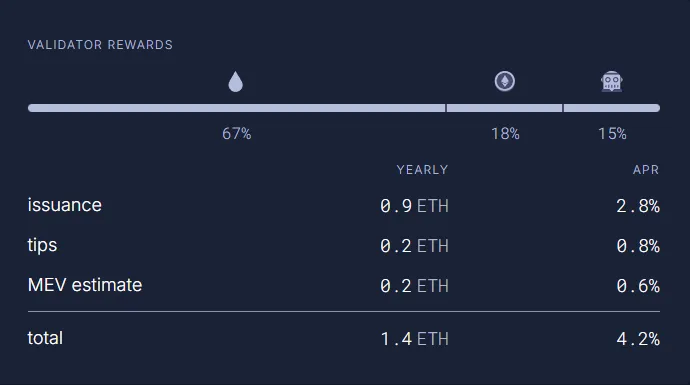
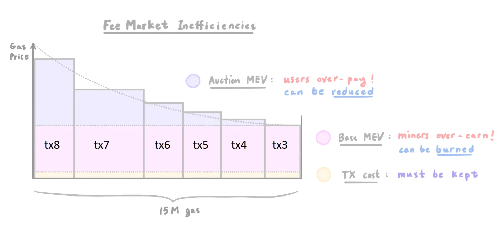
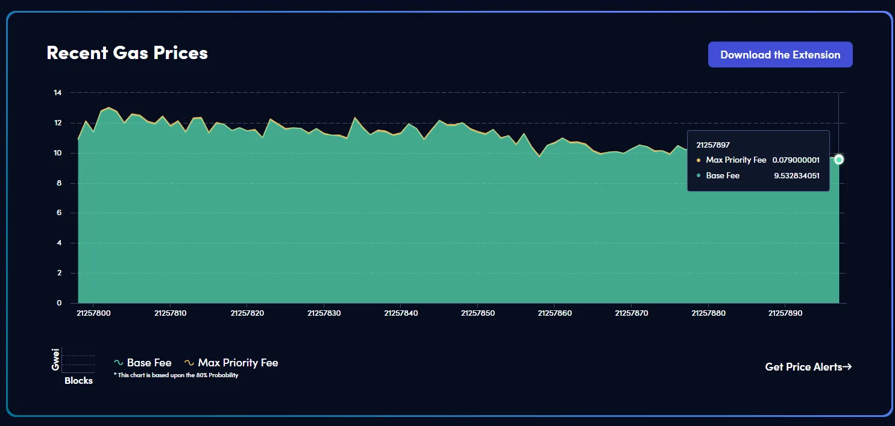

# MEV

## Artículos previos:


November 27th, 2021



December 7th, 2021



March 8th, 2022


## Introducción ¿Qué es MEV?

Si analizamos las recompensas que recibe un validador de Ethereum podemos clasificarlo básicamente en tres:

1. Emisión del protocolo (inflación)
2. Tarifas que pagan los usuarios (fees)
3. MEV

<figure><figcaption>
<a href="https://ultrasound.money/#monetary-premium">https://ultrasound.money/#monetary-premium</a>
</figcaption></figure>

El **Valor Máximo Extraíble (MEV, por sus siglas en inglés)** se refiere al valor adicional que los validadores pueden obtener debido a su capacidad para:

1. Decidir qué transacciones incluir o excluir de un bloque.
2. Determinar el orden en que se ejecutan las transacciones dentro del bloque.

Ambos aspectos tienen implicaciones importantes para el sistema y dan lugar a diferentes tipos de MEV.

En este artículo, abordaremos brevemente el MEV relacionado con el primer punto y exploraremos en profundidad el segundo, donde el reordenamiento de transacciones puede generar valor adicional, habilitando prácticas como el _front-running_ (adelantamiento) o el _sandwiching_ (intercalación).

En resumen, el MEV es el valor que los validadores pueden extraer más allá de las recompensas por bloque y las tarifas de transacción.

## **Inclusion/Exclusion** MEV y EIP-1559, un poco de historia


En esta sección hablamos de mineros, porque esto sucedía en la era POW


Una de las motivaciones detrás de la EIP-1559, el sistema actual de tarifas de Ethereum, fue mitigar e incluso eliminar parte del MEV relacionado con la inclusión y exclusión de transacciones.

En el sistema anterior, Ethereum utilizaba un mecanismo de subasta para vender el espacio en los bloques, o más específicamente, el gas. Este gas representa el esfuerzo computacional necesario para ejecutar operaciones dentro de Ethereum.

Como compradores de este recurso, los usuarios observaban otras transacciones para estimar cuánto estaban pagando (la tarifa por unidad de gas, conocida como _gas price_), y luego ajustaban su propia oferta ligeramente por encima de las existentes. Este proceso generaba ciertas ineficiencias, como el _auction MEV_ (MEV de subasta) y el _base_ _MEV_.

Para entender estos diferentes tipos de MEV pensemos en un momento de alta demanda en la antigua red de Ethereum. En esas circunstancias, no todas las transacciones enviadas podían ser incluidas en el bloque siguiente; solo aquellas que ofrecían tarifas más altas lograban entrar. Consideremos el siguiente ejemplo, donde 8 transacciones compiten por ser incluidas en el siguiente bloque:

1. **tx1**: paga muy poco, no es incluida.
2. **tx2**: paga muy poco, no es incluida.
3. **tx3**: paga lo necesario, entra en el próximo bloque.
4. **tx4**: paga un poco más de lo necesario, entra en el próximo bloque.
5. **tx5**: paga más que la anterior, entra en el próximo bloque.
6. **tx6**: paga más que la anterior, entra en el próximo bloque.
7. **tx7**: paga más que la anterior, entra en el próximo bloque.
8. **tx8**: paga más que la anterior, entra en el próximo bloque.

<figure><figcaption>
<a href="https://raw.githubusercontent.com/jordanmmck/crypto-diagrams/master/eip1559/EIP1559.png">https://raw.githubusercontent.com/jordanmmck/crypto-diagrams/master/eip1559/EIP1559.png</a>
</figcaption></figure>

**Eje X (horizontal):** Representa el tamaño total del bloque en términos de gas consumido. Observamos que **tx7** requiere más gas que las demás, lo cual puede suceder cuando una transacción implica mayor esfuerzo computacional, como por ejemplo mintear un dominio es mas costoso que simplemente enviar ETH.

**Eje Y (vertical):** Indica el precio por unidad de gas pagado por cada transacción.

Cada transacción en el bloque tiene tres componentes diferenciados por colores:

**Amarillo:** Representa el costo base de la transacción, es decir, el esfuerzo computacional puro necesario para ejecutarla. No tiene en cuenta la demanda de los usuarios.

**Magenta:** Indica el _Base MEV_, el sobreprecio que los usuarios pagan debido al congestionamiento de la red. Esto corresponde a la diferencia entre el costo base y el precio justo para incluir la transacción en el bloque.

**Violetita:** Representa el _Auction MEV_, que es el sobreprecio adicional pagado por los usuarios debido al modelo de subasta. Este sobreprecio no es esencial para ser incluidos en el bloque y podría ser reducido con mecanismos más eficientes.

Entonces:

**tx1 y tx2:** No lograron ser incluidas debido a sus tarifas bajas.

**tx3:** Pagó el precio justo para entrar al bloque, absorbiendo solo el _Base MEV_.

**tx4 a tx8:** Pagaron tarifas por encima de lo necesario, generando ademas el _Auction MEV_, una ineficiencia del sistema de subasta que beneficiaba a los mineros.

El proceso ciego de ofertar hacía que los usuarios tendieran a pagar de más. Por ejemplo, la tx8 pago mucho más que tx3 cuando podría haber pagado solo un poco más, o incluso lo mismo, para obtener el mismo resultado.

Por otro lado los mineros no necesitaban este ingreso adicional para estar correctamente incentivados.

#### Implementación de la EIP-1559

La **EIP-1559** introdujo un nuevo mecanismo para abordar las ineficiencias del sistema de tarifas anterior. En lugar de una subasta de primer precio, se implementó un sistema que combina una **tarifa base (**_**base fee**_**)**, que todos los usuarios deben pagar para incluir sus transacciones, y una **propina opcional (**_**tip**_**)**, destinada a los constructores de bloques para incentivar la prioridad en la inclusión.

$$
fee = (baseFee + priorityFee) * gasUsed
$$

* La tarifa base (base\_fee) es un valor ajustado por el protocolo para mantener el uso de la red a un nivel constante
* El tip (pririty\_fee) es una cantidad adicional pagada al validador (cometa) para incentivarlo a incluir tu transacción.

La siguiente imagen muestra una vista en tiempo real del precio del gas. En condiciones normales, la tarifa base (_base fee_) suele ser significativamente mayor que la tarifa de prioridad (_priority fee_). Esto se debe a que, en general, incluir transacciones no presenta mayores dificultades, ya que los bloques suelen tener suficiente espacio disponible. La mayoría de los validadores simplemente toman todas las transacciones visibles en la red y las incluyen en el bloque. Sin embargo, las tarifas de prioridad pueden presentar una variabilidad extrema, especialmente en escenarios de congestión.

<figure><figcaption>
<a href="https://www.blocknative.com/gas-estimator">https://www.blocknative.com/gas-estimator</a>
</figcaption></figure>

Por lo tanto la mejora del EIP-1559 eficientizo los dos principales tipos de MEV presentes en el sistema anterior:

1.  **Auction MEV (MEV de subasta):**

    Aunque este tipo de MEV no puede eliminarse por completo, su impacto se redujo de manera considerable.
2.  **Base MEV (MEV base):**

    En el nuevo sistema, la tarifa base se quema en lugar de destinarse a los constructores de bloques. Esto redistribuye el valor a favor de los holders de ETH, beneficiando al ecosistema al reducir la oferta total de la criptomoneda, en lugar de enriquecer exclusivamente a los mineros.

Si bien este nuevo modelo eficientizo la situación descripta, el desafío relacionado con el orden específico de las transacciones persiste. Actualmente, Ethereum carece de un sistema dentro del protocolo para regular este aspecto.

## **Specific Ordering MEV -** La Importancia del Orden de las Transacciones

En el estado actual de Ethereum los constructores de bloques tienen la libertad de ordenar las transacciones según lo deseen, ya que el protocolo no ofrece un mecanismo oficial para que los usuarios expresen sus preferencias sobre el orden relativo de sus transacciones.

Sin embargo, en un entorno financiero como Ethereum, donde millones de dólares pueden depender de pequeñas diferencias en el orden de ejecución, esta falta de control puede tener consecuencias significativas. El orden de las transacciones puede ser la diferencia entre obtener ganancias o sufrir pérdidas, especialmente en escenarios de alta volatilidad.

Para abordar esta necesidad, surgió una solución fuera del protocolo llamada **MEV-Boost**, un sistema que permite a ciertos usuarios expresar y pagar por sus preferencias sobre el orden de las transacciones. Esto ha permitido un mecanismo más estructurado para gestionar el **Specific Ordering MEV** (MEV por orden específico), un tipo de MEV que va más allá de las simples tarifas y está relacionado directamente con actividades financieras dentro de Ethereum, tales como:

* _Front-running_ (adelantamiento de operaciones).
* _Back-running_ (seguimiento de operaciones).
* _Sandwiching_ (intercalación).
* _Generalized front-running_ (adelantamiento generalizado).

En la práctica, esta falta de control sobre el orden dentro del protocolo ha dado lugar a un mercado no oficial, donde algunos usuarios y constructores negocian directamente por el lugar de sus transacciones en el bloque.

## Construcción estándar de bloques - _Vanilla Block Building_

#### Lo que ve el usuario que envía una transacción

El proceso para enviar una transacción en Ethereum es relativamente simple: la billetera (_wallet_) genera la transacción, el usuario la firma y esta se transmite a un nodo de Ethereum, ya sea un nodo propio o a través de un servicio intermediario como Infura o Alchemy. Estos nodos comparten la transacción con otros nodos conectados, formando una red de transacciones pendientes conocida como el _mempool_ público.

Este _mempool_ es accesible para cualquier participante de la red, lo que proporciona transparencia sobre el estado actual de las transacciones pendientes. Se puede ver el estado en tiempo real del _mempool_ público en el siguiente enlace:



El usuario queda a la espera de que un _block builder_ tome su transacción del _mempool_ y la incluya en el próximo bloque.

#### Lo que hace el validador

En el sistema _Proof of Stake_ (PoS) de Ethereum, se elige aleatoriamente a un validador para actuar como _block proposer_(proponente de bloque).

A día de hoy (agosto de 2024), hay más de 1.000.000 de validadores activos. Esta métrica se puede consultar en el siguiente enlace:



Esto implica que, para un validador individual, ser seleccionado como _block proposer_ es una tarea poco frecuente. En el caso que estamos analizando, conocido como _vanilla block building_, el validador, que será el _block builder_, debe tener instalados en su nodo los siguientes clientes estándar de Ethereum:

1. **Cliente de ejecución.**
2. **Cliente de consenso.**
3. **Cliente de validación.**

Con estos clientes estándar, al momento de elegir transacciones del _mempool_ público para insertarlas en un bloque, solo se consideran aspectos básicos como el _base fee_ y el _priority fee_. Una vez creado el bloque, este se envía a la red. Bajo este modelo, el validador recibe recompensas únicamente por las tarifas (_fees_) pagadas por los usuarios y el subsidio del protocolo (emisión).

A continuación, se explicará cómo es el proceso para seleccionar y ordenar transacciones en Ethereum para que los validadores puedan obtener ganancias a través del _MEV_ (Valor Máximo Extraíble).

## La llegada de Flashbots

En la situación descrita anteriormente, no es difícil imaginar que los validadores con herramientas avanzadas para monitorear el _mempool_ público puedan utilizar la información de las transacciones de los usuarios para su propio beneficio. Este escenario plantea serios desafíos para la equidad y la descentralización dentro del ecosistema de Ethereum.

Es aquí donde entra en escena Flashbots, una organización de investigación y desarrollo enfocada en mitigar los problemas asociados al _MEV_.



Flashbots no tiene como objetivo eliminar el _MEV_ por completo. En cambio, busca transformar la forma en que se gestiona el MEV a través de los siguientes pilares fundamentales:

1. **Iluminar** (_Illuminate_): Exponer la actividad del _MEV_, proporcionando visibilidad sobre cómo y dónde ocurre, para que pueda ser comprendida por la comunidad.
2. **Democratizar** (_Democratize_): Permitir que todos los constructores de bloques (_block builders_) participen en la red, eliminando la necesidad de conexiones exclusivas o pertenecer a grupos privilegiados.
3. **Distribuir** (_Distribute_): Asegurar que los ingresos generados por el _MEV_ se repartan de manera más equitativa entre los participantes.

Este enfoque representa un avance significativo hacia un sistema más justo y transparente dentro de Ethereum, mitigando los efectos más nocivos del _MEV_ y promoviendo la descentralización.

MEV-Boost es una **herramienta específica** creada por Flashbots como parte de su solución al problema del _ME&#x56;_&#x70;reviamente descrito.

A continuación, explicaremos cómo funciona.
