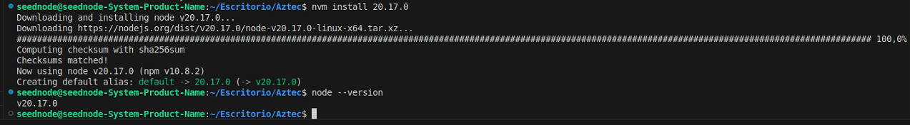
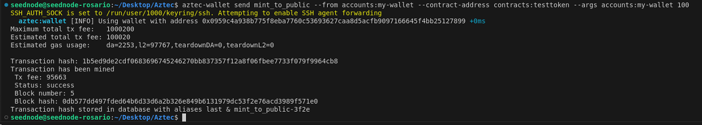
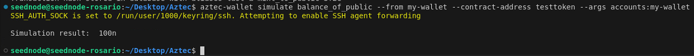

# Aztec

## ¿Qué es Aztec y como interactuar con su sandbox?

Aztec es un protocolo de capa 2 diseñado para Ethereum que combina privacidad y escalabilidad mediante el uso de tecnologías de conocimiento cero (Zero-Knowledge). Su arquitectura permite la ejecución de transacciones privadas y públicas en entornos completamente separados, con los siguientes componentes clave:

<figure><figcaption></figcaption></figure>

#### **Aztec.js**

Es la herramienta que permite a los usuarios interactuar con Aztec, similar a bibliotecas como Web3.js o Ethers.js.

#### **Entorno de Ejecución Privado (PXE)**

* Se ejecuta del lado del cliente.
* Procesa funciones privadas a través de un circuito privado, un simulador ACIR y una base de datos.
* Utiliza un modelo basado en UTXOs (similar al de Bitcoin) para manejar el estado privado, con un árbol de datos diseñado para preservar la privacidad.

#### **Entorno de Ejecución Público (VM Pública)**

* Se ejecuta en nodos de Aztec.
* Procesa funciones públicas y crea rollups que agrupan tanto transacciones privadas como públicas.
* Los datos públicos son manejados de manera similar a un libro mayor tradicional como el de Ethereum.

#### **Transacciones y Estados**

* **Estado Privado**: Gestionado mediante compromisos y nullifiers, asegurando la privacidad al invalidar y actualizar notas privadas.
* **Estado Público**: Similar a otras cadenas como Ethereum, donde los datos son transparentes y accesibles públicamente.

#### **Contratos Inteligentes y Cuentas**

* Cada cuenta en Aztec es un contrato inteligente, lo que permite personalizar la autorización de transacciones, la gestión de claves y el pago de tarifas.
* Los contratos pueden manipular estados privados y públicos mediante Noir, un lenguaje diseñado específicamente para circuitos de conocimiento cero.

#### **Comunicación con Ethereum**

* Aztec permite realizar interacciones privadas con Ethereum a través de "portales", que son contratos inteligentes que median las interacciones.

#### **Circuitos**

<figure><figcaption></figcaption></figure>

Aztec opera con tres tipos de circuitos:

* **Circuitos del kernel privado**: son ejecutados por el usuario en su propio dispositivo y prueban la correcta ejecución de una función.
* **Circuitos del kernel público**: son ejecutados por el secuenciador y aseguran que el registro de transacciones cumpla con las reglas de ejecución de funciones.
* **Circuitos de rollup**: agrupan todas las transacciones de Aztec en una prueba que puede ser verificada de manera eficiente en Ethereum.

Para poder simular la interaccion con Aztec podemos utilizar su _<mark style="color:purple;">**sandbox**</mark>_

## Jugando con el Sandbox

Esta guía te enseñará cómo instalar el sandbox de Aztec, ejecutarlo usando el CLI de Aztec, e interactuar con contratos usando la CLI de la wallet.

El Sandbox es una red Aztec que se ejecuta completamente en tu pc e interactúa con un nodo de desarrollo de Ethereum. Puedes desarrollar y deployar en él tal como lo harías en una testnet o mainnet, es la herramienta perfecta para probar todo lo que quieras.

### Prerequisitos

Necesitas dos dependencias globales en tu pc (Node y Docker) vamos a instalarlos:

* Node.js >= v18.xx.x y <= v20.17.x (lts/iron) (versiones posteriores, por ejemplo v22.9, generan un error relacionado con 'assert’)
  * Se recomienda instalar con [nvm](https://github.com/nvm-sh/nvm)

Instalamos nvm utilizando curl:

```powershell
curl -o- <https://raw.githubusercontent.com/nvm-sh/nvm/v0.40.1/install.sh> | bash
```

o sino con wget:

```powershell
wget -qO- <https://raw.githubusercontent.com/nvm-sh/nvm/v0.40.1/install.sh> | bash

```

Ejecutar cualquiera de los comandos anteriores descarga un script y lo ejecuta. El script clona el repositorio de nvm en `~/.nvm`, e intenta agregar las líneas de código del siguiente fragmento al archivo de perfil correcto (`~/.bash_profile`, `~/.zshrc`, `~/.profile`, o `~/.bashrc`).

```powershell
export NVM_DIR="$([ -z "${XDG_CONFIG_HOME-}" ] && printf %s "${HOME}/.nvm" || printf %s "${XDG_CONFIG_HOME}/nvm")"
[ -s "$NVM_DIR/nvm.sh" ] && \\. "$NVM_DIR/nvm.sh" # This loads nvm
```

Ejecutamos `command -v nvm` para verificar que hayamos instalado nvm correctamente:

<figure><figcaption></figcaption></figure>

Podemos ver que version tenemos instalada con `nvm --version` , ahora que ya tenemos instalado nvm, corremos `nvm ls-remote` para ver las versiones de node disponibles:

<figure><figcaption></figcaption></figure>

Instalamos la version 20.17.0 :

<figure><figcaption></figcaption></figure>

Listo! Ya tenemos node instalado

* Debemos tener docker instalado, si no lo tenemos instalado y estamos usando Ubuntu, podemos seguir su documentacion: [https://docs.docker.com/engine/install/ubuntu/](https://docs.docker.com/engine/install/ubuntu/)

Hay varias formas de instalarlo, en nuestro caso vamos a instalar Docker Engine desde el repositorio apt ([https://docs.docker.com/engine/install/ubuntu/#install-using-the-repository](https://docs.docker.com/engine/install/ubuntu/#install-using-the-repository)):

1. Configuramos el repositorio `apt` de Docker.

```powershell
# Add Docker's official GPG key:
sudo apt-get update
sudo apt-get install ca-certificates curl
sudo install -m 0755 -d /etc/apt/keyrings
sudo curl -fsSL <https://download.docker.com/linux/ubuntu/gpg> -o /etc/apt/keyrings/docker.asc
sudo chmod a+r /etc/apt/keyrings/docker.asc

# Add the repository to Apt sources:
echo \\
  "deb [arch=$(dpkg --print-architecture) signed-by=/etc/apt/keyrings/docker.asc] <https://download.docker.com/linux/ubuntu> \\
  $(. /etc/os-release && echo "$VERSION_CODENAME") stable" | \\
  sudo tee /etc/apt/sources.list.d/docker.list > /dev/null
sudo apt-get update
```

1. Instalamos los paquetes de Docker:

```powershell
sudo apt-get install docker-ce docker-ce-cli containerd.io docker-buildx-plugin docker-compose-plugin
```

1. Verificamos que la instalación se haya realizado con éxito ejecutando la imagen `hello-world`:

```powershell
sudo docker run hello-world
```

Debemos tener el siguiente output:

<figure><figcaption></figcaption></figure>

### Arrancar Docker

Docker tiene que estar corriendo para poder instalar el sandbox, ejecutamos:

```powershell
sudo usermod -aG docker $USER
newgrp docker
docker info
```

Output esperado:

<figure><figcaption></figcaption></figure>

### Instalamos el sandbox

Corremos:

```powershell
bash -i <(curl -s <https://install.aztec.network>)
```

Esto va a instalar las siguientes herramientas:

* **aztec** - arranca varios subsistemas de infraestructura (sandbox completo, sequencer, prover, pxe, etc.) y proporciona comandos de utilidad para interactuar con la red
* **aztec-nargo** - la versión de Aztec de nargo, la toolchain del compilador noir.
* **aztec-up** - una herramienta para actualizar la toolchain de Aztec a la última versión o a versiones específicas.
* **aztec-wallet** - una herramienta para interactuar con la red de Aztec

Le damos a Yes y va a empezar a descargar el sandbox:

<figure><figcaption></figcaption></figure>

<figure><figcaption></figcaption></figure>

#### Nota:

Si no tenemos corriendo docker, vamos a obtener un error como el siguiente:

<figure><figcaption></figcaption></figure>

### Arrancamos el sandbox

Una vez que lo tengamos instalado, para correr el sandbox ejecutamos:

```powershell
aztec start --sandbox
```

<figure><figcaption></figcaption></figure>

El sandbox va a estar listo cuando veamos el siguiente mensaje:

```powershell
[INFO] Aztec Server listening on port 8080
```

Abrimos otra terminal y ya vamos a poder empezar a interactuar con el cliente de Aztec! :

Ejecutamos `aztec -h` para ver la lista de comandos:

<figure><figcaption></figcaption></figure>

### Interactuando con el sandbox

#### **Creando una cuenta**

* RECORDATORIO: Debe estar corriendo el sandbox en una terminal aparte para que se puedan ejecutar los comandos

Para esto corremos el siguiente comando:

```powershell
aztec-wallet create-account -a my-wallet
```

Esto va a crear una nueva wallet con una cuenta y darle el alias “my-wallet”.

Nos va permitirá referenciarla con `accounts:my-wallet`. Verás registros que te mostrarán la dirección, la clave pública, la clave secreta y más.

<figure><figcaption></figcaption></figure>

Podemos checkear que se ejecuto bien el comando corriendo: `aztec-wallet get-alias accounts:my-wallet`deberiamos tener un output como el siguiente:

<figure><figcaption></figcaption></figure>

Ahora que ya tenemos nuestra cuenta nueva, vamos a obtener un poco de tokens (localmente :) )

#### Deployando un smart contract

El sandbox viene con algunos contratos que podemos deployar y jugar con ellos. Uno de estos contratos es el ejemplo de un token, el cual podemos deployar con el siguiente comando:

```powershell
aztec-wallet deploy TokenContractArtifact --from accounts:my-wallet --args accounts:my-wallet TestToken TST 18 -a testtoke
```

En el comando podemos observar:

* el artifact del contrato como argumento, que es `TokenContractArtifact`
* la cuenta del deployer, a la cual le dimos el alias `my-wallet`
* los argumentos que toma el constructor del contrato, que son el `admin` (`accounts:my-wallet`), `name` (`TestToken`), `symbol` (`TST`), y `decimals` (`18`).
* un alias `testtoken` (`a`) para poder referenciarlo fácilmente después como `contracts:testtoken`

Al completarse el despliegue exitosamente, deberías ver algo como esto:

<figure><figcaption></figcaption></figure>

En el siguiente paso vamos a mintear unos tokens!

#### Minteando tokens publicos

Llama a la función pública de minteo de esta forma:

```powershell
aztec-wallet send mint_to_public --from accounts:my-wallet --contract-address contracts:testtoken --args accounts:my-wallet 100
```

En el comando podemos observar:

* el nombre de la función como argumento, que es `mint_to_public`
* la cuenta `from` (quien hace la llamada) que es `accounts:my-wallet`
* la dirección del contrato, que tiene el alias `contracts:testtoken` (o simplemente `testtoken`)
* los argumentos que toma la función, que son la cuenta donde se mintearán los tokens (`my-wallet`), y la `cantidad`(`100`).

Esto solo funciona porque estamos usando la clave secreta del administrador que tiene permisos para mintear.

Una llamada exitosa debería mostrar algo como esto:

<figure><figcaption></figcaption></figure>

Podes verificar que se ejecuto correctamente llamando a la función que comprueba el saldo de tu cuenta pública:

```powershell
aztec-wallet simulate balance_of_public --from my-wallet --contract-address testtoken --args accounts:my-wallet
```

Esto deberia mostrar:

<figure><figcaption></figcaption></figure>

#### **Jugando con hybrid state y funciones privadas**

En los siguientes pasos, moveremos algunos tokens del estado público al privado, y verificaremos nuestro balance público y privado.

```powershell
aztec-wallet send transfer_to_private --from accounts:my-wallet --contract-address testtoken --args accounts:my-wallet 25
```

<figure><figcaption></figcaption></figure>

Los argumentos para la función `transfer_to_private` son:

* la dirección de la cuenta a la que se transferirá
* la cantidad de tokens a enviar al estado privado

Una llamada exitosa debería mostrar algo similar a lo que has visto antes.

Ahora cuando llames a `balance_of_public` de nuevo ¡verás 75!

```powershell
aztec-wallet simulate balance_of_public --from my-wallet --contract-address testtoken --args accounts:my-wallet
```

Esto deberia mostrar:

<figure><figcaption></figcaption></figure>

¡Y luego llama a `balance_of_private` para verificar que tienes tus tokens!

```powershell
aztec-wallet simulate balance_of_private --from my-wallet --contract-address testtoken --args accounts:my-wallet
```

Esto deberia mostrar::

<figure><figcaption></figcaption></figure>

**¡Felicitaciones, ahora conoces los fundamentos para trabajar con el sandbox de Aztec!** Ya estás listo para pasar a cosas más divertidas.

## Recursos










