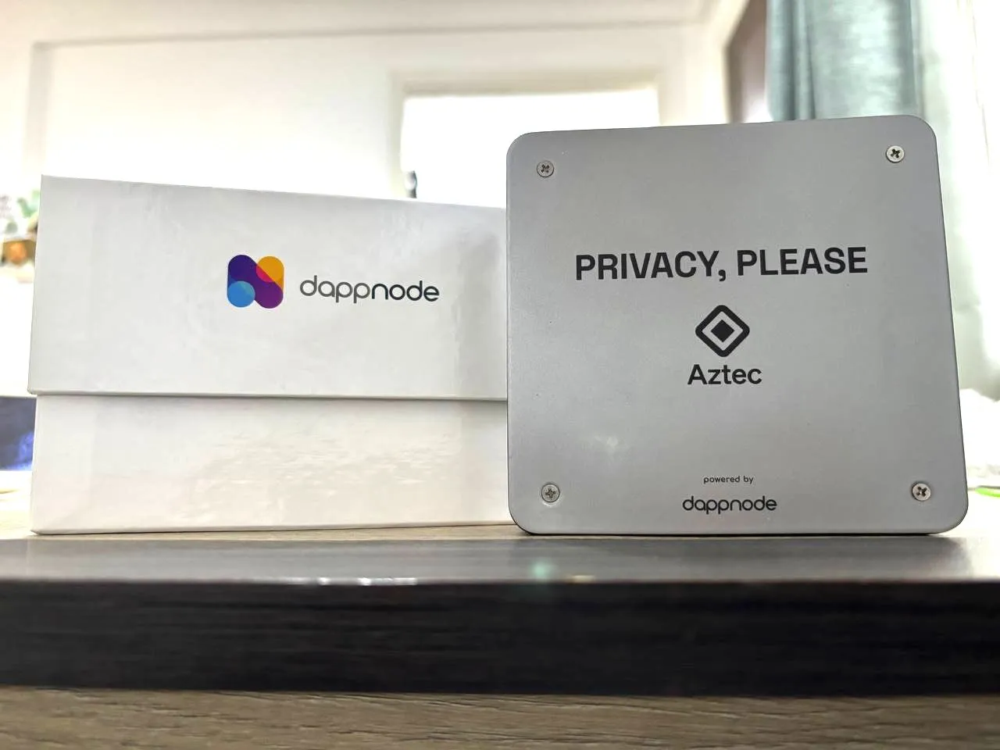

# Corre tu nodo en Aztec! - Testnet

<figure><figcaption></figcaption></figure>

***

### A tener en cuenta

Aztec funciona enviando transacciones desde **Ethereum L1 → Sepolia**, por lo que vas a necesitar:

* ETH en **Sepolia testnet** → [Faucet](https://sepoliafaucet.com/)
* L**lave privada** de una billetera en Sepolia (puedes crearla en **Rabby** o **Metamask**).

### Requerimientos de Hardware

* **CPU:** 4 cores (recomendado 8 cores)
* **RAM:** mínimo 16 GB (recomendado 32 GB para estabilidad)
* **Almacenamiento:** 1 TB SSD (NVMe preferible, por sincronización más rápida)

En caso de no contar con Hardware, existe la posibilidad de acceder a **créditos gratuitos de Google Cloud** → Si es tu caso, puedes seguir la [Guía de Enti](https://enti.gitbook.io/el-consenso-de-ethereum/configuracion-de-nodos-y-validadores/guia-detallada-validador-de-ethereum-con-google-cloud-credits#id-2.-configuracion-de-una-cuenta-en-google-cloud)

### Instalación de DAppNode

#### 1. Pre-requisitos

Abre la terminal y corre:

```bash
sudo wget -O - <https://prerequisites.dappnode.io> | sudo bash

```

#### 2. Instalar DAppNode

```bash
sudo wget -O - <https://installer.dappnode.io> | sudo bash

```

#### 3. Reiniciar sistema

```bash
shutdown -r now

```

#### 4. Acceder a carpeta DNCORE

```bash
cd /usr/src/dappnode/DNCORE

```

#### 5. Configurar variables de entorno

```bash
source .dappnode_profile

```

#### 6. Ver comandos disponibles

```bash
dappnode_help

```

#### 7. Iniciar DAppNode

```bash
dappnode_start

```

***

### Acceso al DAppNode (Wireguard VPN)

#### 8. Obtener credenciales de Wireguard

```bash
dappnode_wireguard

```

#### 9. Descargar e instalar Wireguard


&#x20;[Wireguard Install](https://www.wireguard.com/install/)


#### 10. Configurar túnel

* Copia las credenciales desde la terminal.
* Abre **Wireguard → Add empty tunnel (+)**
* Asigna un nombre (ej: `SEEDLatam`)
* Pega las credenciales y guarda.
* Haz clic en **Activate**.

#### 11. Acceder al Dashboard

Con Wireguard activado, abre en navegador:


&#x20;[http://my.dappnode/dashboard](http://my.dappnode/dashboard)


* Regístrate con usuario y contraseña.

***

### Instalar Paquetes en DAppStore

1. En el buscador escribe **Sepolia**

<figure><figcaption></figcaption></figure>

1. Vas a encontrar:
   * `Aztec Sepolia`
   * `Prsm Sepolia`
   * `Geth Sepolia`

_Recomendado: también instalar **DMS (Dappnode Monitoring System)** para monitoreo._

***

### Configuración del paquete Aztec

Al instalar el paquete **Aztec Sepolia**, te pedirá:

* **RPC**: vienen instalados por defecto.
* **Llave privada** de una billetera (crea una en Rabby/Metamask y súbela).
* **ETH en Sepolia** → [Faucet](https://sepoliafaucet.com/).
* **Dirección de rewards** (a dónde querés recibirlos).

<figure><figcaption></figcaption></figure>

_Importante: El paquete de Aztec **va a tirar error siempre hasta que la red termine de sincronizar**. Una vez sincronizado, quedará operativo._

***

### Continuar con Aztec

* Aztec tiene una **cantidad limitada de registros diarios**.
* El paquete va a intentar registrarse automáticamente cada cierto tiempo.
* Actualmente, habilitaron este **Tally form** para registro manual: [Registro Tally](https://tally.so/r/mVWM7v)

Para corroborar los validadores en producción:


[Dashboard de validadores](https://dashtec.xyz/validators)


#### Eso ha sido todo!&#x20;


Tienes alguna **consulta/problema**? Viste un **error** en la documentación? Algo **desactualizado**? Solo quieres **charlar** con otros operadores de nodos?\
\
Nuestro grupo de telegram [**Club de Nodos**](https://t.me/SEED_Nodes) es el lugar! Te esperamos.

