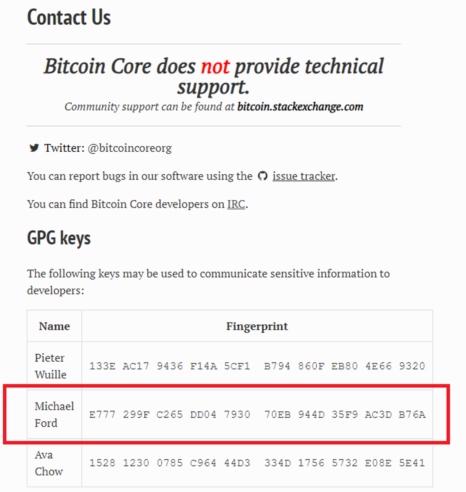

# Bitcoin

El objetivo de este artículo es proporcionar una guía paso a paso para desde cero poder instalar nuestro primer nodo de Bitcoin utilizando la misma computadora que usamos cotidianamente.

Por un lado, buscamos demostrar que no se requiere mucho para formar parte de la red, y por otro, explicar las herramientas necesarias para dar los primeros pasos del "node-runner" de forma segura.

Instalaremos un pruned-node, que es similar a un full-node, pero con la diferencia de que no almacenaremos todo el historial de la blockchain en nuestro nodo. Esto reduce significativamente los requisitos de almacenamiento, lo que facilita ejecutar este nodo en segundo plano en nuestra computadora de uso diario. La instalación la mostraremos sobre el SO Windows.

Esta es una forma interesante para aprender Bitcoin.


Recomiendo que antes de comenzar el tutorial tengan en claro las diferencias entre un nodo minero y un nodo completo (full-nodes) en Bitcoin.


## 1. Requisitos recomendados de HW

* **Procesador** Intel/AMD (2010+ gen)
* **Espacio en disco**: 60 GB o más.
* **Memoria RAM**: 2 GB.

_**Reducción del Almacenamiento**: El modo pruned reduce significativamente los requisitos de almacenamiento en un nodo de Bitcoin. Un full-node ocupa 600 GB y en la versión pruned se lo puede reducir hasta a mínimos de alrededor de 10 GB._

## 2. Procedimiento

### 2.1. Descargamos el instalador

Verificamos la pagina oficial de **bitcoin core** con su cuenta de X:

[Bitcoin Core Project (@bitcoincoreorg) on X](https://twitter.com/bitcoincoreorg)

[Bitcoin](https://bitcoincore.org/)

Entramos en:

**Download**

Nos aseguramos que estemos en una conexión segura \[https]:

<figure><figcaption></figcaption></figure>

Descargamos el instalador para Windows.

_¿Cómo estamos seguros que estamos descargando una versión honesta del software?_

En general nunca nos hacemos esta pregunta con otros programas. Pero en el mundo Bitcoin esto es algo que debemos pensar. La única forma de estar seguros es verificando. Verificar lo que descargamos es quizás la parte mas complicada de este tutorial. A continuación se mostrará de forma detallada como verificar el software que acabamos de descargar.

### 2.2. \[Opcional] Verificación del software

La verificación consiste en dos partes:

* Verificación del checksum: con esto se garantiza que el archivo descargado no ha sido alterado desde su publicación,
* Verificación con GPG: asegura que el archivo fue publicado por una fuente confiable y no ha sido manipulado por terceros.

Para realizar esto vamos a necesitar los siguientes archivos

1. Descargar la lista de checksums criptográficas: SHA256SUMS
2. Descargar las firmas que atestiguan la validez de las checksums: SHA256SUMS.asc

<figure><figcaption></figcaption></figure>

#### 2.2.1. Verificación del checksum

Abrimos una terminal de Windows como administrador (prompt de líneas de comandos). Tenemos dos opciones para abrir la terminal como administrador: Podemos utilizar el metodo abreviado \[win+r → escribimos “cmd” y le apretamos ctrl+shift+enter]

<figure><figcaption></figcaption></figure>

O buscamos en aplicaciones y con botón derecho del mouse abrimos como administrador:

<figure><figcaption></figcaption></figure>

Una vez en la terminal nos dirigimos a la carpeta donde hayamos descargado los archivos. En mi caso:

```jsx
cd C:\\bitcoin node
```

Luego _hasheamos_ el archivo descargado. En mi caso el nombre del archivo descargado es “bitcoin-27.0-win64-setup.exe”. Con escribir solo las primeras letras del nombre del archivo, si presionamos TAB se autocompleta. Esto se realiza con la siguiente instrucción:

```jsx
certUtil -hashfile bitcoin-27.0-win64-setup.exe SHA256
```

<figure><figcaption></figcaption></figure>

Nos aseguramos de que el checksum producido coincide con una de los checksums listados en el fichero de checksums que descargamos previamente. Para eso abrimos el archivo SHASUMS con el block de notas u otro editor de texto y comparamos que los checksum sean iguales:

<figure><figcaption></figcaption></figure>

<figure><figcaption></figcaption></figure>

<figure><figcaption></figcaption></figure>

Si los números son iguales podemos seguir para verificar las firmas. En caso contrario detente y verifica donde esta el problema.

#### 2.2.2. Verificación de firmas con GPG

1. Si no tienes instalado previamente GNU Privacy Guard (GPG) en tu sistema, instálalo ahora:

[Gpg4win - Download Gpg4win](https://gpg4win.org/download.html)

1. Ahora abrimos una terminal de Windows y nos dirigimos a la carpeta donde instalamos GPG. En mi caso:

```jsx
cd C:\\Program Files (x86)\\GnuPG\\bin
```

1. Copiamos los archivos SHASUMS256 y SHASUMS256.asc. y los pegamos en esa misma carpeta “C:\Program Files (x86)\GnuPG\bin” .
2. Ahora debemos buscar las firmas de desarrolladores de bitcoin-core y verificar que ellos hayan firmado lo que nosotros descargamos. Para eso vamos al github de bitcoin-core:

[guix.sigs/builder-keys at main · bitcoin-core/guix.sigs](https://github.com/bitcoin-core/guix.sigs/tree/main/builder-keys)

1. En este tutorial vamos a descargar y utilizar las firmas de \[podrían ser otras]:

* [fanquake.gpg](https://github.com/bitcoin-core/guix.sigs/blob/main/builder-keys/fanquake.gpg)
* [laanwj.gpg](https://github.com/bitcoin-core/guix.sigs/blob/main/builder-keys/laanwj.gpg)
* [luke-jr.gpg](https://github.com/bitcoin-core/guix.sigs/blob/main/builder-keys/luke-jr.gpg)

<figure><figcaption></figcaption></figure>

Una vez que tenemos los tres archivos descargados, los copiamos y los pegamos en la carpeta del GNU \[en este tutorial C:\Program Files (x86)\GnuPG\bin]

1. Importamos sus firmas para poder utilizarlas

```jsx
gpg.exe --import fanquake.gpg
```

<figure><figcaption></figcaption></figure>

1. Verificamos las firmas contenidas en SHA256SUMS.asc contra el archivo SHA256SUMS

```jsx
gpg.exe --verify SHA256SUMS.asc SHA256SUMS
```

**Explicación del resultado:**

```jsx
C:\\Program Files (x86)\\GnuPG\\bin>gpg.exe --verify SHA256SUMS.asc SHA256SUMS
gpg: Firmado el 04/16/24 08:25:32 Hora estndar de Argentina
gpg:                usando RSA clave D1DBF2C4B96F2DEBF4C16654410108112E7EA81F
gpg:                emisor "hebasto@gmail.com"
gpg: Imposible comprobar la firma: No hay clave pública
gpg: Firmado el 04/16/24 10:27:09 Hora estndar de Argentina
gpg:                usando RSA clave 6A8F9C266528E25AEB1D7731C2371D91CB716EA7
gpg:                emisor "sebastian.falbesoner@gmail.com"
gpg: Imposible comprobar la firma: No hay clave pública
gpg: Firmado el 04/16/24 07:45:59 Hora estndar de Argentina
gpg:                usando RSA clave E61773CD6E01040E2F1BD78CE7E2984B6289C93A
gpg:                emisor "pinheadmz@gmail.com"
gpg: Imposible comprobar la firma: No hay clave pública
gpg: Firmado el 04/16/24 06:39:56 Hora estndar de Argentina
gpg:                usando RSA clave CFB16E21C950F67FA95E558F2EEB9F5CC09526C1
gpg:                emisor "fanquake@gmail.com"
gpg: Firma correcta de "Michael Ford (bitcoin-otc) <fanquake@gmail.com>" [desconocido]
gpg: WARNING: The key's User ID is not certified with a trusted signature!
gpg:          No hay indicios de que la firma pertenezca al propietario.
Huellas dactilares de la clave primaria: E777 299F C265 DD04 7930  70EB 944D 35F9 AC3D B76A
     Huella de subclave: CFB1 6E21 C950 F67F A95E  558F 2EEB 9F5C C095 26C1
gpg: Firmado el 04/16/24 14:04:07 Hora estndar de Argentina
gpg:                usando RSA clave 9DEAE0DC7063249FB05474681E4AED62986CD25D
gpg: Firma correcta de "Wladimir J. van der Laan <laanwj@protonmail.com>" [desconocido]
gpg:                 alias "Wladimir J. van der Laan <laanwj@gmail.com>" [desconocido]
gpg:                 alias "Wladimir J. van der Laan <laanwj@visucore.com>" [desconocido]
gpg: ATENCIÓN: ¡Esta clave no está certificada por una firma de confianza!
gpg:          No hay indicios de que la firma pertenezca al propietario.
Huellas dactilares de la clave primaria: 71A3 B167 3540 5025 D447  E8F2 7481 0B01 2346 C9A6
     Huella de subclave: 9DEA E0DC 7063 249F B054  7468 1E4A ED62 986C D25D
gpg: Firmado el 04/16/24 10:04:53 Hora estndar de Argentina
gpg:                usando RSA clave 152812300785C96444D3334D17565732E08E5E41
gpg:                emisor "me@achow101.com"
gpg: Imposible comprobar la firma: No hay clave pública
gpg: Firmado el 04/16/24 08:03:08 Hora estndar de Argentina
gpg:                usando ECDSA clave C388F6961FB972A95678E327F62711DBDCA8AE56
gpg:                emisor "kvaciral@protonmail.com"
gpg: Imposible comprobar la firma: No hay clave pública
gpg: Firmado el 04/16/24 11:26:16 Hora estndar de Argentina
gpg:                usando RSA clave ED9BDF7AD6A55E232E84524257FF9BDBCC301009
gpg: Imposible comprobar la firma: No hay clave pública
gpg: Firmado el 04/16/24 06:51:23 Hora estndar de Argentina
gpg:                usando RSA clave 637DB1E23370F84AFF88CCE03152347D07DA627C
gpg: Imposible comprobar la firma: No hay clave pública
gpg: Firmado el 04/16/24 07:52:54 Hora estndar de Argentina
gpg:                usando RSA clave F4FC70F07310028424EFC20A8E4256593F177720
gpg:                emisor "gugger@gmail.com"
gpg: Imposible comprobar la firma: No hay clave pública
```

Nosotros solo agregamos tres firmas, por eso es evidentemente que hay firmas que son “Imposibles de comprobar”. Por lo tanto filtremos esa información y dejemos solo la que nos brinda información:

```jsx
C:\\Program Files (x86)\\GnuPG\\bin>gpg.exe --verify SHA256SUMS.asc SHA256SUMS

gpg: Firmado el 04/16/24 06:39:56 Hora estndar de Argentina
gpg:                usando RSA clave CFB16E21C950F67FA95E558F2EEB9F5CC09526C1
gpg:                emisor "fanquake@gmail.com"
gpg: Firma correcta de "Michael Ford (bitcoin-otc) <fanquake@gmail.com>" [desconocido]
gpg: WARNING: The key's User ID is not certified with a trusted signature!
gpg:          No hay indicios de que la firma pertenezca al propietario.
Huellas dactilares de la clave primaria: E777 299F C265 DD04 7930  70EB 944D 35F9 AC3D B76A
     Huella de subclave: CFB1 6E21 C950 F67F A95E  558F 2EEB 9F5C C095 26C1
     
gpg: Firmado el 04/16/24 14:04:07 Hora estndar de Argentina
gpg:                usando RSA clave 9DEAE0DC7063249FB05474681E4AED62986CD25D
gpg: Firma correcta de "Wladimir J. van der Laan <laanwj@protonmail.com>" [desconocido]
gpg:                 alias "Wladimir J. van der Laan <laanwj@gmail.com>" [desconocido]
gpg:                 alias "Wladimir J. van der Laan <laanwj@visucore.com>" [desconocido]
gpg: ATENCIÓN: ¡Esta clave no está certificada por una firma de confianza!
gpg:          No hay indicios de que la firma pertenezca al propietario.
Huellas dactilares de la clave primaria: 71A3 B167 3540 5025 D447  E8F2 7481 0B01 2346 C9A6
     Huella de subclave: 9DEA E0DC 7063 249F B054  7468 1E4A ED62 986C D25D
```

De las tres firmas que agregamos, hay dos FIRMAS correctas. No esta la firma de Luke-Jr. Esto no debería ser un problema, si aun tienen dudas puede agregar mas firmas y acotar la incertidumbre. En todo caso también podrían stalkearlo a Luke y sacar mas conclusiones: [https://twitter.com/LukeDashjr](https://twitter.com/LukeDashjr)

Con respecto al WARNING, nos esta advirtiendo que nuestro software no garantiza que esas firmas correspondan a esas personas. Podríamos ignorar estos warnings o chequear manualmente. Para chequear necesitamos los _fingerprints_ de Michael Ford y de Wladimir J. van der Laan.\
Para completar este ejemplo con un nivel de compromiso muy alto haremos este checkeo. El fingerprint de Michael lo podemos sacar de la misma pagina de Bitcoin Core, en Contac Us:

<figure><figcaption></figcaption></figure>

Y el de Wladimir esta subido en su propio github

[laanwj - Overview](https://github.com/laanwj)

<figure><figcaption></figcaption></figure>

Con esta informacion, pudimos chequear que las firmas son correctas y corresponden a quien deben corresponder.

## 3. Instalamos

<figure><figcaption></figcaption></figure>


Esta suficientemente claro. Vamos a descargar toda la cadena, pero solo vamos a almacenar los últimos 6 días de antigüedad. Para este tutorial extendí a 10GB el almacenamiento, lo que me indica una antigüedad de 30 días. Si van a usar datos móviles, tengan en cuenta que se descargara la totalidad de la cadena y no solo 10 GB. El podado se realiza sobre los datos mas antiguos que vamos descargando.


Empezamos descargando la cadena en la época de Satoshi. Estas transacciones no las vamos a poder ver en nuestro nodo podado. Para eso van a tener que seguirnos en el próximo tutorial ;).

<figure><figcaption></figcaption></figure>

<figure><figcaption></figcaption></figure>

## 4. Breve descripción de lo instalado:

Los archivos necesarios para el funcionamiento de Bitcoin Core se instalaron en la siguiente ruta:

```jsx
 %APPDATA%\\Bitcoin\\
```

Pueden copiar y pegar la variable de entorno en el explorador de archivos y los lleva directamente a la carpeta.


Es importante no cambiar de ubicación los archivos para el buen funcionamiento del nodo


<figure><figcaption></figcaption></figure>

* **Subcarpeta “blocks”**: como su nombre lo indica, aquí esta alojada la base de datos de los bloques.\
  TIP: Comparen el tamaño de esta carpeta con el tamaño que seleccionaron al crear el pruned node.
* **Subcarpeta “chainstate”**: aquí se guarda base de datos llamada “UTXO Set” en formato LevelDB. Básicamente guarda el ultimo estado de la blockchain.
* **Subcarpeta “wallets”**: contiene la wallet o wallets que se generen en el nodo, ya sea wallets con claves privadas o watch-only.
* **Archivo “mempool.dat”**: aquí se guarda la base de datos llamada “mempool”. Es donde se van almacenando las transacciones que son propagadas por nuestro nodo y aun no fueron confirmadas.
* **Archivo “bitcoin.conf”**: es donde se define la configuración del nodo. Se puede modificar directamente este archivo o configurarlo desde el software.
* **Archivo** “**settings.json**”: almacena configuraciones que son definidas a través de la interfaz gráfica de usuario (GUI). Este archivo es una forma alternativa de manejar configuraciones, permitiendo que ciertas opciones se guarden automáticamente aquí, en lugar de requerir que el usuario las escriba manualmente en `bitcoin.conf`.

## 5. Primeras configuraciones

📎 Nuestro nodo, nuestras reglas.

Veamos que hay en los archivos de configuración:

```jsx
{
    "_warning_": "This file is automatically generated and updated by Bitcoin Core. Please do not edit this file while the node is running, as any changes might be ignored or overwritten.",
    "prune": "9536",
    "server": true
}
```

```jsx
#Totalmente en blanco
```

#### 5.1 settings.json

El archivo settings.json como bien indica el “warning” fue generado automaticamente. Ahi podemos ver dos configuraciones importantes:

1. “pruned”: “9536” → Indica que es un nodo podado. El valor "9536" se refiere a la cantidad de espacio asignado para el "pruning" en megabytes (MB). En este caso, 9536 MB es aproximadamente 9.3125 GB.
2. “server”: true → significa que el nodo está configurado como un servidor y puede recibir y responder a comandos RPC. Esto permite que otros programas, scripts o usuarios \[nosotros mismos] se conecten al nodo para enviarle comandos y recibir información, lo que es útil para tareas de administración o para interactuar con la red de Bitcoin.

Desde la interfaz podemos ver estas configuraciones:

<figure><figcaption></figcaption></figure>

<figure><figcaption></figcaption></figure>

> _Cuando modificamos estos parámetros se actualiza automaticamente settings.json_

#### 5.2 bitcoin.conf

Cuando instalamos alguna distribución de nodo completo siguiendo algún tutorial, en un momento tenemos que copiar y pegar la configuración del nodo en el archivo bitcoin.conf.

Como nuestra misión es aprender, veamos algunas de estas configuraciones:

\<aside> ⚠️ Algunas configuraciones tipicas que se utilizan el los full-nodes, y que son muy utiles, no son validas en un pruned-node. El ejemplo mas claro esta en por ejemplo \[**txindex**=1] cuya utilidad la veremos en un próximo tutorial.

\</aside>

**dustrelayfee**

```jsx
**#Codigo educativo a modo de ejemplo - SeedNodes
dustrelayfee**=0.00009
```

**Este parámetro configura el umbral del dust\[polvo]**. Llamamos polvo a esas transacciones de tan baja denominación que no tiene sentido económico su uso (la comisión es mayor o igual que el valor transferido).

Al no indicar nada, el valor predeterminado es de 3.000 satoshis por kilobyte \[0.00003 BTC].

**incrementalrelayfee**

```jsx
**#Codigo educativo a modo de ejemplo - SeedNodes
incrementalrelayfee**=0.00005
```

Con este parámetro, se establece el incremento mínimo en la tarifa por kilobyte que debe tener una transacción para que pueda reemplazar a otra en la mempool (Replace-by-Fee, RBF). Este incremento asegura que las nuevas transacciones que buscan reemplazar a una existente paguen significativamente más, evitando que las transacciones sean reemplazadas con aumentos triviales en la tarifa.

**minrelaytxfee**

```jsx
**#Codigo educativo a modo de ejemplo - SeedNodes
minrelaytxfee**=0.00005
```

Este parámetro establece la tarifa mínima por kilobyte que una transacción debe pagar para ser aceptada en la mempool de nuestro nodo y retransmitida a otros nodos.

Así podemos asegurar que nuestro nodo no acepte transacciones que pagan tarifas extremadamente bajas.

Con estas tres simples configuraciones el archivo bitcoin.config quedaría de la siguiente forma:

```jsx
**#Codigo educativo a modo de ejemplo - SeedNodes
Dustrelayfee**=0.00009
**incrementalrelayfee**=0.00005
**minrelaytxfee**=0.00005
```

Una herramienta para seguir explorando bitcoin.conf es la siguiente: [https://jlopp.github.io/bitcoin-core-config-generator/](https://jlopp.github.io/bitcoin-core-config-generator/)

\<aside> 💡 Bitcoin Core lee el archivo bitcoin.conf solo una vez al inicio de su ejecución. Si se realizan modificaciones sobre el mismo debe reiniciar Bitcoin Core para que surjan efecto.

\</aside>

## 6. Comandos básicos

A continuación veremos la forma de interactuar con la red para pedirle información.

<figure><figcaption></figcaption></figure>

<figure><figcaption></figcaption></figure>

* **`help-console`** Nos brindara información básica de como operar en la terminal

***

* **`help`** Muestra una lista completa de todos los comandos disponibles.

***

* **`help <comando>`** Muestra la ayuda específica para el comando indicado, explicando cómo usarlo y qué parámetros acepta. Ejemplo: **`help getblockchaininfo`**

***

*   **`getblockchaininfo`**\
    Devuelve información detallada sobre el estado actual de la cadena de bloques que está manejando el nodo. Ejemplo:

    ```jsx
    {
      "chain": "main",
      "blocks": 856742,
      "headers": 856742,
      "bestblockhash": "000000000000000000031065d275957d1f6389ff98a8f3ddf6dfa3605e0229b8",
      "difficulty": 90666502495565.78,
      "time": 1723639338,
      "mediantime": 1723637956,
      "verificationprogress": 0.9999988774651672,
      "initialblockdownload": false,
      "chainwork": "000000000000000000000000000000000000000088dbba6655949ad5b0a444aa",
      "size_on_disk": 9877668412,
      "pruned": true,
      "pruneheight": 851524,
      "automatic_pruning": true,
      "prune_target_size": 9999220736,
      "warnings": ""
    }
    ```

    Una lectura rápida e inconclusa es la siguiente:

    * **chain**: nos dice que estamos en mainnet y no testnet
    * **blocks**: es el número total de bloques que el nodo ha descargado y verificado.
    *   **headers**: es el número de headers que el nodo conoce.

        \<aside> 💡 Debería coincidir con el número de bloques si el nodo está completamente sincronizado.

        \</aside>
    * **bestblockhash**: es el hash del bloque más reciente que el nodo ha verificado y considera parte de la cadena más larga y válida.
    * **difficulty**: la dificultad actual de la red, que determina cuánto trabajo computacional se requiere para encontrar un nuevo bloque

***

* **`getpeerinfo`** Proporciona información detallada sobre los peers (nodos pares) con los que nuestro nodo está conectado. Esta información es útil para monitorear las conexiones y la actividad entre nuestro nodo y otros nodos en la red.

***

*   **`getdifficulty`**

    Nos da \*\*\*\*el valor actual de la **dificultad** de la red de Bitcoin. La dificultad es una medida de cuán difícil es encontrar un nuevo bloque en la red de Bitcoin y se ajusta aproximadamente cada 2016 bloques (aproximadamente cada dos semanas) para mantener el tiempo promedio entre bloques en 10 minutos.

    ```jsx
    90666502495565.78
    ```

***

* **`getblockcount`** Devuelve el número actual de bloques en la cadena de bloques más larga (la cadena principal) que nuestro nodo ha descargado y verificado.

***

*   **`getmininginfo`** Proporciona información relacionada con la minería

    ```jsx
    {
      "blocks": 856746,
      "difficulty": 90666502495565.78,
      "networkhashps": 6.569089154381459e+20,
      "pooledtx": 18898,
      "chain": "main",
      "warnings": ""
    }
    ```

    * **”networkhashps": 6.569089154381459e+20** Es **l**a potencia de hash estimada de toda la red de Bitcoin en hashes por segundo (H/s). Este valor indica la cantidad total de poder computacional que se está utilizando para minar bloques en toda la red.
    * "pooledtx": 18898 El número de transacciones que actualmente están en la mempool de nuestro nodo. Estas son transacciones que aún no han sido confirmadas y están esperando ser incluidas en un bloque.

<figure><figcaption></figcaption></figure>

***

*   **`getrawmempool`** Devuelve una lista de las transacciones que están actualmente en nuestra mempool. Con fines didacticos pueden copiar una de estas transacciones y pegarla en: [https://mempool.space/es/](https://mempool.space/es/)

    \<aside> 🛠 En nuestro pruned-node no vamos a poder ver detalles de las transacciones por cuenta propia de forma simple. Para eso necesitaremos un full-node. Pero si de todas formas lo queremos practicar, podemos hacer lo que sigue.

    \</aside>

***

* **`getrawtransaction`** Este comando te permite obtener la información detallada de una transacción específica, ya sea que esté en la blockchain confirmada o en el mempool. En nuestro pruned-node solo podremos tomar txs de nuestra mempool local. Ejemplo:
  1.  Usamos **`getrawmempool` y tomamos la primer transacción a modo de ejemplo:**

      ```jsx
      [
        "7dae648936dedb91a0a8224a78af52329eb31cd0964cc4921c7b0e8ac699f556",
        ... ,
        ... ,
      ]
      ```
  2.  **`getrawtransaction 7dae648936dedb91a0a8224a78af52329eb31cd0964cc4921c7b0e8ac699f556`**

      ```jsx
      02000000000101b4784b40993093887df9f9f2252430905cc0f23851300e80b1dd5d9f3a6ef09c0000000000fdffffff026e13000000000000160014c3f1f018c993180e667d6fcc51af0036a38a97290000000000000000076a5d04140114000247304402205a3bb62dd46a8fd44c20d99e0c7942a5a35fba7c522e032b94ca52fe0657eefd02203579c35f048b1c8a4b023f213eaf96d92c6f2ae13f3f484561d016e5d9cd2e950121027e18b1eab7be5d378ab0c9a1ab1f738b75350dbba59f95ae91c8d3094cdf495500000000
      ```

      Acá tenemos la representación en hexadecimal de la transacción en bruto. Esta es la transacción en su formato sin procesar, que es cómo se almacena y se transmite en la red de Bitcoin.
  3.  \*\*`decoderawtransaction 02000000000101b4784b40993093887df9f9f2252430905cc0f23851300e80b1dd5d9f3a6ef09c0000000000fdffffff026e13000000000000160014c3f1f018c993180e667d6fcc51af0036a38a97290000000000000000076a5d04140114000247304402205a3bb62dd46a8fd44c20d99e0c7942a5a35fba7c522e032b94ca52fe0657eefd02203579c35f048b1c8a4b023f213eaf96d92c6f2ae13f3f484561d016e5d9cd2e950121027e18b1eab7be5d378ab0c9a1ab1f7**38b75350dbba59f95ae91c8d3094cdf495500000000`Usamos este comando para convertir esta transacción en formato hexadecimal a un formato más legible (JSON)

      ```jsx
      {
        "txid": "7dae648936dedb91a0a8224a78af52329eb31cd0964cc4921c7b0e8ac699f556",
        "hash": "8a694c496a40487481d9f0cdb2966284eb19da7221964ff120a388428f5d4209",
        "version": 2,
        "size": 207,
        "vsize": 126,
        "weight": 501,
        "locktime": 0,
        "vin": [
          {
            "txid": "9cf06e3a9f5dddb1800e305138f2c05c90302425f2f9f97d88933099404b78b4",
            "vout": 0,
            "scriptSig": {
              "asm": "",
              "hex": ""
            },
            "txinwitness": [
              "304402205a3bb62dd46a8fd44c20d99e0c7942a5a35fba7c522e032b94ca52fe0657eefd02203579c35f048b1c8a4b023f213eaf96d92c6f2ae13f3f484561d016e5d9cd2e9501",
              "027e18b1eab7be5d378ab0c9a1ab1f738b75350dbba59f95ae91c8d3094cdf4955"
            ],
            "sequence": 4294967293
          }
        ],
        "vout": [
          {
            "value": 0.00004974,
            "n": 0,
            "scriptPubKey": {
              "asm": "0 c3f1f018c993180e667d6fcc51af0036a38a9729",
              "desc": "addr(bc1qc0clqxxfjvvquenadlx9rtcqx63c49ef0pfw29)#vrdfe95j",
              "hex": "0014c3f1f018c993180e667d6fcc51af0036a38a9729",
              "address": "bc1qc0clqxxfjvvquenadlx9rtcqx63c49ef0pfw29",
              "type": "witness_v0_keyhash"
            }
          },
          {
            "value": 0.00000000,
            "n": 1,
            "scriptPubKey": {
              "asm": "OP_RETURN 13 1310996",
              "desc": "raw(6a5d0414011400)#cwmyltm8",
              "hex": "6a5d0414011400",
              "type": "nulldata"
            }
          }
        ]
      }

      ```

***

*   **`gettxoutsetinfo`**

    **P**roporciona información sobre el estado actual del conjunto de salidas de transacciones no gastadas (UTXO). El conjunto UTXO es fundamental en Bitcoin, ya que representa todas las salidas de transacciones que aún no han sido gastadas y, por lo tanto, pueden ser utilizadas en futuras transacciones.

    ```jsx
    {
      "height": 856748,
      "bestblock": "00000000000000000000c885a268a93c7f2c78aef3ce3e859e2dbee7c61a7ff0",
      "txouts": 184119851,
      "bogosize": 14217092052,
      "hash_serialized_3": "f8655cca1f077ba0e3c968dbff39da265fd5c7951d0e16cfafe230b13ec22190",
      "total_amount": 19739621.11622303,
      "transactions": 127780928,
      "disk_size": 12414939948
    }
    ```

    Estas chequeando en pocas palabras la base monetaria de Bitcoin, en tu propia computadora.

<figure><figcaption></figcaption></figure>

## 7. Conclusiones

Hemos explorado la instalación y el uso de un autentico nodo de Bitcoin. Aunque esté configurado en modo "pruned", esto no lo convierte en un nodo de segunda categoría. Es cierto que existen algunas limitaciones en cuanto a ciertas funciones, pero estas afectan únicamente nuestra capacidad de interactuar con el nodo y no la función esencial que desempeña dentro de la red.

No abordamos la interacción con la wallet en este nodo porque consideramos que este tipo de configuración no es la más adecuada para ese propósito. Dejaremos esta funcionalidad para futuros tutoriales.

Si han seguido el tutorial, habrán notado que la mayor complejidad reside en la verificación del software. De no haber realizado esta verificación, simplemente habría sido cuestión de ejecutar el instalador y hacer clic en “siguiente” un par de veces. Sin embargo, si en futuros tutoriales queremos mostrar cómo ser un bitcoiner soberano operando nuestro propio nodo (ser un banco central, por así decirlo), es fundamental que nos acostumbremos a verificar cada paso.

## 8. Fuentes consultadas

[https://github.com/bitcoin/bitcoin](https://github.com/bitcoin/bitcoin)

[Index](https://bitcoincore.org/en/doc/27.0.0/)

[Estructura de directorios de Bitcoin Core - Dinero sin reglas](https://dinerosinreglas.com/estructura-de-directorios-de-bitcoin-core/)

[Original Bitcoin client/API calls list - Bitcoin Wiki](https://en.bitcoin.it/wiki/Original\_Bitcoin\_client/API\_calls\_list)

[¿Que NODO BITCOIN montar en 2024? - L230](https://www.youtube.com/watch?v=yUjfHynHmq0)

[Bitcoin Core Config Generator](https://jlopp.github.io/bitcoin-core-config-generator/)
