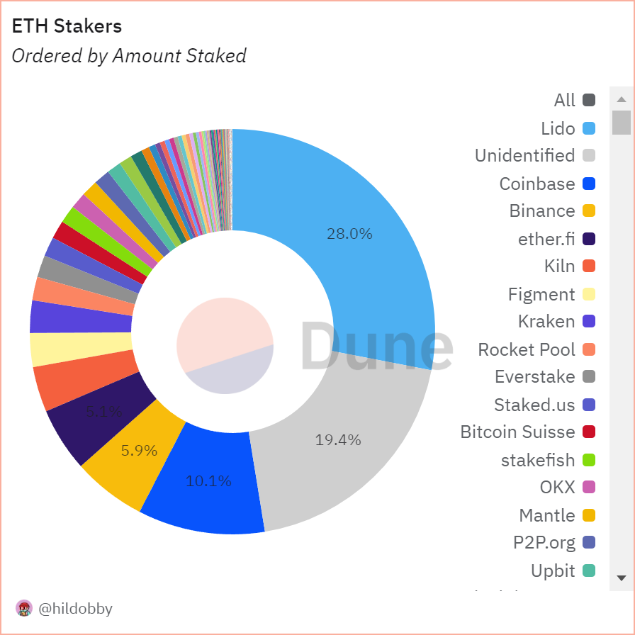
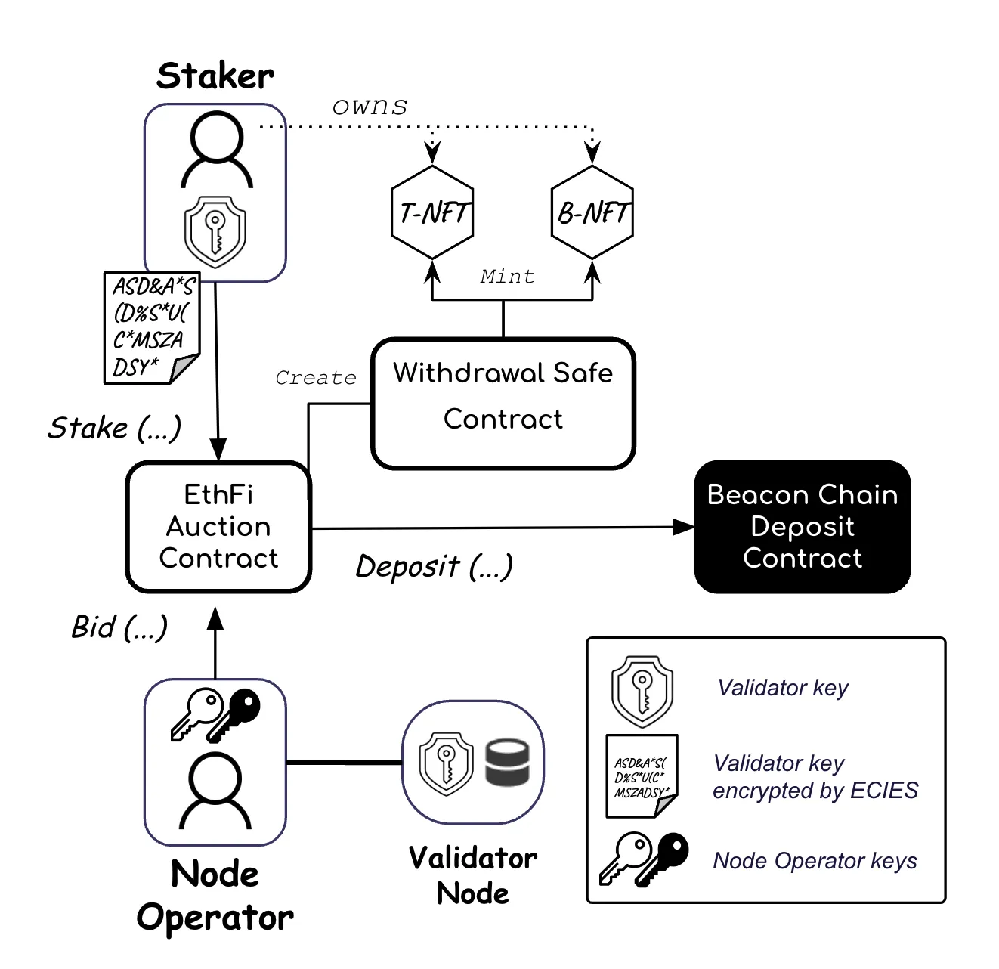

# Ether.fi

## Introducción - Alternativa de Staking en Ethereum

Desde la transición de Ethereum a _Proof of Stake_ y la habilitación de retiros con la actualización _Shappella_, el _staking_ líquido se ha convertido en un pilar fundamental del ecosistema Ethereum. Lido lideró esta transformación al ofrecer liquidez inmediata mediante su token stETH, ganándose la confianza de instituciones y usuarios individuales. Sin embargo, su posición dominante ha generado inquietudes sobre la centralización del stake.

<figure><figcaption>
<a href="https://dune.com/hildobby/eth2-staking">https://dune.com/hildobby/eth2-staking</a>
</figcaption></figure>

En respuesta a estos desafíos, [Ether.fi](http://ether.fi/) surge como una alternativa que combina seguridad y eficiencia económica a través de dos pilares igualmente importantes: la custodia de claves por parte del usuario y el restaking como funcionalidad central del protocolo.

Por un lado, [Ether.fi](http://ether.fi/) permite a los usuarios avanzados mantener el control total de sus claves privadas _(para los que stakean 32 ETH o multiplos de 32)_, eliminando riesgos de contraparte y evitando depender de terceros para acceder a sus activos. Esta característica requiere un conocimiento técnico considerable, lo que la hace más adecuada para usuarios con experiencia en la gestión de claves criptográficas (power users).

Por otro lado, para el usuario promedio, [Ether.fi](http://ether.fi/) ofrece una experiencia de staking líquido accesible y sin fricciones , similar a otras plataformas líderes como Lido. Los usuarios pueden participar con cualquier cantidad de ETH y aprovechar los beneficios del staking líquido sin necesidad de gestionar claves privadas directamente, simplificando el proceso sin sacrificar la seguridad.

Un elemento clave que diferencia a [Ether.fi](http://ether.fi/) es su integración nativa con EigenLayer, lo que permite implementar restaking de forma automática. Esta funcionalidad aprovecha el ETH depositado no solo para asegurar la red Ethereum, sino también para ofrecer seguridad a otras redes y servicios descentralizados, maximizando los rendimientos y generando nuevas oportunidades para los participantes.

Ambos pilares —la autonomía en la custodia de claves para usuarios avanzados y la facilidad de uso para el staking líquido generalizado— se complementan con una infraestructura robusta que redefine los estándares de seguridad y eficiencia en el staking líquido de Ethereum.

El valor diferencial de [Ether.fi](http://ether.fi/) no reside únicamente en su enfoque no custodial, sino en cómo logra equilibrar la seguridad, la descentralización y la eficiencia económica.

Para entender mejor su propuesta, es fundamental explorar el flujo técnico del protocolo, su integración con EigenLayer y su modelo económico sostenible.

## **Funcionamiento de** [**Ether.fi**](http://ether.fi/)**: Seguridad y Control de Claves**

### **Control de las claves: Un modelo no custodial**

En la mayoría de los protocolos de _staking_ líquido tradicionales, los usuarios ceden sus activos y el control de sus claves a operadores de nodos o contratos inteligentes, lo que introduce riesgos significativos. En [Ether.fi](http://ether.fi/), este problema se aborda con un diseño que asegura que el usuario siempre retiene el control de sus claves privadas (power users, avanzados).

El proceso comienza con el usuario generando sus claves mediante una aplicación propia de [Ether.fi](http://ether.fi/), que funciona como una interfaz sobre la CLI oficial de Ethereum. Este proceso garantiza que:

* Las claves privadas nunca abandonan el control del usuario.
* La validación se delega de manera segura a un operador de nodos, seleccionado a través de un sistema de pujas transparentes.
* En caso de una falla crítica en el protocolo o intervención externa, el usuario puede retirar sus fondos directamente utilizando sus claves privadas.

Adicionalmente, las claves de validación se cifran y comparten de forma segura con los operadores a través de IPFS. Esto elimina el riesgo de que un operador malintencionado pueda retener o interferir con los fondos depositados.



### **Los NFTs como representación del Validador**

Cada nodo validador en [Ether.fi](http://ether.fi/) está vinculado a un par de **NFTs únicos** , que actúan como un recibo digital y representan\*\*:\*\*

1. B-NFT (Bond NFT): el deposito de 32 ETH. No transferible.
2. T-NFT (Ticket NFT): el derecho de participación en las recompensas. Transfrible

Esta representación en forma de NFT no solo facilita la trazabilidad y transparencia, sino que habilita una serie de funcionalidades avanzadas:

* Transferencia del T-NFT: Los validadores pueden ser transferidos entre usuarios sin afectar el nodo subyacente.
* Inscripción en servicios de restaking: Los NFT pueden ser utilizados para habilitar servicios adicionales a través de EigenLayer u otras plataformas compatibles.

En este modelo, los NFTs dejan de ser simples representaciones estáticas y se convierten en instrumentos activos dentro del ecosistema DeFi.

### **Explicación en detalle del modelo de subasta**

<figure><figcaption>
<a href="https://etherfi.gitbook.io/etherfi/ether.fi-whitepaper/technical-documentation#delegated-staking-via-auction">https://etherfi.gitbook.io/etherfi/ether.fi-whitepaper/technical-documentation#delegated-staking-via-auction</a>
</figcaption></figure>

1. Registro y Oferta por Parte del Operador de Nodo
   * Los operadores de nodos interesados registran sus claves públicas en el sistema de subastas.
   * Posteriormente, cada operador realiza una oferta (bid) en ETH (por ejemplo, 0.01 ETH).
   * El monto ofrecido representa la cantidad que el operador está dispuesto a pagar para gestionar un validador.
   * Propósito: Garantizar competencia y transparencia en la selección de operadores.
2. Depósito (32 ETH)
   * Un staker deposita 32 ETH en el Auction Deposit Contract.
   * Este depósito activa el Auction Manager Contract, que:
     * Ejecuta la subasta.
     * Selecciona la oferta ganadora.
     * Asigna el nodo validador al operador con la mejor oferta.
3. Generación y Envío de Claves Validadoras
   * El staker genera claves validadoras cifradas y las envía mediante una transacción on-chain.
   * Para optimizar costos, las claves se almacenan en IPFS
   * El CID (Content Identifier) de las claves se sube on-chain para que el operador de nodo pueda localizarlas, descargarlas y descifrarlas.
4. Confirmación y Configuración del Nodo
   * El operador de nodo envía una transacción de confirmación de aceptación al Auction Manager Contract.
   * El contrato emite dos NFTs ({B, T}-NFTs) a la billetera del staker:
   * B (Bond NFT): Representa el depósito de 32 ETH.
   * T (Ticket NFT): Representa el derecho de participación en las recompensas.
   * Se crea una nueva instancia del Withdraw Safe Contract, la cual actuará como credenciales de retiro.
   * Los 32 ETH son transferidos al Contrato de Depósito oficial de Ethereum mediante el Withdraw Safe Contract.
5. Activación y Generación de Recompensas
   * Una vez que el nodo validador se configura y se activa correctamente, comienza a generar recompensas.
   * Las tarifas recaudadas en la subasta se distribuyen dentro del ecosistema de [Ether.fi](http://ether.fi/) en forma del token eETH (rebasing token).
6. Distribución de Ingresos
   * Una parte de los ingresos generados en la subasta se distribuye entre los participantes del protocolo [Ether.fi](http://ether.fi/).
   * El operador del nodo recibe una cantidad predeterminada de ETH, proporcional a su oferta inicial.

## **Restaking-nativo en** [**Ether.fi**](http://ether.fi/)

En el ecosistema de Re-Staking Líquido, los usuarios normalmente bloquean sus Liquid Staking Tokens (LSTs), como stETH (de Lido), en los contratos de estrategia de re-staking, como por ejemplo de EigenLayer:



Sin embargo, este método presenta algunas desventajas:

1. No transferibles: Los activos re-stakeados no se pueden transferir.
2. No utilizables en DeFi: No puedes usarlos en otros protocolos DeFi.
3. Período de retiro: Requieren un período de espera de 7 días para redimir los LSTs. Luego, hay un segundo retraso para convertir esos LSTs nuevamente en ETH.

### Tokens líquidos de Ethereum en Ether.fi


Si bien existen varios tokens de reestaking nativo en [Ether.fi](http://ether.fi/) (LRTs), por comodidad escribiremos únicamente de weETH o eETH.

Diferentes tokens de re-staking de Ethereum son:

1. weETH: EigenLayer Restaking
2. weETHs: Symbiotic Restaking
3. weETHk: Karak Restaking



Para los power users que tengan sus claves deben seguir el procedimiento de [ether.fi](http://ether.fi/) para realizar el restaking, para el resto de los usuarios es automatico.


eETH y weETH realizan el Re-Staking de manera nativa en el protocolo de [Ether.fi](http://ether.fi/).

* ¿Qué significa esto?
  * El Re-Staking ocurre de forma integrada en el protocolo [Ether.fi](http://ether.fi/) desde el inicio.
  * Los usuarios no necesitan realizar acciones adicionales ni bloquear manualmente sus activos en contratos de EigenLayer.

### Beneficios para los Poseedores de eETH/weETH

Al tener tokens eETH/weETH, los usuarios obtienen dos tipos de recompensas:

1. Recompensas de Staking Tradicional:
   * Generadas por los rendimientos estándar del protocolo de staking de [Ether.fi](http://ether.fi/).
2. Recompensas de Re-Staking:
   * Basadas en el ETH re-stakeado de manera nativa a nivel de protocolo.
   * Incluyen los rendimientos derivados de EigenLayer y “el actual farmeo” de puntos.
3. Uso en DeFi:
   * eETH/weETH son transferibles.
   * Puedes usar tus tokens en otros protocolos DeFi.
   * Esto permite a los usuarios participar en estrategias avanzadas de inversión y maximizar sus rendimientos.
4. Retiros Sin Retrasos de 7 Días
   * Puedes redimir tu ETH directamente desde eETH/weETH sin esperar el período estándar de 7 días.
   * Esto es posible siempre que Ether.fi tenga suficiente ETH líquido disponible en el contrato.

### **Documentación Adicional**

Para una comprensión más técnica del proceso de **Re-Staking en EigenLayer**, se recomienda consultar la **documentación oficial de EigenLayer**.



## Modelo Económico

El modelo de ingresos de [Ether.fi](http://ether.fi/) está diseñado para ser claro y alineado con los intereses de todos los participantes. Sus principales fuentes de ingresos incluyen:

* Recompensas base de staking:
  * 90% de las recompensas se distribuyen directamente a los usuarios.
  * 10% se divide entre los operadores de nodos y el protocolo.
* Ingresos por subastas de nodos:
  * Los operadores compiten en un sistema de pujas transparentes para ganar el derecho a operar validadores.
  * Las tarifas recaudadas se distribuyen entre stakers, operadores y el protocolo.
* Comisiones por minting y burning del token líquido de staking:
  * Cada vez que un usuario emite o quema tokens líquidos, se aplican pequeñas comisiones, similares a las tarifas en pools de Curve.
* Ingresos por servicios adicionales (restaking):

Este modelo no solo asegura un flujo de ingresos estable, sino que establece incentivos claros y alineados para cada grupo de participantes.

## **Operación Solo Staker: Descentralización Real para Ethereum**

[Ether.fi](http://ether.fi/) lo explica de la siguiente forma:&#x20;

> _”Es una iniciativa que apunta directamente a descentralizar Ethereum nodo por nodo, empoderando a operadores individuales para que participen activamente en la validación de la red desde sus propios hogares. Lo innovador de esta propuesta es que elimina barreras técnicas y financieras, ofreciendo un modelo accesible incluso para quienes no cuentan con los recursos o conocimientos avanzados que tradicionalmente se requerían.”_

### **Un modelo descentralizado con tecnología DVT**

El funcionamiento de la Operación Solo Staker se basa en la tecnología **DVT (Distributed Validator Technology)**, que permite dividir una clave de validador en fragmentos seguros que son distribuidos entre múltiples operadores individuales. Esto significa que ninguna persona tiene control total sobre la clave, reduciendo así los riesgos operativos.

[**Ether.fi**](http://ether.fi/) **proporciona** el ETH necesario para participar en el proceso de validación, el software necesario para operar el nodo y un soporte técnico continuo. Por su parte, el staker individual solo necesita disponer de un equipo adecuado y una conexión a Internet estable. No hay requisitos de garantías adicionales, lo que elimina una de las principales barreras de entrada que históricamente han limitado la participación de operadores más pequeños.

El proceso es claro: [**Ether.fi**](http://ether.fi/) **deposita los 32 ETH necesarios para activar un validador** y genera una clave que, gracias a DVT, se distribuye entre varios nodos individuales. Una vez que los nodos están en línea, comienzan a proponer bloques y atestar transacciones, contribuyendo así directamente a la seguridad y estabilidad de la red Ethereum.

### **Descentralización práctica y recompensas sostenibles**

La Operación Solo Staker no es solo una solución técnica; es también una declaración sobre cómo debe evolucionar Ethereum para mantenerse fiel a sus principios fundacionales. Al permitir que cualquier usuario con el hardware adecuado pueda participar, [Ether.fi](http://ether.fi/) está creando una red más robusta, menos vulnerable a fallas concentradas y con una distribución geográfica mucho más amplia.

Además, los operadores individuales reciben recompensas proporcionales por su participación, alineando los incentivos económicos con los objetivos de descentralización. Esto no solo asegura una red más segura, sino que también ofrece un modelo de ingresos pasivos atractivo para aquellos que decidan unirse a la operación.

En definitiva, Operación Solo Staker no solo descentraliza los nodos, sino que descentraliza el acceso al staking en sí mismo. Con esta iniciativa, [Ether.fi](http://ether.fi/) no solo refuerza su compromiso con una Ethereum más resistente, sino que redefine lo que significa ser un participante activo en la red.

Esta operación representa un paso concreto hacia un Ethereum verdaderamente descentralizado, donde cualquier persona, sin importar su ubicación o recursos financieros, pueda contribuir al mantenimiento y la seguridad de la red.


Lido esta ejecutando una solución propia del mismo tipo llamada SIMPLE-DVT


## **Otras Características de** [**Ether.fi**](http://ether.fi/)

[**Ether.fi**](http://ether.fi/) ha expandido su ecosistema más allá del _staking_ y el _re-staking_, integrando herramientas y productos que buscan maximizar la utilidad y accesibilidad para sus usuarios. Estas características adicionales refuerzan su propuesta de valor y diversifican las oportunidades dentro del protocolo:

### **Liquid Vaults: Estrategias Automatizadas de DeFi**

[Ether.fi](http://ether.fi/) ha lanzado **estrategias automatizadas de DeFi**, conocidas como **Liquid Vaults**, que permiten a los usuarios maximizar el rendimiento de sus tokens de forma eficiente y sin necesidad de conocimientos técnicos avanzados.

<figure><figcaption></figcaption></figure>

### **Cash: Otra tarjeta de Crédito Cripto**

**Cash** representa una innovación en la experiencia del usuario, al permitir el uso directo de los activos depositados en [Ether.fi](http://ether.fi/) en el mundo real. A través de una **aplicación móvil dedicada** y una tarjeta de crédito física Visa, los usuarios podrán **pedir préstamos respaldados por sus activos cripto** para cubrir gastos cotidianos. Además, el sistema ofrecerá recompensas y devoluciones por cada compra realizada, consolidando la experiencia entre las finanzas tradicionales y las descentralizadas.

### **Diversificación con Nuevos LRTs**

[Ether.fi](http://ether.fi/) ha ampliado su gama de tokens con opciones como eUSD LRT, eBTC, weETHs (_Super Symbiotic LRT_) y weETHk (_King Karak LRT_). Cada uno de estos tokens está diseñado para abordar necesidades específicas dentro del ecosistema, ofreciendo flexibilidad y opciones adicionales a los participantes.

### **Multichain y Re-Staking Nativo en L2**

Con el re-staking nativo en L2, [Ether.fi](http://ether.fi/) simplifica la interacción con activos en redes de capa 2 (L2) como Blast y Mode. Gracias a la integración con LayerZero y el estándar OFT, los usuarios pueden mintear weETH directamente en una L2, evitando procesos complejos de puentes y transferencias. Esto mejora la experiencia del usuario al permitir una gestión fluida y eficiente de los activos a través de múltiples redes.

## **Conclusiones**

A lo largo de este articulo, hemos explorado las características clave que posicionan a [Ether.fi](http://ether.fi/) como un jugador destacado dentro del competitivo ecosistema de _staking_ líquido de Ethereum. Su enfoque en el control de claves por parte del usuario y su integración nativa con EigenLayer para el re-staking destacan como pilares fundamentales de su propuesta de valor. Sin embargo, [Ether.fi](http://ether.fi/) no se queda únicamente en estos puntos; su ecosistema abarca una serie de productos y servicios que buscan ampliar su impacto y ofrecer nuevas oportunidades a sus usuarios.

[Ether.fi](http://ether.fi/) presenta un ecosistema robusto, con productos interconectados que cubren desde la participación en _stakin&#x67;_&#x6C;íquido hasta estrategias avanzadas de DeFi y casos de uso en la economía tradicional. Sin embargo, como cualquier protocolo innovador en el espacio cripto, no está exento de riesgos:

* Riesgos de Smart Contracts: A pesar de las auditorías y pruebas exhaustivas, siempre existe un riesgo inherente al interactuar con contratos inteligentes en Ethereum.
* Riesgos en la Gestión de Claves: Si bien [Ether.fi](http://ether.fi/) implementa los estándares más altos en cifrado y protección de claves, la seguridad nunca es absoluta, y una parte de la responsabilidad recae directamente en los usuarios.
* Riesgos Regulatorios: El cambiante panorama regulatorio global podría afectar el funcionamiento y expansión del protocolo, desde impuestos hasta restricciones a proveedores de servicios en la nube.

En conclusión, [Ether.fi](http://ether.fi/) representa un modelo innovador que busca equilibrar la descentralización, la accesibilidad y la eficiencia en el staking líquido y el re-staking nativo. Con un enfoque claro en la creación de un ecosistema integral que va más allá del staking tradicional, la plataforma presenta una propuesta de valor sólida tanto para usuarios avanzados como para aquellos que buscan una experiencia más accesible. Sin embargo, el éxito a largo plazo dependerá no solo de su capacidad para innovar, sino también de su habilidad para navegar los riesgos técnicos y regulatorios inherentes al espacio cripto.

## Algunos Recursos






