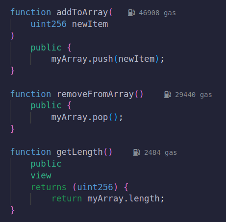
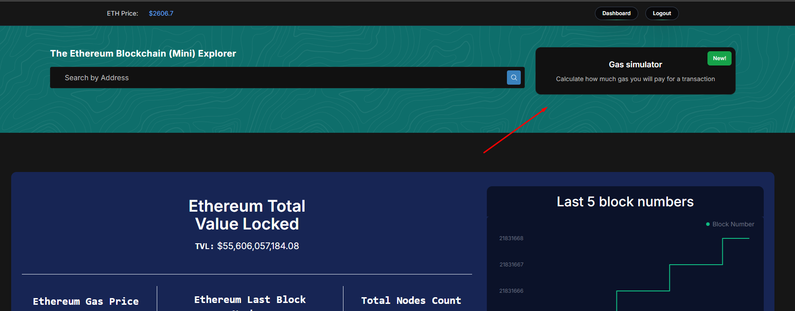
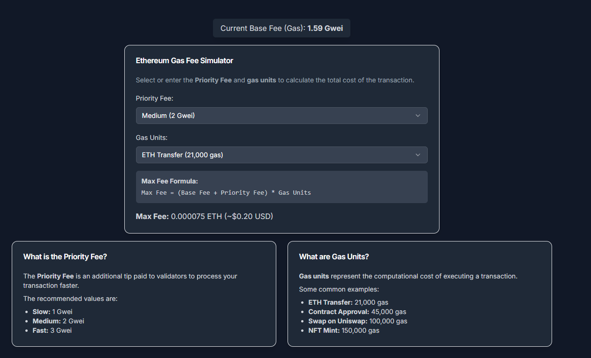
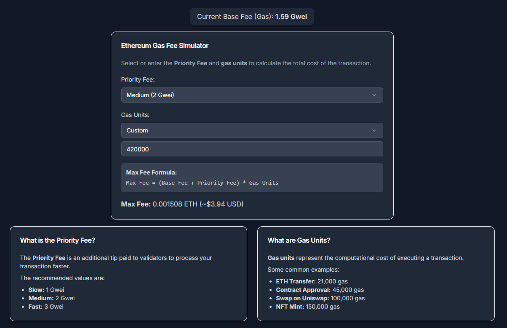

## 1. Introducción

Ethereum no solo revolucionó el concepto de blockchain al introducir contratos inteligentes, sino que también transformó la forma en que se gestionan y pagan las tarifas de transacción. El “gas” es el mecanismo que asegura que cada operación tenga un costo computacional, previniendo abusos y garantizando la seguridad de la red. Con la implementación de EIP‑1559 en agosto de 2021 se pasó de un sistema de subasta de primer precio a un modelo híbrido, en el que se separa el costo entre una Tarifa Base (automática y quemada) y una Propina o Priority Fee (opcional). En este artículo, exploraremos desde los conceptos básicos hasta estrategias avanzadas y simulaciones en tiempo real para predecir y optimizar el gasto en gas.

Este contenido tiene como objetivo:

- Educar sobre el funcionamiento interno del gas en Ethereum.
- Desglosar cómo EIP‑1559 redefine el modelo de tarifas.
- Presentar métodos y herramientas para predecir el costo del gas.
- Mostrar el simulador desarrollado como public good, permitiendo a los usuarios y desarrolladores entender y anticipar el comportamiento de las tarifas.

## 2. Fundamentos del gas en Ethereum

### 2.1. ¿Qué es el gas en Ethereum?

El gas es la unidad que mide el trabajo computacional necesario para ejecutar operaciones en la red de Ethereum. Cada transacción o interacción con un smart contract consume cierta cantidad de gas, cuyo costo se expresa en Gwei (una milmillonésima de un ETH). Este mecanismo evita que se saturen los recursos de la red y garantiza que quienes consuman recursos paguen por ello.

### 2.2. Gas Limit vs. Gas Price

- **Gas Limit:** Es la cantidad máxima de gas que un usuario autoriza para una transacción. Define el “techo” de recursos que se pueden consumir.
- **Gas Price:** Es el precio que se paga por cada unidad de gas, expresado en Gwei.

### 2.3. La estructura de tarifas según EIP‑1559

EIP‑1559 introdujo tres parámetros clave:

- **Tarifa Base (Base Fee):**
  - Determinada automáticamente por el protocolo (Ethereum) en función del nivel de congestión de la red.
  - Se ajusta cada bloque (aproximadamente cada 15 segundos) en función de si el bloque anterior estuvo más o menos lleno que un objetivo predefinido (usualmente el 50% de la capacidad).
  - Se quema, es decir, se elimina de la circulación, lo que introduce una presión deflacionaria en ETH.
- **Propina o Priority Fee:**
  - Es el incentivo adicional que el usuario añade para que su transacción sea priorizada por los validadores
  - Si se compite por la inclusión rápida, se recomienda aumentar este valor.
- **Max Fee (Tarifa Máxima):**
  - Es el tope máximo que el usuario está dispuesto a pagar por unidad de gas.

### 2.4. Mecanismo de ajuste del Base Fee y gasUsedRatio

El Base Fee se actualiza automáticamente en función de la proporción de gas usado en el bloque anterior (gasUsedRatio). Si un bloque está por encima del 50% de su capacidad, la tarifa aumenta (hasta un máximo del 12.5% por bloque); si está por debajo, disminuye. Este mecanismo hace que la tarifa sea más predecible y responda de forma dinámica a la demanda transaccional.

## 3. Factores que determinan el costo del gas

### 3.1. Congestión de la red

La cantidad de transacciones pendientes (mempool) y la actividad en la red influyen directamente en el ajuste del Base Fee. Durante periodos de alta demanda (por ejemplo, lanzamientos de NFT o eventos DeFi), los bloques se llenan más rápido, lo que incrementa la tarifa base.

### 3.2. Complejidad de las transacciones

No todas las transacciones consumen la misma cantidad de gas. Las interacciones simples (como una transferencia de ETH) consumen alrededor de 21,000 unidades de gas, mientras que los contratos inteligentes complejos pueden requerir cientos de miles o incluso millones de unidades, dependiendo de la cantidad de operaciones que ejecuten.

### 3.3. Volatilidad del precio de ETH

La relación entre el costo del gas (en Gwei) y el precio de ETH en dólares afecta el costo real de una transacción. En momentos de alta volatilidad, puede haber un impacto en el comportamiento de la red y en la rapidez con la que se ajustan las tarifas.

## 4. Métodos y herramientas para predecir tarifas de gas

### 4.1. Análisis de datos históricos

Herramientas como la API **eth_feeHistory** permiten obtener datos de los últimos bloques (gasUsed, Base Fee, percentiles de Priority Fee) y construir modelos predictivos. Por ejemplo, se puede calcular la media de la Priority Fee en ciertos percentiles para estimar una tarifa adecuada para cada nivel de prioridad.

Ejemplo de código y análisis se encuentra en la [guía de Alchemy](https://docs.alchemy.com/docs/how-to-build-a-gas-fee-estimator-using-eip-1559)

### 4.2. Modelos teóricos y simulaciones

Se han desarrollado modelos teóricos —incluyendo enfoques basados en algoritmos de aumento aditivo y disminución multiplicativa (AIMD)— para ajustar dinámicamente el Base Fee en respuesta a cambios en la demanda. Estudios han evaluado la efectividad de EIP‑1559 y proponen mejoras para suavizar las oscilaciones inter-bloque.

Por ejemplo, investigaciones como “Empirical Analysis of EIP‑1559: Transaction Fees, Waiting Time, and Consensus Security” muestran que, aunque EIP‑1559 mejora la experiencia del usuario y reduce tiempos de espera, las oscilaciones pueden ser intensas en periodos de demanda.

[arxiv.org](https://arxiv.org/abs/2201.05574)

### 4.3. Comparativa de estimadores

Mientras algunos clientes (como Geth y MetaMask) ya implementan estimaciones internas, construir un estimador propio utilizando datos en tiempo real puede ofrecer flexibilidad. Se pueden comparar las estimaciones manuales obtenidas a partir de percentiles históricos con las sugeridas por el cliente para validar y ajustar el modelo predictivo. Tambien si estamos desarrollando nuestro propio smart contract, la herramienta [Remix](http://remix.ethereum.org/) nos da un estimado de cuanto gas cuesta interactuar con una función en particular de nuestro contrato. (podemos verlo al lado del nombre de la función)

<figure><figcaption>
Funciones para interactuar con un Array en Solidity
</figcaption></figure>

Esto nos es de utilidad, ya que en el simulador que desarrollamos, podemos ingresar valores custom de gas para estimar cuanto nos puede costar en tiempo real interactuar con la misma.

## 5. Simulación en tiempo real de tarifas de gas

### 5.1. Diseño y arquitectura del simulador

El simulador desarrollado se basa en la integración de datos históricos y en modelos dinámicos de ajuste de tarifas. La idea es replicar en tiempo real la evolución del Base Fee y la distribución de las Priority Fees según la congestión y el comportamiento del mercado.

### 5.2. Flujo de trabajo

El proceso del simulador se resume en los siguientes pasos:

1. **Recopilación de datos:** Se consulta la API de Ethereum para obtener el historial de bloques recientes y sus métricas (gasUsed, Base Fee, Priority Fee).
2. **Procesamiento y análisis:** Se transforman los datos (por ejemplo, convertir de hexadecimal a numérico) y se agrupan por bloque para extraer tendencias.
3. **Predicción:** Se calcula la estimación del gas a partir de los datos proporcionados y se añade el Base Fee del ultimo bloque para obtener el costo total estimado.
4. **Simulación en tiempo real:** Se actualiza la predicción conforme se confirman nuevos bloques, ajustando el modelo de acuerdo con la variabilidad observada en el current gas fee y el precio de ETH.

Un ejemplo de implementación se encuentra en el proyecto [Etherscaneitor](https://frontend-etherscaneitor-production.up.railway.app/) donde todo el codigo es open source, asi que si tienes alguna mejora o recomendación, no dudes en abrir una Pull request!

<figure><figcaption>
Pagina principal etherscaneitor
</figcaption></figure>

<figure><figcaption>
Simulador de Gas
</figcaption></figure>

<figure><figcaption>
Simulador de Gas ingresando gas units personalizadas
</figcaption></figure>

### 5.3. Casos de uso y ejemplos prácticos

El simulador permite:

- Visualizar en tiempo real la evolución del Base Fee y la variabilidad en el Priority Fee ingresada por el usuario, permitiendo al mismo elegir entre (baja, media, agresiva).
- Probar estrategias de optimización, como esperar a bloques de menor congestión o ajustar manualmente la Priority Fee.

Podes probarlo directamente en el siguiente link : [Gas simulator](https://frontend-etherscaneitor-production.up.railway.app/simulator)

## 6. Estrategias prácticas para optimizar el pago de gas

### 6.1. Uso del simulador como public good

El simulador se pone a disposición de la comunidad como una herramienta de public good. Tanto usuarios como desarrolladores pueden utilizarlo para:

- Evitar pagar tarifas excesivas.
- Planificar la ejecución de transacciones en momentos de baja congestión.
- Ajustar parámetros de transacción para maximizar la probabilidad de inclusión sin sobrepagar.

### 6.2. Estrategias de reducción de costos

Entre las estrategias que se pueden aplicar destacan:

- **Transacciones en horarios de baja congestión:** Analizar la tendencia de la red para identificar momentos en los que el Base Fee es menor.
- **Optimización de smart contracts:** Reducir la complejidad y optimizar el código para consumir menos gas. (Remix puede ser de gran utilidad)

### 6.3. Recomendaciones para ajustar tarifas de forma inteligente

Para transacciones críticas (por ejemplo, en NFT drops o swaps en DeFi) se recomienda:

- Establecer un Max Fee que incluya un “factor de seguridad” (usualmente el doble del Base Fee actual más la Priority Fee) para evitar que la transacción quede rezagada en periodos de alta demanda.
- Utilizar la opción “agresiva” cuando se requiera alta prioridad, pero revisando que el costo sea aceptable.
- Complementar con el simulador, lo que permite ajustar los parámetros en función de la evolución en tiempo real.

## 7. Perspectivas futuras y evolución del modelo de tarifas

### 7.1. Innovaciones y propuestas de mejora

Aunque EIP‑1559 ha supuesto un gran avance en la transparencia y previsibilidad del mercado de tarifas, la investigación continua sugiere posibles mejoras:

- **Mecanismos de ajuste variable:** Estudios de 2023 proponen reglas AIMD (Aumento Aditivo, Disminución Multiplicativa) que se adapten mejor a picos de demanda y reduzcan las oscilaciones inter-bloque.
- **Modelos multivariables:** La integración de otros factores (como la interacción entre recursos en la red) para optimizar dinámicamente la tarifa.

Un estudio titulado “Optimal Dynamic Fees for Blockchain Resources” demuestra cómo estos enfoques pueden mejorar la eficiencia del modelo de tarifas: [arxiv.org](https://arxiv.org/abs/2309.12735)

## 8. Conclusión y recursos adicionales

### 8.1. Resumen de aprendizajes

Hemos visto que:

- El gas es esencial para el funcionamiento de Ethereum, y su coste se determina por la interacción entre el Base Fee, la Priority Fee y el Gas usado.
- EIP‑1559 ha introducido un modelo más predecible y deflacionario que mejora la experiencia del usuario, aunque no elimina por completo la volatilidad en momentos de alta demanda.
- La utilización de datos históricos y simulaciones permite predecir y optimizar el pago de gas, haciendo posible ajustar estrategias en tiempo real.

### 8.2. Glosario de términos técnicos

- **Gas:** Unidad de medida para el trabajo computacional en Ethereum.
- **Gwei:** Una unidad de medida (1 Gwei = 10 ⁻ ⁹ ETH) utilizada para expresar precios del gas.
- **Tarifa Base (Base Fee):** Tarifa automática que se ajusta en función de la congestión y se quema.
- **Priority Fee:** Incentivo adicional para los validadores.
- **Max Fee:** Tope máximo dispuesto a pagar por el usuario por cada unidad de gas.
- **EIP‑1559:** Propuesta de mejora que redefine el modelo de tarifas en Ethereum.
- **Layer 2:** Soluciones que operan sobre la cadena principal para aumentar escalabilidad y reducir costes.

### 8.3. Fuentes, bibliografía y enlaces

- Alchemy Docs – How to Build a Gas Fee Estimator using EIP‑1559
  [docs.alchemy.com](https://docs.alchemy.com/docs/how-to-build-a-gas-fee-estimator-using-eip-1559)
- Blocknative – EIP‑1559 Gas Fees: Base Fee, Priority Fee, & Max Fee
  [blocknative.com](https://www.blocknative.com/blog/eip-1559-fees)
- OneSafe Blog – Nuevas Tarifas de Gas en Ethereum
  [onesafe.io](https://www.onesafe.io/es/blog/eip-1559-procesamiento-de-pagos-de-tarifas-de-gas-ethereum)
- MetaMask – How EIP‑1559 Gas Fees Work
  [metamask.io](https://metamask.io/1559/)
- “Optimal Dynamic Fees for Blockchain Resources”
  [arxiv.org](https://arxiv.org/abs/2309.12735)
