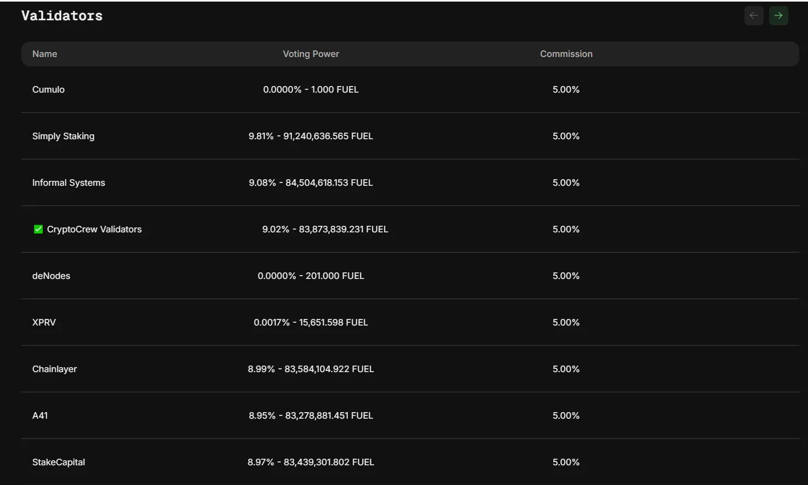

# Funcionamiento y Perspectivas a Futuro

## Introducción

En diciembre de 2020, Fuel V1 se convirtió en el primer rollup optimista en Ethereum. No solo eso, sino que también alcanzó el estado "STAGE 2" en L2Beat.

<figure><figcaption>
<a href="https://l2beat.com/scaling/summary">https://l2beat.com/scaling/summary</a>
</figcaption></figure>

Fuel V1 fue una verdadera prueba de concepto que demostró una forma innovadora de brindar escalabilidad utilizando un modelo de ejecución distinto al de la EVM: un sistema de ejecución paralelizable basado en UTXO, capaz de alcanzar un alto número de TPS sin comprometer la descentralización.

Cuatro años después, en un ecosistema que, por múltiples razones prácticas, tiende a la centralización, Fuel lanza Ignition, una arquitectura escalable diseñada para ejecutarse en hardware accesible, permitiendo que cualquiera pueda participar en la validación desde casa.

En términos técnicos, Fuel Ignition es una solución Layer 2 de alto rendimiento que aborda dos problemas clave en blockchain: la sostenibilidad del estado y la ejecución eficiente. Funciona como un rollup de Ethereum, utilizando la Fuel Virtual Machine (FuelVM) y una arquitectura centrada en tokens nativos y basada en UTXO. Al igual que la mayoria del ecosistema de L2s, la propuesta de valor de Fuel Ignition es ofrecer un nivel de seguridad equivalente al de Ethereum, pero con transacciones rápidas y de bajo costo.

Ahora bien, si al leer hasta acá te quedaron varias palabras rebotando en la cabeza (UTXO, FuelVM, sostenibilidad del estado... ¿qué?), no te preocupes, no estás solo. Justamente, la primera parte de este artículo estará dedicada a desglosar todos estos términos y explicar qué significan realmente. Luego, en la segunda parte, nos pondremos manos a la obra y veremos cómo levantar un nodo de Fuel Ignition en la práctica.

## **FuelVM:**

### Motivaciones

Las soluciones Layer 2 han demostrado ser una respuesta efectiva a los problemas de escalabilidad en Ethereum, pero siguen teniendo sus limitaciones. Un problema recurrente en el ecosistema actual es la obsesión por la compatibilidad con la EVM. Muchas L2 buscan replicar la Ethereum Virtual Machine (EVM) en diferentes contextos sin cuestionar si realmente es la mejor opción para las necesidades actuales.


En blockchains de propósitos generales, la máquina virtual (VM) es el componente que interpreta el código de los contratos inteligentes y ejecuta las transiciones de estado según las reglas definidas en ese código. En otras palabras, la VM es el sistema operativo de una blockchain de smart contracts.


Si bien la compatibilidad con la EVM facilita la adopción por parte de los desarrolladores y permite aprovechar la infraestructura existente, también arrastra consigo ineficiencias y limitaciones del diseño original. Básicamente, seguimos construyendo sobre una base que no fue pensada para la ejecución paralela ni para un alto rendimiento. Afortunadamente, en los últimos años ha habido un aumento en la exploración de máquinas virtuales alternativas, buscando innovar en la capa de ejecución y romper con los [cuellos de botella tradicionales.](https://x.com/WestieCapital/status/1770853327527444483) Algunos ejemplos incluyen la [Solana Virtual Machine (SVM)](https://solana.com/developers/evm-to-svm), que permite el procesamiento paralelo de transacciones para mejorar la eficiencia,  [MoveVM](https://medium.com/movementlabsxyz/the-movevm-a-new-era-of-blockchain-precision-and-safety-a1b5bd4a65ea), originalmente diseñada para el proyecto Libra de Facebook, que introduce innovaciones en la gestión de recursos y CairoVM de Starknet.

Sin embargo, no todas de estas alternativas ha sido diseñada específicamente para optimizar la ejecución de un rollup de Ethereum.

Más allá de estos desafíos de ejecución, otro problema clave en Ethereum es la gestión del estado global.

[Vitalik Buterin lo define de la siguiente manera](https://hackmd.io/@vbuterin/state_size_management#Introduction-What-is-the-problem):

> "El estado se refiere a la información que un nodo debe conservar para poder procesar nuevos bloques y transacciones entrantes. Se suele contrastar con el historial, que es la información sobre eventos pasados que puede almacenarse para su posterior retransmisión y archivo, pero que no es estrictamente necesaria para continuar procesando la cadena."

Este crecimiento del estado no es solo un desafío para Ethereum Layer 1, sino también para la mayoría de las Layer 2. Muchos rollups no abordan adecuadamente este problema, lo que con el tiempo genera ineficiencias y costos crecientes. De hecho, los rollups enfrentan los mismos problemas de crecimiento del estado que Ethereum, algo que el propio [Vitalik enfatizó](https://hackmd.io/@vbuterin/state_size_management#Rollups-will-need-and-can-use-the-same-solutions):

> "Los rollups no eliminan la necesidad de preocuparse por el tamaño del estado; de hecho, los rollups tienen problemas de tamaño del estado exactamente del mismo tipo que la cadena de Ethereum."

Esta realidad deja en evidencia una gran oportunidad para el diseño de nuevas soluciones que no solo optimicen la ejecución, sino que también aborden el crecimiento del estado de manera estructural. Superar las limitaciones impuestas por las soluciones actuales sin comprometer la seguridad es un desafío crítico.

Aquí es donde entra en juego FuelVM, diseñada desde sus raíces para abordar estos problemas de manera integral. FuelVM no solo introduce ejecución eficiente, sino que también incorpora mecanismos que gestionan el crecimiento del estado, evitando las mismas limitaciones que afectan tanto a Ethereum como a otros rollups. Ahora que entendemos el contexto y los desafíos que Fuel busca resolver, es momento de meternos de lleno en cómo funciona FuelVM. Vamos a ver cómo su modelo de transacciones basado en UTXO permite una ejecución más eficiente utilizando ejecución paralela.

### Ejecución en Paralelo de Transacciones a través de UTXOs

#### UTXOs

En el ecosistema de Bitcoin, hablar de UTXOs es cosa de todos los días (de hecho, en la comunidad hispanohablante es común pronunciarlo "uchos"). Sin embargo, en Ethereum no es así. La razón es simple: Ethereum funciona con un sistema basado en cuentas, mientras que Bitcoin utiliza UTXOs.

Mucha charla, pero… ¿qué son exactamente los UTXOs?

La traducción es Unspent Transaction Outputs (salidas de transacción no gastadas), pero una buena forma de imaginarlos es pensar en monedas. Mientras que en Ethereum manejamos cuentas con saldos, en Bitcoin lo que realmente gestionamos son monedas individuales (UTXOs), que pueden tener cualquier denominación.

Veamos un ejemplo:

**Estado inicial**

* Lola posee un UTXO de 1 BTC y otro de 0.1 BTC.
* Pepe no posee ningún UTXO.

Ahora, Lola le envía a Pepe 0.6 BTC:

<figure><figcaption></figcaption></figure>

Estado final

* Pepe ahora tiene un único UTXO de 0.6 BTC.
* Lola sigue teniendo el UTXO de 0.1 BTC que no usó y, además, ahora tiene un UTXO de 0.4BTC (es decir, el cambio por comodidad si descontar la comisión de la red).

Si quieren entender mejor este modelo, pueden revisar el siguiente enlace, que incluye un simulador muy interesante:



#### Ejecución en paralelo

La ejecución en paralelo es una característica fundamental del modelo de UTXOs. Este modelo permite que múltiples transacciones se procesen simultáneamente, siempre que no intenten gastar los mismos UTXOs. En Bitcoin, cada transacción opera sobre su propio conjunto de inputs y outputs, lo que las hace en gran medida independientes entre sí.


La ejecución en paralelo es una característica fundamental del modelo de UTXOs. Este modelo permite que múltiples transacciones se procesen simultáneamente, siempre que no intenten gastar los mismos UTXOs. En Bitcoin, cada transacción opera sobre su propio conjunto de inputs y outputs, lo que las hace en gran medida independientes entre sí.


El modelo de ejecución en paralelo de transacciones es clave para la eficiencia y escalabilidad de Fuel. Básicamente, en lugar de procesar las tareas en secuencia, Fuel las divide en subtareas y las ejecuta simultáneamente en varias unidades de procesamiento. Esto aumenta el rendimiento y reduce la latencia. Para lograr esto, Fuel se basa en dos conceptos clave:

1. El modelo UTXO, que, como ya vimos en Bitcoin, permite que cada transacción use salidas de transacción individuales en lugar de modificar un saldo global.
2. Las listas de acceso (Access Lists), que categorizan a cada transacción en en Read-Only (Solo lectura), Write-Destroy (Escritura y destrucción) y Write-Create (Escritura y creación). Ademas debe especificar de antemano todos los recursos con los que interactuará, incluyendo UTXOs e identificadores de contratos..

Al analizar estas listas antes de la ejecución, la FuelVM puede identificar qué transacciones no comparten recursos en común y ejecutarlas en paralelo, maximizando la eficiencia.

**¿Cómo funciona esto en la práctica?**

Cuando envías una transacción en Fuel, esta no solo dice qué querés hacer, sino también qué datos va a modificar. Para que quede más claro, veamos qué compone una transacción en FuelVM:

* Inputs: Lista de todos los UTXOs (salidas de transacción no gastadas) que la transacción usará + datos para desbloquearlos.
* Outputs: Define los nuevos UTXOs que se crearán después de la transacción.
* Gas: Precio del gas y límites de consumo.
* Witnesses: Firma digital y metadatos para la autorización.

El punto clave está en la lista de inputs, que deja claro qué partes del estado tocará cada transacción. Si la FuelVM detecta que hay transacciones que no interactúan con los mismos UTXOs, entonces puede ejecutarlas en paralelo sin problema.

Ejemplo: Lola y Pepe enviando tokens

**Veamos un caso sencillo para ilustrarlo:**

* Lola le envía 1 ETH a Carlos.
* Pepe le envía 100 USDC a David.

Como cada transacción usa UTXOs distintos, no hay razón para que una tenga que esperar a la otra. Así es como Fuel procesa ambas en paralelo:

1. Lola inicia su transacción con una lista de acceso de solo lectura para su saldo de ETH y una lista de escritura y destrucción para el UTXO de 1 ETH.
2. Pepe inicia su transacción con una lista de acceso de solo lectura para su saldo de USDC y una lista de escritura y destrucción para el UTXO de 100 USDC.
3. FuelVM analiza ambas transacciones y confirma que no hay superposición en los recursos que tocan.
4. Como no hay conflictos, FuelVM ejecuta ambas transacciones al mismo tiempo.
5. Carlos recibe su ETH y David sus USDC simultáneamente.

¿Por qué esto es tan importante?

En Ethereum, todas las transacciones se procesan una por una, lo que genera cuellos de botella y altos costos de gas. En Fuel, si dos transacciones no tocan los mismos UTXOs, se ejecutan en paralelo sin problemas. Esto no solo mejora la capacidad de procesamiento, sino que también mejora el problema de escalabilidad.

### Activos nativos en Fuel

En Ethereum, la única moneda nativa es ETH. Si queremos representar otros activos, necesitamos smart contracts que gestionen los saldos, como es el caso de los tokens ERC-20. Esto significa que cada transacción con tokens ERC-20 implica la ejecución de código dentro de un smart contract, lo que consume más gas y requiere pasos adicionales, como establecer aprobaciones antes de transferir fondos.

Fuel adopta un enfoque diferente: permite que los activos sean nativos dentro de la máquina virtual. Esto significa que los desarrolladores pueden implementar activos mediante smart contracts si lo desean, pero también tienen la opción de que la FuelVM los gestione de forma nativa, sin necesidad de contratos adicionales.

### **Predicados: otra forma de autorizar transacciones**

En las EVM estamos acostumbrados a que si querés gastar fondos, necesitás una clave privada que te permita firmar la transacción. En Ethereum, por ejemplo, las transacciones siempre deben provenir de una cuenta externa (EOA) o de un smart contract que implemente su propia lógica de autenticación (como una smart contract wallet). Esto impone ciertas limitaciones, ya que los contratos no pueden iniciar transacciones por sí mismos y siempre dependen de un EOA.

Fuel introduce un concepto nuevo: los predicados. Un predicado no es un smart contract, pero permite definir reglas personalizadas para autorizar transacciones. En lugar de depender de una clave privada, un predicado establece condiciones que deben cumplirse para que una transacción pueda ejecutarse.

Desde afuera, un predicado se comporta como una dirección normal, similar a una cuenta en Ethereum. Se pueden enviar y recibir monedas a un predicado, pero en lugar de requerir una firma privada para gastarlas, se necesita una transacción que cumpla con la condición establecida en el predicado.

Un detalle importante es que los predicados no leen el estado global de la blockchain, lo que evita problemas como ataques de denegación de servicio (DoS). Su evaluación siempre es determinística, lo que significa que si una transacción cumple con la condición, será válida en cualquier momento, sin importar qué haya pasado en la red entre medio.

Lo interesante es que los predicados abren la puerta a nuevas formas de automatización en blockchain. Por ejemplo, un usuario podría configurar una transacción para que se ejecute automáticamente cuando se cumpla una determinada condición, como que el precio de un token alcance cierto valor. En cuanto la condición se cumple, la transacción se procesa sin intervención manual, todo on-chain y sin necesidad de terceros.

Además, los predicados en Fuel no contribuyen al problema del crecimiento descontrolado del estado. Una vez que se gastan, pueden eliminarse sin dejar rastro en la blockchain, lo que mejora la eficiencia de la red.

En resumen, los predicados son una forma innovadora de autorizar transacciones sin depender de claves privadas ni modificar el estado global. Esto no solo simplifica muchas interacciones en blockchain, sino que también permite nuevos modelos de ejecución más eficientes y flexibles.

### **Sway: el lenguaje de programación para FuelVM**

Para sacar el máximo provecho de FuelVM, se necesitaba un lenguaje diseñado específicamente para este entorno. Así nace Sway, un lenguaje de programación especializado en blockchain (DSL - Domain-Specific Language) creado para la Fuel Virtual Machine.

Sway está basado en Rust, por lo que hereda su eficiencia y seguridad, pero con una sintaxis adaptada a blockchain, eliminando la necesidad de escribir código innecesariamente repetitivo. Esto permite desarrollar smart contracts más claros y optimizados, aprovechando las ventajas de Fuel, como la ejecución en paralelo, los activos nativos y los predicados, sin las restricciones que impone la EVM.

Si quieren profundizar más en los detalles técnicos de la FuelVM, su arquitectura y todas las capacidades que ofrece, pueden dirigirse directamente a la documentación oficial de Fuel, donde encontrarán explicaciones detalladas, ejemplos y guías para desarrolladores.

## **Staking y Validadores en Fuel: Descentralizando la Secuenciación**

Hoy en día, la mayoría de los rollups dependen de secuenciadores centralizados. Si bien esto permite optimizar la eficiencia, también abre la puerta a problemas serios: riesgo de censura, falta de equidad y vulnerabilidades en liveness.

Fuel está abordando este problema desde la raíz con un plan claro:

1. Descentralizar la red de proponentes de bloques.
2. Descentralizar el proceso de construcción de bloques.
3. Aumentar progresivamente el número total de proponentes y constructores.

El secuenciador de Fuel utiliza un mecanismo de prueba de participación (PoS) basado en Tendermint, lo que permite que cualquier usuario pueda delegar sus tokens $FUEL a los proponentes del secuenciador y recibir recompensas por staking. Actualmente, el sistema se encuentra en la Fase 0, que ya ha sido completada. En esta etapa, se establecieron 12 proponentes del secuenciador e introdujeron las primeras medidas de seguridad. Los validadores fueron seleccionados directamente por el equipo de Fuel, marcando el punto de partida para la progresiva descentralización del sistema.

<figure><figcaption></figcaption></figure>

<figure><figcaption></figcaption></figure>

La idea es simple: mientras más descentralizada sea la secuenciación, más resistente es la red. No se trata solo de performance, sino de evitar que un solo actor pueda manipular la inclusión de transacciones.

El objetivo final es claro: una secuenciación completamente descentralizada y permissionless. Esto no solo mejora la tolerancia a fallos, sino que también refuerza la resistencia a la censura y garantiza un sistema más robusto a largo plazo.

## **Full Nodes en Fuel: ¿Para qué sirven y por qué vamos a montar uno?**

Hasta ahora hemos hablado sobre ejecución, secuenciación y escalabilidad, pero ¿qué pasa con la verificación de la red? Ahí es donde entran en juego los Full Nodes.

En Fuel, cualquier persona puede ejecutar un Full Node utilizando el software fuel-core. A diferencia de un Block Builder, un Full Node no puede construir bloques. Su trabajo es otro:

* Recibir actualizaciones de Layer 2 desde otros nodos.
* Re-ejecutar los bloques localmente para asegurarse de que todo cuadra.
* Verificar el estado de la blockchain sin depender de terceros.

Un detalle interesante es que los Full Nodes permiten enviar pruebas de fraude (fraud proofs) en caso de que haya alguna irregularidad. Básicamente, es una forma de mantener a raya a los secuenciadores y asegurarse de que no hagan trampa.

Otra función clave es que cada Full Node ofrece su propio endpoint GraphQL, lo que permite enviar transacciones a la red sin depender de un proveedor externo. De hecho, todos los servicios que interactúan con Fuel a través de GraphQL operan su propio Full Node para garantizar acceso al estado más actualizado de la red.

En la segunda parte de este artículo, vamos a ver cómo instalar y correr un Full Node de Fuel. De esta manera, no solo entenderemos mejor su funcionamiento, sino que también veremos cómo conectarnos directamente a la red sin intermediarios.

## **Fuel Ignition en números**


#### **Estado actual del ecosistema**

Para poner en contexto las cifras que vamos a mencionar, es útil mencionar los números que se pueden alcanzar hoy en un escenario ideal con la tecnología existente. Sin embargo, hay que tener en cuenta que estos valores suelen estar inflados y la realidad suele ser inferior.

#### **Rollups que usan Ethereum DA**

* ≥1,000 TPS (Starknet).

#### **L2s con DA alternativas**

* 12,000 a 14,000 TPS (Eclipse).

#### **Otras métricas importantes**

* Cantidad de nodos _físicos_ que construyen bloques: ≥8,000 (Ethereum).
* Tiempo de bloques: ≤400 ms (Solana).

Estos valores representan un estimado del estado actual del arte en algunos términos populares de escalabilidad y rendimiento en blockchain.


Fuel Ignition es un rollup sobre Ethereum que busca mejorar la escalabilidad sin comprometer la seguridad de la red. Actualmente, alcanza los 600 TPS con bloques de 1 segundo, pero su diseño permite escalar aún más.

El objetivo es llegar a 5,000 TPS con la infraestructura de Ethereum DA actual y aprovechar futuras mejoras en la disponibilidad de datos para ampliar aún más su capacidad. Según el equipo de Fuel, esta cifra ya es alcanzable hoy, aunque su implementación real dependerá del crecimiento de la red y de las necesidades de los usuarios.

## **Futuro de Fuel**

Un desafío recurrente en la industria es que, a medida que las aplicaciones descentralizadas crecen, las soluciones de escalabilidad pueden volverse insuficientes. Algunos equipos ya han señalado que 5,000 TPS podrían no ser suficientes para ciertos casos de uso más exigentes.

Ante esta demanda, Fuel ha estado trabajando en una nueva capa de ejecución que busca llevar la escalabilidad aún más lejos.

Por ahora, este nuevo desarrollo no tiene un nombre oficial y es referido por el equipo de Fuel como **"Redacted"**. A diferencia de Ignition, esta nueva capa no sigue el mismo enfoque y parece estar orientada a casos de uso donde la demanda de rendimiento es mucho mayor.

El proyecto aún está en desarrollo y no hay detalles concretos sobre su implementación final. Sin embargo, Fuel ha dejado abierta la posibilidad de que la comunidad participe en su evolución, incluyendo la elección de un nombre definitivo.

#### **Fuel Sequencer: La apuesta por la descentralización real**

La meta es ambiciosa: crear la capa de secuenciación más descentralizada. Para lograrlo, se necesita escalar en dos frentes:

1. Aumentar el número de proponentes (validadores que ordenan las transacciones).
2. Expandir el throughput (cantidad de datos que el secuenciador puede manejar por segundo).

Si el objetivo es que el secuenciador gestione toda la data en bruto—ya sea para interoperabilidad, comunicación entre capas o compromisos criptográficos—la infraestructura tiene que ser masiva y escalable.

El plan es llevar la red a 10,000 proponentes, pero sin caer en la trampa de intentar que todos validen cada bloque. En su lugar, Fuel implementará arquitecturas de comités, un enfoque más eficiente que permite distribuir la carga y mantener la velocidad sin sacrificar descentralización.

En pocas palabras, el Fuel Sequencer no es solo un "componente técnico". Es el corazón de la resistencia a la censura y la escalabilidad de Fuel.

Para que todo este ecosistema funcione, hay una base económica detrás: $FUEL. Este token no solo es un mecanismo de staking en el secuenciador, sino que busca sustentar todo el sistema criptográfico y económico de Fuel.

Los mecanismos de $FUEL aplican tanto en Ignition como en Redacted, lo que garantiza que ambas capas sigan funcionando de manera eficiente y alineada con los incentivos de la red.

#### **Descentralización Progresiva: Un proceso por etapas**

Fuel está avanzando de forma escalonada en tres fases clave:

* Fase 0 _(ya completada)_: Se establecieron 12 proponentes del secuenciador y se implementaron las primeras medidas de seguridad.
* Fase 1: Se centrará en la descentralización del proceso de construcción de bloques, reduciendo la dependencia de un grupo limitado de actores y reforzando la seguridad.
* Fase 2: Buscará escalar significativamente la red, aumentando el número de proponentes y agregando funciones de seguridad avanzadas.

Este es solo el inicio del camino hacia una red completamente descentralizada. Más allá de optimizar la secuenciación, Fuel apunta a construir una infraestructura que sea resistente, accesible y confiable a largo plazo.

## **Conclusión**

Fuel no es solo otra solución de escalabilidad; es una pila tecnológica completa diseñada para construir blockchains y aplicaciones descentralizadas con un enfoque moderno. Desde el inicio, su diseño ha estado orientado a abordar los desafíos actuales del ecosistema, sin comprometer la descentralización, la velocidad ni la eficiencia.

Lo que diferencia a Fuel de otras soluciones es su arquitectura desde la base:

* Una máquina virtual (FuelVM) personalizada, optimizada para blockchains modernas.
* Un modelo de transacciones basado en UTXO, que permite ejecución en paralelo y activos nativos sin las limitaciones del modelo de cuentas tradicional.
* Sway, un lenguaje que combina lo mejor de Rust y Solidity, adaptado específicamente para smart contracts en Fuel.
* Un ecosistema con herramientas que facilita el desarrollo de aplicaciones sobre esta infraestructura.
* Fuel Sequencer, que busca convertirse en la capa de secuenciación más descentralizada del ecosistema con 10,000 proponentes.
* Fuel Ignition, su Layer 2 en Ethereum, que aprovecha la seguridad de Ethereum con un diseño más escalable.

El futuro de Fuel no se detiene en Ignition. La necesidad de mayor rendimiento ha impulsado el desarrollo de una nueva capa de ejecución, aún sin nombre oficial, pero pensada para gaming, IA y otros casos de alto rendimiento.

Toda esta infraestructura está impulsada por $FUEL, el token que mantiene la economía del secuenciador y permite el staking dentro del ecosistema.

El camino no está terminado. Fuel ha diseñado un plan de descentralización progresiva, donde cada fase llevará la red un paso más cerca de su visión final: un sistema descentralizado, eficiente y con espacio para seguir innovando.

Si Fuel logra cumplir con estas promesas, estaremos frente a una de las arquitecturas más ambiciosas y flexibles en el mundo de las L2.
