# Mainnet Node

## Introducción:

Para esta guía, utilizaremos la versión precompilada del nodo, siguiendo las instrucciones de la [documentación oficial de Fuel](https://docs.fuel.network/guides/running-a-node/running-a-mainnet-node/).

Este método es el más rápido y sencillo, ya que evita la necesidad de compilar el código fuente manualmente. En pocos pasos, tendremos un nodo funcional y sincronizado con la red Ignition.

Si buscas mayor control sobre la instalación puedes compilarlo desde el repositorio oficial en [GitHub](https://github.com/FuelLabs/fuel-core). Sin embargo, para esta guía, nos enfocaremos en la opción más directa.

## **Requisitos para correr un nodo en mainnet**

Para mantener tu nodo operativo y sincronizado, estos son los **requerimientos mínimos y recomendados**:

| **Recurso**        | **Mínimo** | **Recomendado** |
| ------------------ | ---------- | --------------- |
| **Procesador**     | 2 Cores    | 8 Cores         |
| **Memoria RAM**    | 8 GB       | 16 GB           |
| **Almacenamiento** | 500 GB     | 1 TB            |

Nosotros usamos un CLOUD VPS 2 en Contabo, con almacenamiento de 600 GB utilizando el SO Ubuntu.



<figure>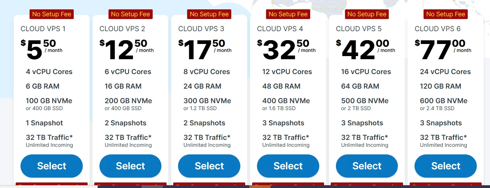<figcaption></figcaption></figure>

## Pasos

#### **1. Instalación del Toolchain de Fuel**

El primer paso es instalar el conjunto de herramientas necesarias para ejecutar un nodo. Para ello, utilizamos `fuelup`, el gestor de paquetes oficial de Fuel, ejecutando el siguiente comando:

```bash
curl <https://install.fuel.network> | sh
```

Esto descargará e instalará automáticamente las herramientas esenciales, incluyendo:

* `forc` → Compilador y CLI de Fuel.
* `forc-client` → Cliente para interactuar con la red.
* `forc-wallet` → Herramienta para gestionar cuentas y transacciones.
* `fuel-core` → El software del nodo.

Todos estos binarios se instalarán en `~/.fuelup/bin`.


**Advertencia**: Este comando ejecuta un script desde la web, así que asegúrate de que la misma no este comprometida xD


<figure>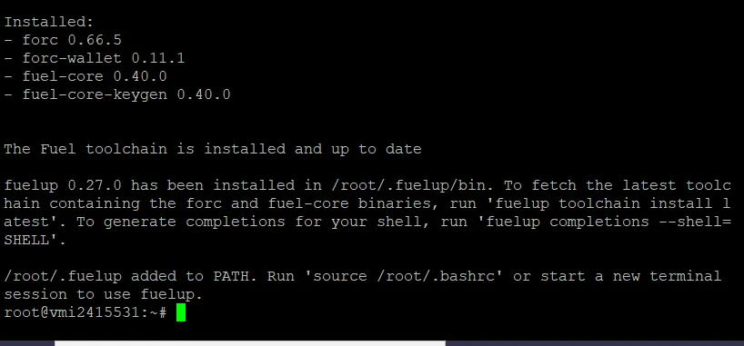<figcaption></figcaption></figure>

Esto significa que, aunque la instalación se completó, los binarios de Fuel no están disponibles en la sesión actual de la terminal. Para solucionar esto sin necesidad de reiniciar la terminal, simplemente ejecutamos:

```bash
source /root/.bashrc
```

Luego, para asegurarnos de que todo esté en orden, verificamos la versión instalada con:

```bash
fuel-core --version
```

Si el comando devuelve un número de versión, entonces la instalación fue exitosa y podemos continuar con la configuración del nodo.

<figure>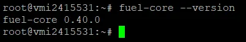<figcaption></figcaption></figure>

#### **2. Conexión con Ethereum**

Para que nuestro nodo de Fuel pueda interactuar con la red principal de Ethereum, es necesario obtener una **API Key** de un proveedor de RPC.

Los dos servicios más utilizados para esto son:

* [Infura](https://infura.io/)
* [Alchemy](https://www.alchemy.com/)

Una vez que generes tu API Key, deberás usar uno de estos endpoints:

```bash
Para Infura
<https://mainnet.infura.io/v3/{YOUR_API_KEY}>

# Para Alchemy
<https://eth-mainnet.g.alchemy.com/v2/{YOUR_API_KEY}>
```


**Asegúrate de usar la red Ethereum Mainnet.** Si configuras otra red como Sepolia, el relayer de Fuel **no podrá sincronizarse correctamente**. En esta guia usamos Alchemy.


<figure>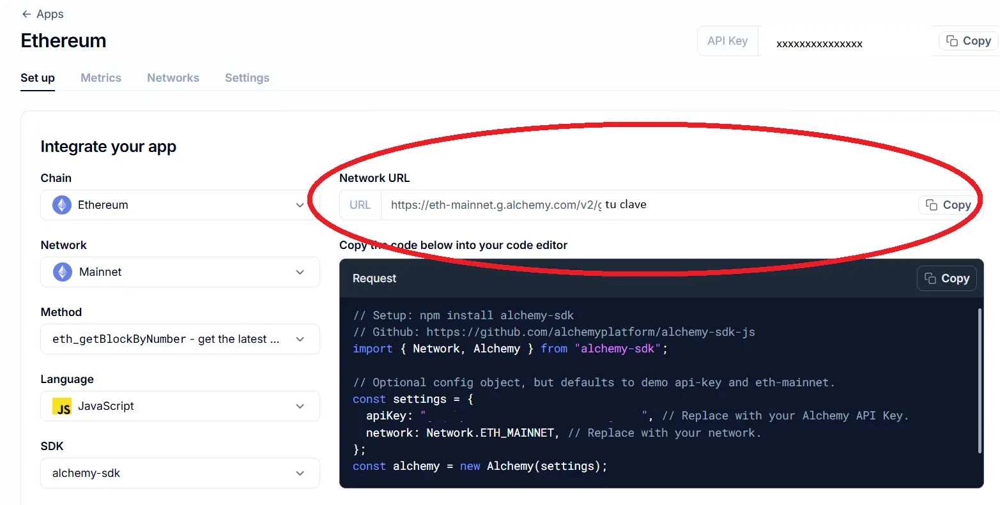<figcaption></figcaption></figure>

#### **3. Generación de Claves P2P**

Para que nuestro nodo pueda comunicarse con otros dentro de la red **Fuel**, necesitamos generar un **par de claves P2P**. Estas claves identifican nuestro nodo y le permiten participar en la red de manera segura.

El comando para generarlas es:

```bash
fuel-core-keygen new --key-type peering
```

Al ejecutarlo, obtendremos un resultado similar a este:

```json
{
  "peer_id":"16Uiu2HAmEtVt2nZjzpXcAH7dkPcFDiL3z7haj6x78Tj659Ri8nrs",
  "secret":"b0ab3227974e06d236d265bd1077bb0522d38ead16c4326a5dff2f30edf88496",
  "type":"peering"
}
```

* **peer\_id**: Es el identificador público del nodo en la red P2P de Fuel.
* **secret**: Es la clave privada y **nunca debe compartirse**.


**Importante** Guarda esta clave privada en un lugar seguro. Si la pierdes, tendrás que generar un nuevo par de claves y podrías afectar la conectividad de tu nodo.


#### **4. Configuración de la Cadena y Persistencia**

Para que nuestro nodo pueda operar de manera estable y almacenar su estado en disco, es necesario contar con los archivos de configuración de la cadena. Estos archivos contienen los parámetros que permiten que el nodo se conecte correctamente a la red **Fuel Ignition** y mantenga una copia local del estado de la blockchain.

La forma más sencilla de obtener estos archivos es clonando el repositorio oficial en un directorio de nuestra elección:

```bash
git clone <https://github.com/FuelLabs/chain-configuration.git>
```

<figure>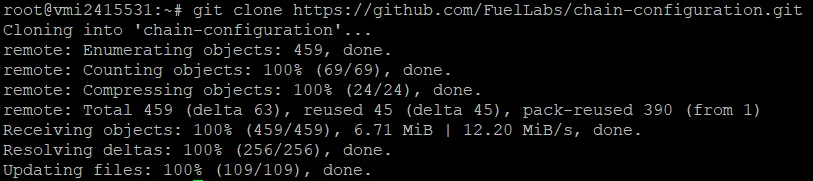<figcaption></figcaption></figure>

Esto creará una carpeta llamada `chain-configuration`, dentro de la cual se encuentra la configuración específica de **Ignition**, en la ruta:

```
/chain-configuration/ignition/
```

Es importante **recordar esta ubicación**, ya que más adelante necesitaremos referenciarla para que el nodo utilice los parámetros adecuados al ejecutarse. Con esto, nuestro nodo podrá **mantener su estado en disco y operar de manera persistente**, evitando descargas innecesarias y acelerando el proceso de sincronización cada vez que se inicie.

Podemos verificar las carpetas usando:

```bash
cd chain-configuration
ls
cd ..
```

<figure>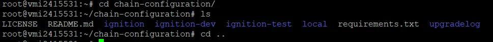<figcaption></figcaption></figure>

#### **5. Verificando la Última Versión del Toolchain**

Antes de continuar, es recomendable asegurarnos de que tenemos la última versión del **toolchain de Fuel** instalada. Mantenerlo actualizado garantiza que contemos con **todas las mejoras recientes, optimizaciones de rendimiento y correcciones de errores**.

Para actualizarlo, simplemente ejecutamos:

```bash
fuelup self update
```

Este comando buscará la versión más reciente y, si hay una nueva disponible, la descargará e instalará automáticamente.

<figure>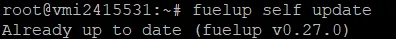<figcaption></figcaption></figure>

Es una buena práctica ejecutar esta actualización antes de configurar o ejecutar el nodo, ya que Fuel sigue en constante desarrollo y las versiones más recientes pueden incluir **mejor compatibilidad con la red Ignition**.

#### **6. Ejecutando el Nodo de Fuel Ignition**

Ya tenemos todo listo para iniciar nuestro nodo. Antes de ejecutarlo, es necesario ajustar un parámetro del sistema para evitar limitaciones en la cantidad de archivos abiertos simultáneamente. Esto se hace con el siguiente comando:

```
ulimit -S -n 32768
```

Este ajuste es importante para que el nodo pueda manejar múltiples conexiones sin restricciones.

Luego, podemos iniciar el nodo ejecutando:

```
fuel-core run \\
--enable-relayer \\
--service-name fuel-mainnet-node \\
--keypair {P2P_PRIVATE_KEY} \\
--relayer {ETHEREUM_RPC_ENDPOINT} \\
--ip=0.0.0.0 --port 4000 --peering-port 30333 \\
--db-path ~/.fuel-mainnet \\
--snapshot ./chain-configuration/ignition/ \\
--utxo-validation --poa-instant false --enable-p2p \\
--bootstrap-nodes /dnsaddr/mainnet.fuel.network \\
--sync-header-batch-size 100 \\
--relayer-v2-listening-contracts=0xAEB0c00D0125A8a788956ade4f4F12Ead9f65DDf \\
--relayer-da-deploy-height=20620434 \\
--relayer-log-page-size=100 \\
--sync-block-stream-buffer-size 30

```

Hay dos valores que debemos reemplazar antes de ejecutar el comando:

* `{P2P_PRIVATE_KEY}` → La clave privada que generamos en el paso anterior con `fuel-core-keygen new --key-type peering`. Solo la clave privada (el numero despues de secret, sin llaves ni comillas).
* `{ETHEREUM_RPC_ENDPOINT}` → El **endpoint de Ethereum** que obtuvimos del proveedor ( **Alchemy en esta guia)**.

También es importante notar el parámetro:

* `-snapshot ./chain-configuration/ignition/` → Esto indica la ruta de la configuración de la red, la cual clonamos previamente.

Una vez que ejecutemos este comando, el nodo **comenzará a sincronizarse con la red Fuel Ignition**. Dependiendo del hardware y la conexión, este proceso puede tomar algún tiempo.

<figure>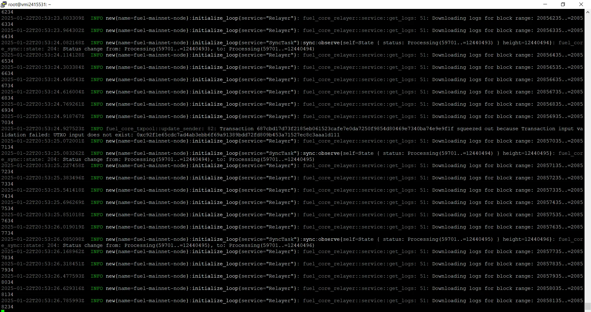<figcaption></figcaption></figure>

#### **Manteniendo el nodo activo en segundo plano**

Si el nodo se está ejecutando en una máquina dedicada, no hay problema en dejar la terminal abierta con los logs corriendo. Pero si estás usando una sesión remota (por ejemplo, a través de **PuTTY** o **SSH**) y cierras la terminal, **el nodo se apagará automáticamente**.

Para evitar esto, lo ideal es correr el nodo en **segundo plano**. Una opción recomendada es **`tmux`**, que permite ejecutar el nodo en una sesión separada y volver a ella más tarde, incluso si la terminal se cierra. También existen otras alternativas como **`screen`** o incluso ejecutar el nodo con **`nohup`** para que siga corriendo sin depender de la sesión activa.

Si planeas operar un nodo en producción y no quieres interrupciones, asegurarte de que **el proceso siga ejecutándose aunque cierres la terminal** es fundamental.

## Conectando Fuel Wallet a nuestro nodo

Vamos a conectar [**Fuel Wallet**](https://wallet.fuel.network/docs/install/) a nuestro nodo. Para eso, primero asegurate de tenerla instalada en tu navegador. Una vez abierta, hacé clic en el nombre de la red (en este caso, **Ignition**) para cambiar la configuración.

<figure>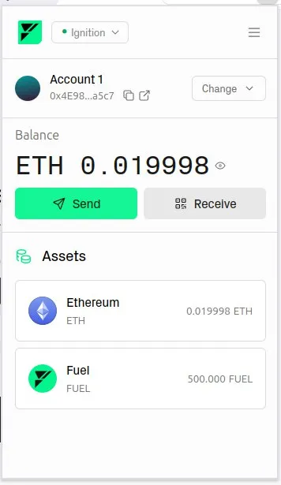<figcaption></figcaption></figure>

Solo por una cuestión de **UI/UX**, primero hay que **renombrar la red "Ignition"** en la wallet. Podés llamarla, por ejemplo, **"IgnitionWallet"**, para recordar que es la configuración predeterminada de Fuel Wallet.

Este paso es opcional y probablemente en futuras versiones ya no sea necesario, pero por ahora ayuda a evitar confusiones cuando agreguemos nuestro propio nodo.

<figure>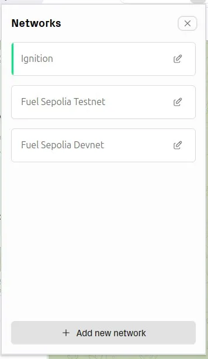<figcaption></figcaption></figure>

Desde ahí, debemos hacer clic en **"Add new network"** para agregar manualmente nuestro nodo. Ingresamos la **URL RPC**, que debe tener el formato:

```bash
http://<IP_DEL_SERVIDOR>:4000/v1/graphql
```

Reemplazando `<IP_DEL_SERVIDOR>` por la dirección IP de nuestra máquina remota (ya sea una VPS, un servidor dedicado o cualquier otra configuración que estemos utilizando).

El **Chain ID** de Fuel es **9889**.

Si todo está correctamente configurado, la wallet se conectará y podremos ver el estado de la red directamente desde nuestro nodo.

<figure>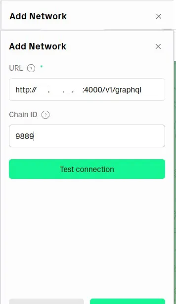<figcaption></figcaption></figure>

<figure>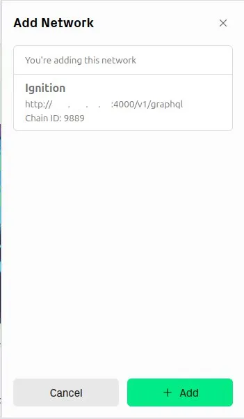<figcaption></figcaption></figure>

## **Conclusión**

Si seguiste todos los pasos hasta aquí, ya deberías tener tu nodo de **Fuel Ignition** corriendo y sincronizándose con la red. Ahora puedes verificar el estado de tu nodo, interactuar con él mediante **Fuel Wallet** y contribuir a la infraestructura descentralizada de Fuel.

Con esto, finalizamos el proceso de instalación. Tu nodo ya forma parte de la red Fuel.

## Referencias


