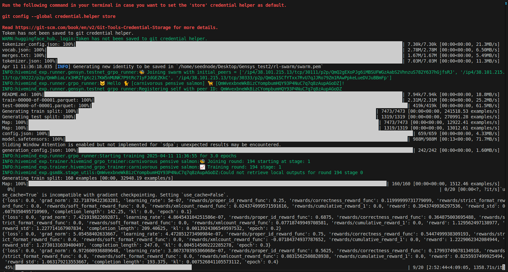
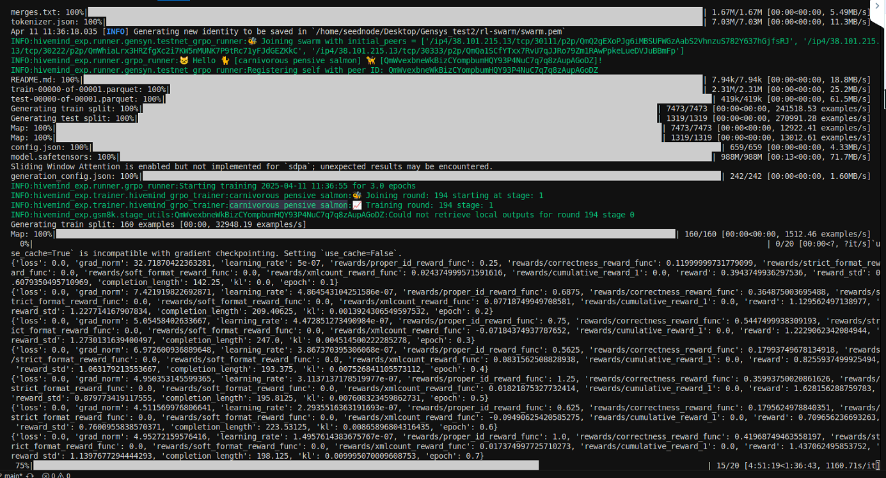
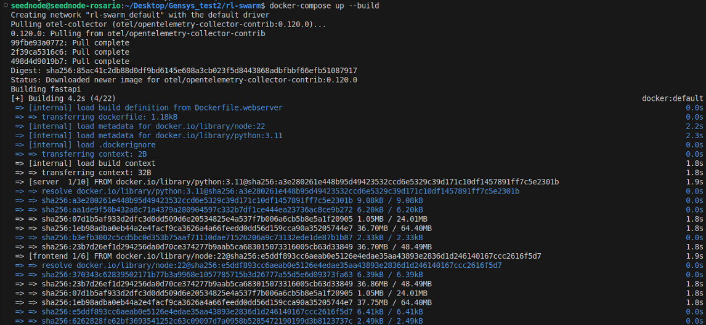

# Guia Gensys

# 🧠 Guía paso a paso para correr un nodo RL Swarm (Gensyn)

> Esta guía funciona en Linux (Ubuntu, Debian, WSL2) y Mac.

---

## ✅ Requisitos

- Python 3.10 o superior
- git, curl, node, yarn
- 16 GB de RAM mínimo
- GPU opcional (recomendado)
- Cuenta en Hugging Face: https://huggingface.co/join

---

## 🧱 Paso 1 – Clonar el repositorio

1. Abrí una terminal y ejecutá:

```
git clone https://github.com/gensyn-ai/rl-swarm.git
cd rl-swarm
```

## 🐍Paso 2 – Crear y activar el entorno virtual

```
python3 -m venv .venv
source .venv/bin/activate
```

## ⚙️ Paso 3 – Instalar dependencias (corrigiendo error de protobuf)

El archivo requirements.txt pide protobuf 5.29.0, pero no es compatible. Vamos a instalar todo manualmente.

1. Actualizá pip y setuptools:

```
pip install --upgrade pip setuptool
```

1. Borrá la versión incorrecta de protobuf si ya estaba instalada:

```
pip uninstall -y protob
```

1. Instalá la versión compatible:

```
pip install protobuf==5.27.0
```

1. Instalá las demás dependencias necesarias:

```
pip install -r requirements.txt
```

> Si vas a usar una GPU, instalá PyTorch con CUDA desde: https://pytorch.org/get-started/locally

---

## 🚀 Paso 4 – Ejecutar el nodo

Desde la raíz del proyecto, ejecutá:

```
./run_rl_swarm.sh
```

Esto abrirá el navegador para que inicies sesión y crees tu identidad (`swarm.pem`).

> Si estás en una VM, abrí manualmente: http://localhost:3000 y usá SSH con -L 3000:localhost:3000

---

## 🔐 Paso 5 – Login y conexión a la testnet

1. Iniciá sesión con Google o email.
2. Se creará tu archivo `swarm.pem`.
3. Verás un mensaje como:

```
>> Done!
>> Would you like to push models you train in the RL swarm to the Hugging Face Hub? [y/N]
```

## 🔗 Paso 6 – Obtener el token de Hugging Face

1. Ir a https://huggingface.co/settings/tokens
2. Hacer clic en **"New token"**
3. Elegir **la opción "Write"** (¡NO uses "Fine-grained"!)
4. Darle nombre: `rl-swarm-gensys`
5. Crear y copiar el token generado (`hf_xxxxxxxxx...`)
6. Pegarlo en el terminal cuando te lo pida:

```
Enter your Hugging Face access token:
```

## 🧠 Paso 7 – Verificar que el nodo esté funcionando

Deberías ver en consola algo como:

```
training step: 34, loss: 1.203, samples/sec: 53.7
peer registered: abc123
```

**Peering inicial y training**

Tu peer registrará y votará on-chain. Puedes seguir el registro [aquí](https://gensyn-testnet.explorer.alchemy.com/).

<figure><figcaption><p>Terminal, estado 9/20</p></figcaption></figure>

<figure><figcaption><p>Terminal, estado 15/20</p></figcaption></figure>

## 🌐 Paso 8 – (Opcional) Lanzar el Swarm UI

Si querés ver el estado desde un dashboard, podés correr en otra terminal:

```
docker-compose up --build
```

Y abrir: [http://localhost:8080](http://localhost:8080/)

(tenemos que tener instalado docker compose)

Por si no lo tenemos intalado, correr:

```
sudo apt install docker-compose
```

Dejamos que corra:

<figure><figcaption><p>Terminal corriendo</p></figcaption></figure>

<figure><figcaption><p>Terminal corriendo</p></figcaption></figure>

[localhost:8080](http://localhost:8080)

## 🛠 Paso 9 – Solución de problemas comunes

- **Error de protobuf**: asegurate de tener `protobuf==5.27.0`
- **No se abre el navegador**: abrí manualmente [http://localhost:3000](http://localhost:3000/)
- **Ya te logueaste antes y falla**: borra `swarm.pem` con `rm swarm.pem` y volvé a correr
- **Querés correr otro nodo**: usá un mail distinto y generá un nuevo `swarm.pem`

---

## 🎉 ¡Listo!

Ya estás participando del entrenamiento descentralizado.

Podés ver tu progreso on-chain en:

https://testnet-explorer.gensyn.ai
