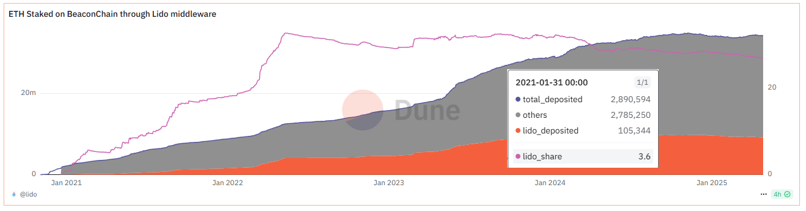
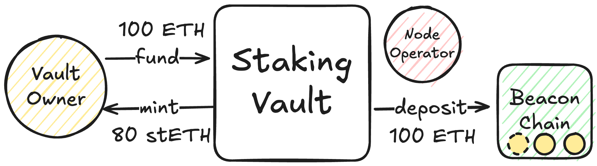
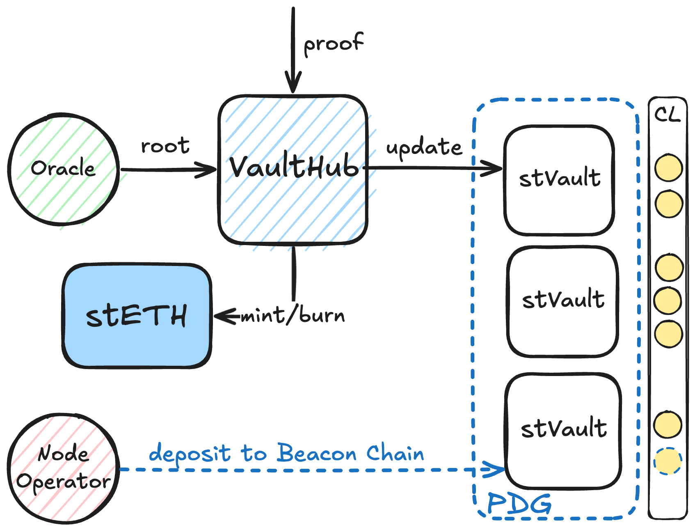
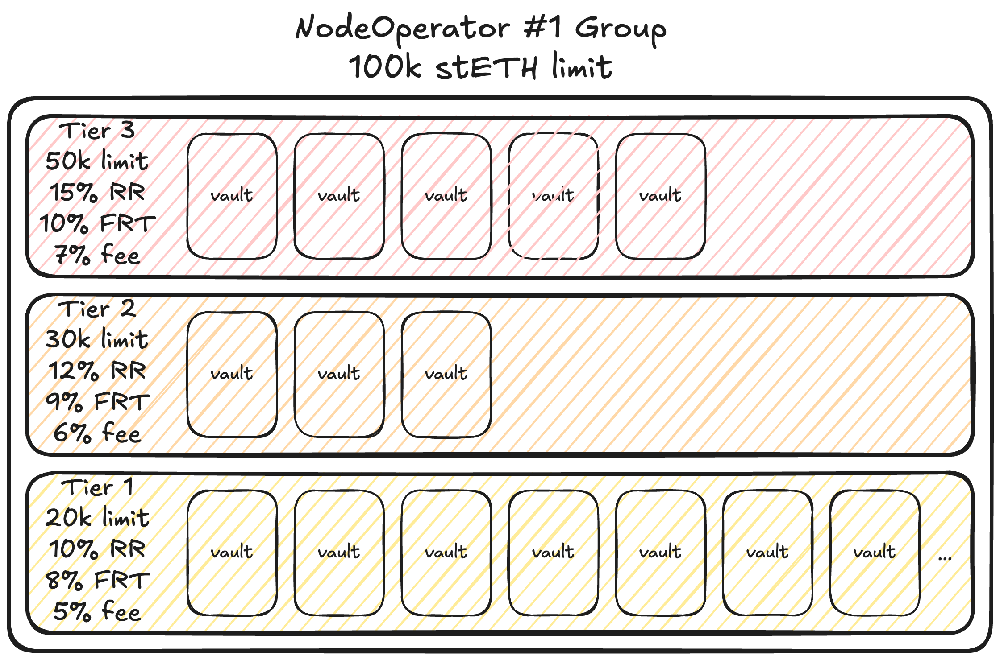
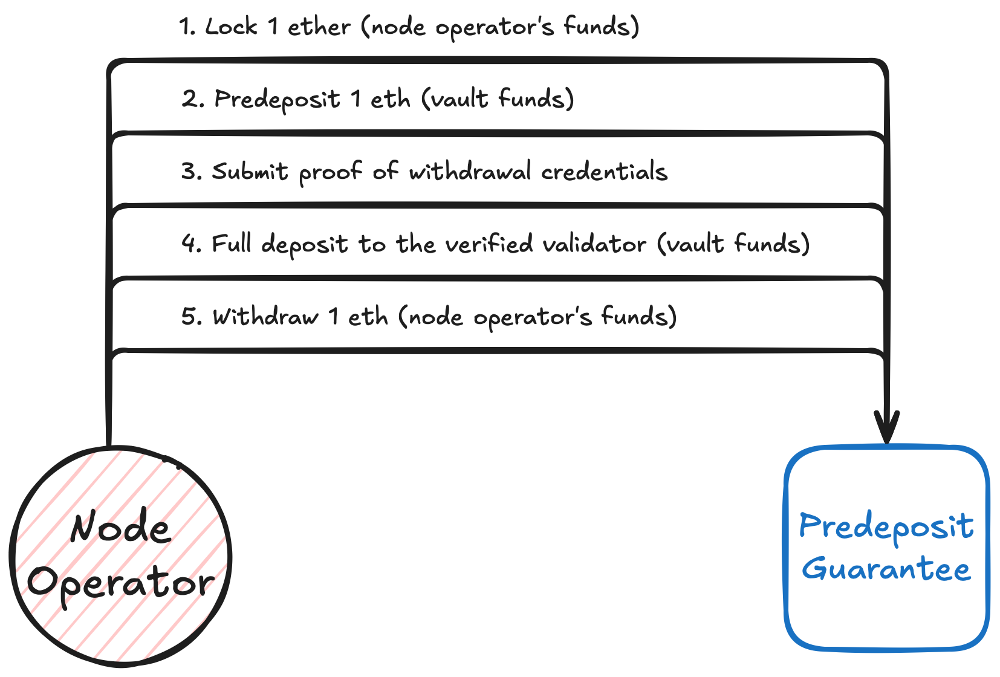

# Articulo Lido V3

# Primer parte - conceptos generales

# **1. Introducción**

Lido no necesita demasiadas presentaciones: es el protocolo de liquid staking más grande de Ethereum, y uno de los más importantes de todo el ecosistema cripto.

Pero como todo proyecto que ha crecido y madurado junto con Ethereum, Lido tampoco es hoy lo que fue en sus inicios.

Este artículo tiene dos grandes objetivos.

Primero, vamos a recorrer la **evolución de Lido**: desde sus comienzos pragmáticos, donde hacer liquid staking era casi una apuesta, hasta su consolidación como líder del mercado, enfrentando críticas, desafíos y la necesidad constante de descentralizarse.

Y segundo —y más importante—, vamos a enfocarnos en **la transformación más reciente y profunda del protocolo**: la incorporación de los **vaults** en Lido V3.

Un cambio que responde no solo a las nuevas tendencias como el **restaking** y el **staking institucional**, sino también a la necesidad de ofrecer mayor flexibilidad, adaptabilidad y resiliencia.

Entender cómo funcionan estos vaults, qué problemas vienen a resolver, y por qué representan un paso lógico en la trayectoria de Lido, es fundamental para interpretar hacia dónde va el staking en Ethereum en los próximos años.

Para que la lectura sea más  flexible, organizamos el contenido en dos grandes partes.

La primera parte tiene un enfoque más informativo y general. La segunda parte entra en un terreno más técnico. 

Si solo querés entender los conceptos generales, con leer la primera parte alcanza. Para seguir la lectura de los ejemplos y conclusiones no es necesario haber leído toda la parte técnica.

La segunda parte está pensada especialmente para los más curiosos o para quienes quieran profundizar en el funcionamiento detallado del protocolo.

### Primera parte - conceptos generales

1. **Introducción**
2. **Evolución del staking y de Lido**
    - **Lido en sus orígenes**
    - **Primer gran crecimiento**
    - **Críticas, riesgos de concentración y avances hacia la descentralización**
    - **El surgimiento de nuevas tendencias: restaking y staking institucional**
3. **Vaults**
4. **Lido V3 – Un marketplace de staking**
5. **Fungibilidad de stETH**

### Segunda parte - explicación técnica

1. **Arquitectura y funcionamiento estructural de Lido V3**
    - **Essential Layer**
    - **Utility Layer**
2. **Actores principales en Lido V3: roles y límites**
    - **Propietario del Vault (Vault Owner)**
    - **Operador de Nodo (Node Operator)**
    - **Lido DAO y protocolo central (Lido Core)**
    - **Red Oracle (Nodo Oracle)**
3. **Ejemplo de un Vault en Lido V3**
4. **Conclusiones**
5. **Referencias**

---

# **2. Evolución del staking y de Lido**

## **2.1. Lido en sus orígenes**

Cuando Lido arrancó, Ethereum estaba en plena transición: existían dos redes separadas, ETH1 (la cadena "normal") y ETH2 (la nueva *beacon chain*). Recién con el Merge se unieron en lo que hoy conocemos como la capa de ejecución y la capa de consenso.

El Lido original nació en ese contexto medio caótico, donde no existía la posibilidad de hacer retiros de los fondos en staking.

El protocolo ofrecía una solución práctica: permitir staking con cualquier cantidad de ETH, pero bajo la custodia de una multisig —porque en ese momento, técnicamente, no existía otra forma.

Este modelo no era perfecto, pero sí era la mejor opción disponible. Lido apostó por hacerlo posible, con la vista puesta en evolucionar a medida que Ethereum madurara.

## **2.2. Primer gran crecimiento**

La realidad es que el *Merge* se demoró mucho más de lo esperado, y eso generó una gran incertidumbre.

En ese escenario, quienes querían stakear tenían básicamente dos opciones:

- depositar su ETH en un exchange centralizado (como Binance o Coinbase),
- o usar una solución como Lido.

Lido supo leer ese momento: ofreció una vía simple y líquida para stakear, sin quedar atrapado en un exchange.

Gracias a estas decisiones —permitir el acceso con cualquier cantidad, crear un token líquido (*stETH*), y ofrecer una alternativa más descentralizada— Lido tomó un enorme impulso.

Ese contexto —sin retiros, con barreras de entrada de 32 ETH, y con riesgo de concentración en exchanges— fue el terreno fértil perfecto para su crecimiento.

Con el tiempo, cuando Ethereum habilitó los retiros, Lido también evolucionó: eliminó el esquema de multisig, trasladó el control a contratos inteligentes, amplió su set de operadores de nodo, y mientras tanto, stETH se consolidaba como un activo fundamental dentro de DeFi.

Así, Lido se convirtió en el mayor LST (Liquid Staking Token) de todo el ecosistema cripto.

## **2.3. Críticas, riesgos de concentración y avances hacia la descentralización**

Durante su expansión, Lido no estuvo exento de críticas.

El hecho de que llegara a controlar cerca de un tercio del staking total de Ethereum generó debates intensos sobre los riesgos de concentración.

Con el tiempo, el crecimiento de Lido se estancó naturalmente: la demanda inicial quedó satisfecha, y la participación de mercado dejó de aumentar.

[ETH Staked on BeaconChain through Lido middleware](https://dune.com/queries/2859190/4782072/)

Mientras tanto, Lido fue trabajando en sus objetivos estratégicos de largo plazo:

- mejorar la descentralización del set de operadores,
- habilitar retiros permissionless,
- permitir la incorporación permissionless de nuevos Operadores de Nodo.

Aquí surgieron dos grandes esfuerzos técnicos:

- el Community Staking Module (CSM), que permitió sumar nuevos operadores de forma permissionless,
- y el despliegue del módulo compatible con Distributed Validator Technology (DVT), que distribuye las responsabilidades de validación entre múltiples operadores.

Aunque no todo el staking es completamente permissionless, se avanzó en esa dirección, permitiendo a algunos stakers y operadores participar de manera mucho más abierta.

## **2.4. El surgimiento de nuevas tendencias: restaking y staking institucional**

Si bien en **SeedNodes** somos muy optimistas respecto a tecnologías como DVT, la realidad es que la última gran ola de adopción en el staking de Ethereum tomó otros caminos.

Por un lado, apareció el restaking: la posibilidad de "re-stakear" el valor ya “stakeado” en otros sistemas para obtener recompensas adicionales.

En este frente, Lido no se involucró, por considerar que no se alineaba con los principios de seguridad del protocolo.

Otros proyectos, como Ether.Fi, sí lo hicieron su bandera [ver referencias].

Cabe aclarar que el slashing en el restaking recién fue habilitado recientemente (abril 2025), así que recién ahora estamos viendo cómo evoluciona realmente este paradigma [ver referencias].

Por otro lado, el staking institucional empezó a tomar fuerza.

Lido participó de manera ciertamente limitada, ya que su propuesta es rígida: ofrece una canasta definida de productos, sin posibilidad de personalizar detalles específicos para cada cliente.

Esta necesidad de mayor flexibilidad fue de cierta forma puesta en escena por StakeWise a través de su modelo de vaults: pequeños entornos de staking configurables, donde cada cliente puede definir su perfil de riesgo, su set de nodos, su relación contractual, y además acceder a liquid staking mediante un derivado común.

# 3. ¿Qué son los Vaults?

A lo largo de este recorrido vimos cómo Lido creció, se adaptó y enfrentó nuevos desafíos.

También vimos que, pese a su éxito, su modelo de staking tradicional tenía una limitación importante: la rigidez del producto ofertado.

Hasta ahora, todo en Lido funcionaba bajo un esquema bastante homogéneo: los stakers no podían elegir a qué operadores de nodo delegar, qué configuraciones de validación seguir, ni explorar estrategias diferentes.

Todo el ETH en Lido estaba agrupado en un único gran pool.

Esta estructura simple fue una ventaja en la primera etapa de crecimiento de Lido, pero hoy, frente a nuevas necesidades más sofisticadas, era evidente que se necesitaba una mayor flexibilidad.

Los vaults llegan para resolver justamente esa necesidad.

Un **vault** en Lido V3 es, en pocas palabras, **un espacio de staking configurado a medida**: permite definir reglas específicas, seleccionar operadores de nodo, elegir si se usa DVT, establecer diferentes MEV relays, y ajustar el perfil de riesgo según los intereses de los participantes.

Lo importante es que todos los vaults siguen acuñando el mismo stETH: el objetivo es que la liquidez, la fungibilidad y la estabilidad de stETH no se fragmenten, incluso aunque detrás existan diferentes configuraciones de staking.

Estos vaults personalizados se denominan **stVaults** dentro del protocolo. Entonces, los **stVaults** permiten:

- personalizar el perfil de riesgo-recompensa,
- alinear mejor a operadores de nodo con sus propios clientes,
- y facilitar la creación de nuevos productos estructurados e integraciones en DeFi.

En definitiva, los vaults introducen flexibilidad real en el ecosistema de Lido, ampliando las posibilidades de participación sin sacrificar la liquidez ni la solidez de stETH.

# **4. Lido V3 – Un marketplace de staking**

Hasta ahora vimos cómo Lido evolucionó para agregar flexibilidad a través de los vaults.

Pero el cambio que trae V3 no es solo técnico: es un cambio de visión estratégica.

La idea detrás de Lido V3 es que el protocolo deje de ser simplemente un "proveedor" de staking líquido, para convertirse en una verdadera plataforma sobre la cual puedan construirse múltiples estrategias, perfiles de riesgo y productos de staking.

En otras palabras, Lido se transforma en un marketplace.

Así como Uniswap V4 evolucionó hacia una plataforma abierta donde distintos actores pueden construir sobre su liquidez, Lido V3 abre la infraestructura de staking para que múltiples participantes interactúen bajo un mismo ecosistema: todos conectados, todos compartiendo la liquidez, la distribución y **las integraciones de stETH como pieza central.**

El stETH sigue siendo el activo unificador, sin importar desde qué vault provenga el staking, o qué configuración se utilice, todo converge en el mismo stETH líquido y fungible que los usuarios conocen y utilizan.

# 5. Fungibilidad de stETH

Un desafío central en la evolución de Lido V3 es cómo preservar la **fungibilidad de stETH** en un entorno mucho más flexible y modular.

Hasta ahora, todos los stakers en Lido compartían el mismo perfil de riesgo y recibían las mismas recompensas. No importaba a qué operador de nodo se delegara el stake, ni qué estrategia técnica se utilizara: el resultado siempre era el mismo stETH, homogéneo y confiable.

Con la aparición de los vaults, sin embargo, la situación cambia. Ahora es posible que distintos vaults tengan configuraciones diferentes y algunos podrían optar por perfiles de riesgo más altos.

Frente a esta diversidad, surge una pregunta inevitable: ¿cómo asegurarse de que todo el stETH siga siendo igual de confiable, aunque detrás haya riesgos distintos?

La respuesta de Lido es sencilla pero elegante. En lugar de emitir siempre un stETH por cada ETH depositado, se introduce un mecanismo de bond. Esto significa que, en los vaults con mayor riesgo, los usuarios no reciben un stETH completo por cada ETH que depositan. Parte del ETH depositado se mantiene como colateral sobrante dentro del sistema, actuando como garantía extra o bond.

Por ejemplo, si un vault es considerado más riesgoso, al depositar 1 ETH quizá solo se minteen 0,98 stETH. El 2% restante no desaparece: queda reservado como bond, funcionando como una protección frente a posibles eventos adversos.

Así, el riesgo adicional se absorbe en el momento de la emisión y no se traslada a quienes usen stETH en el mercado.

Este enfoque es muy similar al modelo de **Loan-To-Value (LTV)** que usan los protocolos de préstamos: cuanto mayor es el riesgo del activo subyacente, menor es la cantidad que se puede emitir contra él.

En definitiva, este mecanismo permite que todos los stETH sigan siendo fungibles —independientemente del vault de origen— y mantiene la liquidez, la estabilidad y la confianza que el ecosistema espera de Lido.

---

# Segunda parte - explicación técnica

# 6. Arquitectura y funcionamiento estructural de Lido V3

<aside>
🚧

Disclaimer:
La especificación de Lido V3 todavía se considera un *draft* en evolución. Si bien la arquitectura general y componentes presentados son los propuestos oficialmente, algunos detalles podrían ajustarse mediante gobernanza antes de ser deployado en mainnet.

</aside>

Para equilibrar la seguridad con la flexibilidad, la arquitectura de Lido V3 se divide en dos capas principales:

- **Capa Esencial (Essential Layer):** Conjunto de smart contracts fundamentales, estrictamente gobernados, que gestionan la relación entre el protocolo central de Lido (Lido Core) y la plataforma de Vaults:
    - **`StakingVault`**,
    - **`VaultHub`**,
    - **`AccountingOracle v3`**,
    - **`OperatorGrid**` y
    - **`PredepositGuarantee`**.
    
    Estos contratos definen las reglas de colateralización, emisión/quema de stETH, límites de riesgo y seguridad en los flujos de depósito, asegurando que los vaults operen sin comprometer la integridad de Lido Core.
    
- **Capa de Utilidad (Utility Layer):** Conjunto de smart contract adicionales que mejoran la experiencia de usuario y la integración, sin introducir riesgos al núcleo. Incluyen:
    - **`VaultFactory**` y el
    - **`Dashboard`**
    
    Son herramientas para facilitar la creación y manejo de vaults, automatizando procesos complejos e introduciendo interfaces de administración más amigables.
    

A continuación, se describen los **principales componentes de la arquitectura:**

### 6.1. **Essential Layer**

- **`StakingVault`:** Es el SC (smart contract) que representa cada staking vault individual. Un **`StakingVault**` equivale a una posición de staking aislada, controlada por un único “owner” (propietario) y atendida por un único “node operator” (operador de nodo).
    
    En sí mismo, un vault actúa como un mini-protocolo de staking delegado: el propietario deposita ETH en su vault y el operador de nodo asociado valida con esos fondos en la beacon chain. El owner mantiene la custodia sobre su ETH en el contrato del vault (no lo entrega al operador), y puede usar el valor total acumulado (balance de validadores + ETH no asignado) como colateral para mintear stETH. 
    
    El vault registra este valor total como totalValue, y también cuánto de ese colateral está **bloqueado (locked)** respaldando stETH emitido. 
    
    Como ya explicamos el diseño **no** obliga a emitir stETH por el 100% de lo depositado; de hecho, para mitigar riesgos se introduce un **“Reserve Ratio (RR)”**, es decir, un porcentaje del ETH que debe quedar como reserva de seguridad sin emitir stETH. 
    
    Por ejemplo, si el RR es 20%, por cada 100 ETH en el vault solo se podrán emitir hasta 80 ETH en forma de stETH, dejando un 20% como bond ante posibles slashing o pérdidas. 
    
    

    
    Esta sobrecolateralización hace que el stETH emitido vía vaults tenga un margen de seguridad adicional frente a eventos adversos, reforzando la solvencia económica de stETH.
    
- **`VaultHub`:** Actúa como hub central (concentrador) de todos los StakingVaults conectados al protocolo Lido. Cuando un vault desea participar en Lido (es decir, poder mint/burn stETH), debe conectarse mediante el `VaultHub`. Este contrato administra por cada vault un “socket” con todos sus parámetros relevantes: el número de **stETH shares** emitidas por ese vault (liabilityShares), su límite de participación, su Reserve Ratio aplicable, la comisión para Lido, umbrales de rebalanceo forzoso, etc.
    
    `VaultHub` **solo permite conectar vaults autorizados**, y aplica límites para que ningún vault emita más stETH del permitido por su colateral o por las políticas asignadas. 
    
    Es también el componente que realmente **emite y quema stETH** en nombre de cada vault, coordinando con Lido Core. 
    
    Si un vault cae por debajo de cierto umbral de seguridad (por ejemplo, su valor colateral ya no cubre adecuadamente el stETH emitido), `VaultHub` puede habilitar **acciones de emergencia**: permitir  reequilibrar el vault e incluso forzar la salida (exit) de validadores para reducir riesgo. Desde la perspectiva de un usuario, `VaultHub` es la “puerta de entrada” para cualquier operación de stETH relacionada con vaults, garantizando que en todo momento haya el colateral requerido detrás de cada stETH emitido.
    
    
    
    Esto es el flujo de staking operativo: un Operador de Nodo usa el ETH que hay en el **`stakingVault`** para depositarlo en la Beacon Chain, pasando primero por el **`PredepositGuarantee`** (PDG), que asegura que todo se haga con credenciales de retiro correctas. Esto sucede fuera de VaultHub: `VaultHub` no participa directamente en los depósitos de ETH en Ethereum, pero sí controla que el colateral que respalda a los stVaults esté bien registrado y actualizado.
    
- **`AccountingOracle v3`:** Es la nueva versión del oráculo de contabilidad de Lido, adaptado para soportar múltiples vaults de manera escalable.
    
    En Lido V2, el oráculo (v2) periódicamente informaba el balance total de la beacon chain para actualizar la tasa de rebase de stETH. En V3, el **`AccountingOracle v3`** extiende esa función: mantiene un **árbol de Merkle** con el estado global de todos los vaults. En lugar de actualizar cada vault individual en cadena (lo cual sería costoso si hay miles de vaults), el oráculo actualiza solo una raíz de Merkle representando la suma de estados, y cualquier actualización individual (cuando se necesita) se realiza mediante pruebas Merkle on-demand. 
    
    En la práctica, esto significa que el oráculo diariamente registra el estado agregado (incluyendo Lido Core y todos los vaults) y guarda la raíz. Si un vault necesita actualizar su información (por ejemplo, al querer retirar fondos, se requiere su último totalValue confirmado), se envía una prueba de que los datos de ese vault coinciden con la raíz registrada. Al validarse la prueba, `VaultHub` y el `StakingVault` actualizan su estado interno. 
    
    Este mecanismo “lazy oracle” permite escalar a muchos vaults sin congestionar la red. 
    
    Cabe destacar que el oráculo está operado por una red descentralizada de oráculos (similar al oráculo de Lido v2), por lo que no depende de una sola entidad sino de múltiples actores independientes que deben consensuar los datos.
    
- **`OperatorGrid`:** Es el contrato que gestiona los parámetros de minting de stETH relacionados a los operadores de nodo. Su propósito principal es organizar los vaults en grupos y tiers (niveles) vinculados a cada operador, para asegurar que ningún Operador de Nodo individual pueda manejar una cantidad desproporcionada de stETH a través de vaults. En la práctica, cada operador de nodo representa un “grupo” en la grid, y la DAO de Lido (junto con los operadores) puede definir uno o varios tiers dentro de ese grupo con parámetros específicos. Cada tier establece: un límite máximo de stETH que todos los vaults en ese tier pueden emitir (shareLimit), un Reserve Ratio mínimo, un umbral de rebalanceo y quizás una comisión de Lido particular. Por defecto, todos los nuevos vaults comienzan en un tier por defecto que no está asociado a ningún operador especial y típicamente tiene límites conservadores. Si un propietario de vault desea trabajar con un operador de nodo específico bajo condiciones acordadas (por ejemplo, un tier con mayor límite de emisión a cambio de cierto bond o fee), debe solicitar un cambio de tier en el OperatorGrid.
    
    
    
    El flujo es el siguiente: el vault owner solicita entrar al tier X de tal operador, y ese Operador de Nodo aprueba la solicitud; entonces el vault pasa a regirse por los parámetros de ese tier. Esto crea un mercado abierto donde operadores compiten ofreciendo distintos tiers (con diferentes fees o requerimientos de garantía) para atraer stakers, a la vez que se mantiene el control de riesgos (el grid impone topes globales por operador y distribuye la emisión entre muchos operadores para evitar centralización excesiva). 
    
    En resumen, `OperatorGrid` actúa como capa de coordinación entre vaults y operadores, aplicando políticas de descentralización y riesgo definidas por el protocolo: no permitir que un solo operador concentre más allá de X stETH en vaults, y asignar a cada vault los parámetros de minting correctos según el operador con el que trabaja.
    
- `PredepositGuarantee` (PDG): Es un contrato de garantía previa al depósito, diseñado para asegurar la integridad en el proceso de depósito de validadores. Resuelve un posible exploit de “frontrunning” de depósitos que se identificó en protocolos como Rocket Pool/Lido anteriormente.
    
    En Lido V3, un operador de nodo no puede simplemente tomar 32 ETH del vault y depositarlos en la beacon chain con sus propias credenciales; primero debe pasar por el PDG. 
    
    
    
    El mecanismo funciona así: 
    
    - el operador debe bloquear 1 ETH de garantía en PDG y
    - simultáneamente hacer un pre-depósito de 1 ETH desde los fondos del vault.
    - Luego espera a que el validador aparezca en la beacon chain. Ese validador debe tener las credenciales de retiro correctas (es decir, que apunten al contrato del StakingVault, no a una dirección del operador).
    - Usando pruebas on-chain (EIP-4788, que permite obtener el root de bloque de la beacon chain), el operador demuestra que el validador registrado tiene las credenciales esperadas; solo entonces se desbloquea su depósito de garantía de 1 ETH.
    - Cumplida la verificación, el operador ya puede completar el depósito de los restantes 31 ETH para ese validador.
    
    En caso de que intentara hacer trampa (por ejemplo, usando credenciales de retiro distintas para secuestrar los fondos), no podría desbloquear su 1 ETH y el vault owner tendría derecho a recuperarlo como compensación. 
    
    Así, PDG introduce una pequeña penalización económica y comprobaciones criptográficas que alinean los incentivos: el operador solo deposita si lo hace correctamente hacia el vault; de lo contrario, pierde su bond. 
    

### **6.2. Utility Layer**

- **`VaultFactory`:** Es un SC que simplifica enormemente la creación y configuración de nuevos vaults. Mediante una única transacción, **`VaultFactory**` puede desplegar un contrato `StakingVault` (usando el patrón proxy para estandarizar implementaciones) y también desplegar un contrato **`Dashboard**` asociado, inicializándolos con los parámetros deseados.
    
    Sin esta fábrica, el proceso manual implicaría múltiples transacciones (desplegar vault, configurar operador, hacer depósito mínimo, autorizar contratos, etc.), con riesgo de error en la secuencia. Por ello, aunque es opcional, el uso de `VaultFactory` se recomienda para cualquiera que quiera lanzar un vault nuevo, facilitando una puesta en marcha segura y atomizada.
    
- **`Dashboard` :** Es un SC auxiliar que funciona como capa de administración para un StakingVault. Técnicamente, cuando se usa un Dashboard, este contrato se convierte en el “owner” del StakingVault, mientras que el usuario original pasa a ser administrador del Dashboard.
    
    Esto permite introducir ciertas capacidades y lógica de negocio adicional sin complicar el contrato base del vault. 
    
    El `Dashboard` provee métodos más amigables para operaciones comunes (depositar, retirar, reclamar recompensas), sirviendo de “controlador” del vault en nombre del usuario. 
    
    Es importante aclarar que el `Dashboard` **no es obligatorio**; un usuario muy técnico podría interactuar directamente con el `StakingVault`, pero renunciaría a estas comodidades y tendría que manejar manualmente todas las interacciones. En la práctica, se espera que la mayoría use `Dashboard` por facilidad, ya que además la interfaz web de Lido y herramientas CLI estarán diseñadas para operar vía `Dashboard` en conjunción con los vaults.
    

# 7. Actores principales en Lido V3: roles y límites

En Lido V3 intervienen varios **actores clave**, cada uno con responsabilidades y restricciones bien definidas por la arquitectura. 

A continuación, identificamos estos actores (usando sus nombres técnicos precisos) y resumimos **qué puede y qué no puede hacer** cada uno dentro del sistema:

### 7.1. Propietario del Vault (Vault Owner)

El **propietario del vault** es el usuario o entidad que crea/controla un `StakingVault`para stakear sus propios ETH bajo condiciones personalizadas. Por ejemplo, puede ser una institución, un proveedor DeFi o un staker avanzado que desea gestionar su posición de staking de forma independiente.

- **Lo que puede hacer:** El owner es quien **deposita ETH** en su vault (ej. transfiriendo fondos al contrato StakingVault) e inicia el proceso de staking. Tiene la facultad de **elegir al operador de nodo** que correrá sus validadores, pudiendo seleccionar uno de confianza o con ciertas características técnicas. A través del vault, el propietario puede **mintear stETH** utilizando el valor de sus fondos stakeados como colateral, siempre respetando el Reserve Ratio y límites aplicables (es decir, puede acuñar stETH hasta el máximo permitido por el sistema según sus depósitos).
    
    También puede **quemar stETH** para liberar su colateral en ETH cuando desee retirarse: al devolver stETH equivalente, recupera la parte desbloqueable de sus ETH (esto puede implicar esperar la confirmación del oráculo y/o la salida de validadores si estaban activos). 
    
    El owner mantiene en todo momento el **control de sus fondos** dentro del vault – los ETH nunca abandonan la custodia del contrato de vault salvo para ir a la beacon chain con las credenciales de retiro apuntando de vuelta al vault. Adicionalmente, el propietario puede **configurar parámetros de su vault** en la medida que el protocolo lo permita: por ejemplo, puede solicitar unirse a un *tier* específico ofrecido por su operador de nodo (para cambiar condiciones de comisión o límites), puede decidir usar el `Dashboard` para delegar ciertas funciones al operador, e incluso puede optar por **desconectar su vault** de Lido si ya no quiere participar en la liquidez de stETH (volviendo su vault un staking “nativo” independiente). 
    
    Cabe destacar que Lido V3 introduce cierta **soberanía para el staker**: si el owner decide retirar todo su stETH y no usar más la conexión a Lido, su vault queda en modo autónomo donde el staker tiene control total y no está obligado a aceptar futuras actualizaciones del protocolo Lido.
    
- **Lo que no puede hacer:** El propietario del vault no puede exceder los límites de seguridad definidos por el protocolo. Por ejemplo, no puede acuñar más stETH del que le corresponde por colateral (el contrato `VaultHub` rechazará cualquier intento que sobrepase su shareLimit o que viole el Reserve Ratio).
    
    Tampoco puede retirar ETH libremente sin quemar la cantidad equivalente de stETH: si tiene ETH “locked” respaldando stETH emitido, esa parte está bloqueada hasta que se queme el stETH correspondiente y un reporte de oráculo confirme el nuevo estado. 
    
    En concreto, si un vault está 100% utilizado (locked = totalValue), el owner no puede retirar nada hasta devolver stETH. Asimismo, el owner no puede cambiar unilateralmente de operador de nodo una vez creado el vault; la relación con el Operador de Nodo se establece al desplegar el vault y cualquier cambio requeriría esencialmente migrar a un nuevo vault (no es un parámetro que se pueda reconfigurar al vuelo, dado que los validadores ya depositados están bajo claves del operador original). El propietario tampoco puede eludir las medidas de seguridad del depósito: por diseño, no tiene control directo sobre el proceso de depositar en la beacon chain (eso lo hace el operador vía el PDG), por lo que no puede forzar un depósito inmediato si el operador no ha provisto la garantía o la prueba de credenciales. En resumen, el owner debe operar dentro del marco que impone Lido V3: sus libertades de configuración no incluyen modificar las reglas de colateralización ni la lógica de los contratos (no puede, por ejemplo, cambiar el código de su vault, ni evitar pagar la comisión al tesoro de Lido establecida para su tier). Cualquier aspecto fuera de los permisos previstos (como parámetros globales) queda fuera de su control y bajo la gobernanza del DAO.
    

### 7.2. Operador de Nodo (Node Operator)

El Operador de Nodo es la entidad que corre los validadores de Ethereum para el vault. En Lido V3, cada vault está asociado a un único operador, usualmente seleccionado por el propietario del vault (p. ej. un staker institucional elige un operador de confianza o interno). Los operadores de nodo en Lido V3 pueden ser empresas de staking, equipos técnicos o incluso el mismo usuario si tiene capacidad técnica.

- **Lo que puede hacer**: El operador es responsable de depositar los validadores utilizando los ETH proporcionados por el vault. Esto implica generar las claves validadoras, y ejecutar el proceso de depósito en dos fases a través de `PredepositGuarantee` como se explicó (primero 1 ETH con garantía y luego completar). El operador puede definir las condiciones bajo las cuales acepta vaults: mediante el `OperatorGrid`, puede ofrecer distintos tiers de servicio con límites y requisitos específicos (por ejemplo, podría tener un tier “institucional” donde exige cierto Reserve Ratio y en contraparte ofrece un límite de stake alto, u otro tier con fee diferente). En la práctica, el Operador de Nodo aprueba o rechaza que un vault entre a uno de sus tiers, lo que le da control sobre con qué clientes (vaults) trabaja y bajo qué parámetros.
    
    Una vez activo, el operador corre el validador de  Ethereum PoS para validar bloques con los fondos del vault, buscando maximizar las recompensas y operando de forma segura (evitando slashing). 
    
    También puede tener derecho a una comisión por sus servicios: Lido V3 permite que se configure una comisión del operador que se paga de las recompensas generadas en el vault. El Dashboard, si se usa, facilita que el operador reclame su fee acumulada de forma periódica según la fórmula establecida (proporcional a las recompensas del intervalo). Además, el Operador de Nodo puede interactuar con el vault para tareas operativas: por ejemplo, puede iniciar voluntariamente un retiro de validadores si el vault owner se lo solicita (para devolver fondos), puede monitorear la salud del vault (ya que le conviene evitar caer bajo los umbrales de rebalance forzoso) y colaborar con el owner en estrategias como re-staking adicional. En suma, el operador de nodo en V3 tiene un rol más activo y personalizado que en Lido V2: puede ofrecer productos a medida y mantener una relación directa con cada vault/cliente, en lugar de simplemente contribuir a un pool general.
    
- **Lo que no puede hacer**: A pesar de controlar la infraestructura de validación, el operador de nodo no tiene custodia sobre los ETH subyacentes. No puede desviar los fondos del vault hacia sí mismo, ya que las credenciales de retiro de los validadores están fijadas hacia el contrato del `StakingVault` (ver PDG). Esto significa que, aunque el operador produce bloques y técnicamente recibe las recompensas en el validador, esas recompensas van al vault y quedan bajo control del owner/protocolo, con solo la porción de comisión asignada al operador siendo reclamada separadamente.
    
    El operador no puede mintear ni quemar stETH por sí solo; esas acciones corresponden al `VaultHub` y requieren la colaboración del owner (p.ej., el operator no puede decidir emitir más stETH de lo que el owner depositó). Tampoco puede modificar los parámetros del vault a su antojo: por ejemplo, no puede cambiar el Reserve Ratio ni el límite de shares de un vault (eso viene dado por el tier aprobado vía `OperatorGrid`, que en última instancia está sujeto a parámetros fijados por la DAO para ese operador). 
    
    De hecho, el `OperatorGrid` impone que ningún operador puede superar cierto tope global sumando todos sus vaults, por lo que un operador no podría saltarse esa restricción para acumular más stake del permitido. Asimismo, no puede rehusarse unilateralmente a cumplir con retiros: si el owner quema stETH para retirar y hay que cerrar validadores, el sistema (`VaultHub` y oráculo) lo detectará y el operador deberá proceder a retirar los validadores correspondientes. En caso extremo de negativa, el protocolo tiene previstas vías (ej. rebalance forzoso, o eventualmente medidas de slashing social si aplicaran) para asegurar que los fondos regresen al owner; por diseño, el operador no tiene manera de tomar los fondos y “desaparecer” sin penalización. 
    
    En resumen, el Operador de Nodo opera los nodos pero no posee los fondos ni puede alterar las reglas del protocolo: su papel es limitado a la validación y seguimiento de las políticas acordadas. Cualquier incumplimiento (como intentar cambiar las credenciales de retiro o provocar slashing intencionalmente) resultaría en sanciones dentro del sistema (pérdida de garantía, daño reputacional que le impediría conseguir más vaults, etc.).
    

### 7.3. Lido DAO y protocolo central (Lido Core)

Lido DAO es el organismo de gobernanza que rige el protocolo Lido. Aunque no interactúa día a día con cada vault, sus decisiones enmarcan qué es posible y qué no en Lido V3. Podemos considerarla el actor que controla la “metacapa” del sistema.

- **Lo que puede hacer:** La DAO de Lido, a través de sus votaciones, establece los parámetros globales y las políticas bajo las cuales opera Lido V3. Por ejemplo, solo la DAO puede cambiar la Reserve Ratio base para los vaults – dicho ratio determina qué porcentaje mínimo de colateral debe quedar sin emitir en todos los vaults (inicialmente se sugiere un valor que asegure sobre-colateralización razonable, pero la DAO podría ajustarlo en el futuro si la situación de la red lo permite).
    
    También define la estructura de comisiones de Lido: tradicionalmente Lido cobra una tarifa sobre las recompensas (que se reparte entre tesorería y operadores); en V3 esto puede configurarse por tier en `OperatorGrid`, pero los valores (por ej. 5% al tesoro) son decididos por gobernanza. 
    
    La DAO asimismo aprueba qué operadores de nodo pueden participar en Lido Vaults y puede fijar límites de stake para cada uno (ej. cuánto stETH en total puede emitir un cierto operador en todos sus vaults, para evitar concentración). Además, la DAO tiene la potestad de actualizar los contratos del protocolo esencial (`VaultHub`, `OperatorGrid`, etc.) cuando sea necesario, siguiendo los procesos de upgrade administrados (respetando la voluntariedad de los vaults para adoptar upgrades, ver abajo). Esto significa que, con el debido quórum y tras auditorías, la DAO podría mejorar la lógica de rebalanceo, cambiar cómo funciona el oráculo, o introducir nuevos tipos de modules/vaults. En caso de emergencias, la DAO puede tomar medidas como pausar temporalmente nuevas conexiones de vaults o ajustes similares para proteger el sistema.
    
    Resumiendo, la Lido DAO actúa como guardián de último recurso de la integridad del protocolo: define las reglas del juego y puede intervenir mediante votación si se requiere corregir el rumbo.
    
- **Lo que no puede hacer:** Lido DAO no maneja directamente los fondos de los usuarios en vaults ni en el pool principal. Las garantías de no custodia permanecen: incluso si la DAO quisiera, no puede vaciar un vault o mover los ETH de un usuario a otro lugar, ya que están bloqueados por las reglas de los smart contracts.
    
    Tampoco puede alterar unilateralmente la fungibilidad de stETH: por diseño, todo stETH emitido está respaldado, así que la DAO no podría decidir “imprimir” stETH extra sin colateral o algo por el estilo (el sistema simplemente no lo permitiría a nivel de contratos). Otra limitación es la voluntariedad de upgrades para vaults: Lido V3 introduce la idea de *opt-in upgradeability*, donde si se lanza una nueva versión, los vaults conectados que sigan usando stETH se consideran como aceptando las nuevas reglas, pero un vault owner podría optar por desconectarse (retirar su stETH) antes de un cambio si no está de acuerdo. Esto significa que la DAO no puede forzar a un staker individual a adoptar un cambio que este no consienta (claro que, al desconectarse, ese vault ya no emite stETH, quedando fuera del ámbito de Lido). 
    
    En la práctica, la DAO tampoco interviene en relaciones bilaterales específicas: por ejemplo, no va a decidir qué fee pactan un vault owner y su Operador de Nodo más allá de asegurar que la parte del tesoro de Lido se cobre. 
    
    Dicho de otro modo, la DAO fija parámetros marco pero no microgestiona cada vault. Finalmente, la DAO está sujeta a su propia gobernanza y controles: no podría aprobar algo que viole principios básicos (como comprometer la solvencia 1:1 de stETH) sin que eso implicara una crisis de confianza y técnica. 
    
    Los principios de diseño originalmente planteados (no dañar a stakers de stETH básicos, mantener reservas, etc.) actúan como límites autoimpuestos. Así que, aunque en teoría la DAO tiene autoridad amplia, en la práctica su poder está restringido por la lógica inmutable de muchos contratos y por la necesidad de mantener la confianza de los participantes.
    

### 7.4. Red Oracle (Nodo Oracle)

*Nota:* El oráculo no es una persona o entidad única, sino un conjunto de participantes técnicos, pero lo incluimos brevemente como “actor sistémico” dado su importancia en Lido V3.

- **Rol en el sistema:** La red de oráculos de Lido se compone de nodos independientes (generalmente operados por entidades reputadas en el ecosistema) que periódicamente reportan datos del estado de la beacon chain al contrato de `AccountingOracle`. En V3, su tarea se amplía a reportar también el estado agregado de vaults (a través del mecanismo de Merkle mencionado). Esta red puede actualizar el estado de Lido Core (igual que en V2, determinando cuánta recompensa acumulada se distribuye a stETH) y también puede confirmar estados de vaults para habilitar retiros o mintings tras eventos.
    
    En condiciones normales, los oráculos operan automáticamente y no interactúan directamente con usuarios; su influencia es garantizar que todos los cálculos de cuánto vale cada vault y cuánto stETH corresponde estén correctos. 
    
    No “deciden” nada por cuenta propia – solo informan datos objetivos de la cadena (balances de validadores, ocurrencia de slashing, etc.).
    
- **Límites:** Los oráculos no pueden introducir datos arbitrarios sin consenso: Lido requiere un umbral (quórum) de firmas de los oráculos para aceptar un reporte, lo que protege contra malas actuaciones individuales. Además, no tienen poder para cambiar lógica o parámetros, solo proveen datos.
    
    Si por alguna razón la red de oráculos fallara en reportar, las operaciones que requieran datos frescos (como retiros importantes) podrían quedar pendientes, pero los fondos en sí no peligran (simplemente se esperaría o se estimularía a que se corrija la falta de reporte). En definitiva, el oráculo es un actor técnico crucial pero no un decisor: está acotado a reflejar el estado real de la red Ethereum en los contratos de Lido.
    

# 8. Ejemplo de un Vault en Lido V3

Para ilustrar las **nuevas posibilidades** que habilita Lido V3, consideremos un caso concreto de Staking Vault que antes (en Lido V2) no podía realizarse:

**Ejemplo: Vault institucional con validador dedicado y entorno de cumplimiento (KYC)**

Supongamos que una gran entidad financiera (por ejemplo, un banco o fondo regulado) desea participar en staking de Ethereum para obtener rendimiento, **pero** tiene requisitos internos estrictos: solo puede delegar sus ETH a validadores operados por entidades aprobadas (KYC/whitelisted), quiere que los fondos se mantengan segregados de otros participantes por motivos contables, y necesita ciertas garantías de control (por ejemplo, poder pausar depósitos si cambian las condiciones regulatorias). En Lido V2, esta entidad no tenía manera de satisfacer esas condiciones usando Lido: el protocolo V2 mezclaba los fondos de todos en un pool común y asignaba automáticamente validadores de su grupo de operadores; no había forma de elegir un operador específico ni de aislar el stake de uno para que no se mezcle con el de otros. La única opción hubiera sido montar su propia infraestructura de staking (sacrificando la liquidez de stETH) o aceptar las condiciones estándar de Lido sin personalización.

Con **Lido V3**, este banco puede crear un **vault institucional dedicado**. El flujo sería así, a grandes rasgos:

1. **Creación del vault:** La entidad despliega (o solicita vía `VaultFactory`) un `StakingVault` y lo configura para que solo sus direcciones puedan depositar y retirar (un vault puede implementar whitelists de depósito/retiro a través del `Dashboard`, cumpliendo la política interna). Esto ya garantiza que su ETH no se mezclará con usuarios desconocidos.
2. **Selección de operador de nodo:** Escogen un Operador de Nodo aprobado que cumpla sus requisitos (quizá un operador que haya pasado controles de cumplimiento, o incluso una filial tecnológica del propio banco si figura como operador en Lido). Mediante el `OperatorGrid`, este vault se asocia al grupo de ese operador. 
    
    Ahora, todos los ETH que el banco deposite irán a validadores manejados exclusivamente por ese operador de confianza, en lugar de repartirse por todo el pool general.
    
3. **Depósito y staking:** El banco deposita, digamos, 10,000 ETH en su vault (en tramos manejables de 32 ETH para lanzar validadores). El operador de nodo procedería a activar ~312 validadores usando esos fondos, siguiendo el protocolo PDG para cada uno. Durante este proceso, el banco mantiene la custodia efectiva ya que cualquier retirada de la beacon chain solo podrá venir de vuelta al vault. A medida que los validadores se ponen activos, el vault puede mintear stETH respaldado por ese stake. Siguiendo el RR acordado, si fuera 20%, quizá por cada 32 ETH staked se mintean 25.6 stETH y 6.4 ETH quedan como bond en el vault. El banco ahora recibe sus stETH, que son totalmente fungibles como cualquier otro stETH del mercado (puede usarlos en DeFi, liquidez, etc.), pero están asociados a su vault en términos de colateralización.
4. **Personalización adicional:** Este vault podría habilitar características específicas vía el `Dashboard`, por ejemplo respecto a MEV.
5. **Retiros y control:** Si en algún momento el banco necesita sus fondos de vuelta (por ejemplo, decide deshacer el staking por cambios regulatorios), puede quemar los stETH que obtuvo para empezar a retirar. `VaultHub` verificaría su colateral y el oráculo actualizaría balances; los validadores del vault serían retirados (parcial o totalmente) a petición, y el ETH liberado iría al vault para que el banco lo saque a sus direcciones permitidas. Todo el proceso ocurre dentro de su perímetro controlado. 
    
    Además, si el banco decide que ya no quiere seguir usando Lido (imaginemos que quisieran “congelar” la configuración para auditar), podrían optar por desconectar el vault: esto implicaría devolver todos sus stETH al protocolo y quedarse con los validadores corriendo de manera independiente. Seguirían validando y ganando ETH directamente, pero ya sin stETH  – básicamente en un modo “staking nativo” conservando el control total sobre los nodos (esta es la idea de soberanía voluntaria que Lido V3 permite).
    

Esta clase de vault **no era posible en Lido V2**. Antes, todos los stakers compartían la misma estrategia y los mismos operadores, sin opción de separar **quién valida tu ETH** ni ajustar cosas como comisiones o riesgo. 

# 9. Conclusiones

El diseño de Lido V3 no es una ruptura con el pasado, sino la evolución natural de la lógica que Lido ha mantenido desde sus primeros días: facilitar el acceso al staking líquido de Ethereum garantizando seguridad, descentralización y eficiencia.

Cada etapa del crecimiento de Lido se ha enfocado en expandir las oportunidades de participación en la validación de Ethereum, sin comprometer la liquidez ni la confianza de los usuarios. V3 sigue este mismo principio, pero introduce una nueva capa de modularidad y flexibilidad.

La introducción de los Staking Vaults transforma a Lido en algo más que un pool de staking: lo convierte en un marketplace de staking, donde múltiples actores (stakers, operadores de nodos, protocolos) pueden interactuar bajo reglas claras y configuraciones personalizadas.

En este nuevo esquema, los operadores de nodos se convierten en curadores de servicios, ofreciendo distintas condiciones de staking adaptadas a necesidades diversas —desde instituciones financieras que requieren cumplimiento regulatorio, hasta usuarios avanzados que buscan optimizar estrategias de rendimiento y riesgo.

Esta arquitectura aporta versatilidad y optimización a una amplia gama de usuarios. Los stakers ahora tienen la capacidad de elegir validadores específicos y adaptar su experiencia de staking según su perfil de riesgo, sin perder la liquidez de stETH ni sacrificar la solvencia del sistema.

Al mismo tiempo, se preserva la integridad y fungibilidad del protocolo central, asegurando que stETH sigue siendo un activo homogéneo y respaldado 1:1 en todo el ecosistema.

En definitiva, Lido V3 representa la maduración del modelo de staking líquido: un sistema más modular, más inclusivo y más resiliente, preparado para responder a las nuevas demandas del ecosistema Ethereum y para impulsar su descentralización a largo plazo.

# 10. Referencias

[[Hasu's GOOSE-2 Submission] A Product Line Approach to Grow Lido’s Staking Ecosystem](https://research.lido.fi/t/hasus-goose-2-submission-a-product-line-approach-to-grow-lido-s-staking-ecosystem/8841)

[Lido v3 Deep Dive | Hasu & Konstantin](https://www.youtube.com/watch?v=uyARkcFYyzQ)

[Lido Staking Vaults (stVaults) Technical Design and Architecture - HackMD](https://hackmd.io/@lido/stVaults-design#Lido-Staking-Vaults-stVaults-Technical-Design-and-Architecture)

[The State of Liquid Staking, GOOSE-2, and Lido v3 | Hasu](https://www.youtube.com/watch?v=x8UV4c6KQsA)

[Introducing Lido V3: Ethereum Staking Infrastructure](https://blog.lido.fi/lido-v3-ethereum-staking-infrastructure/#:~:text=Institutional%20staking%20sometimes%20requires%20greater,manage%20deposit%20and%20withdrawal%20access)

[Ether.fi | Club de Nodos](https://seednodes.gitbook.io/club-de-nodos/guias/ether.fi)

[EigenLayer on Twitter / X](https://x.com/eigenlayer/status/1912885738116620670)
