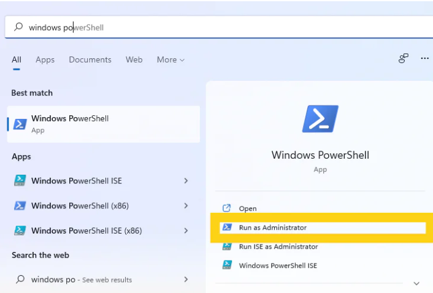

# Starknet

Vamos a montar un Nodo de Starknet desde cero. Algunas consideraciones previas:

* Tenés una pc con Windows.
* Mucha paciencia.
* Ganas de leer.

## Paso 1 - Instalaciones - Linux

Vamos a instalar el subsistema de Windows para Linux, donde utilizaremos Linux Ubuntu (Ultima versión)

* Abrimos “Windows PowerShell o CMD”, vamos a buscarlo en la barra de búsqueda de Windows, y luego seleccionamos “Ejecutar como administrador”

<figure><figcaption></figcaption></figure>

* En el símbolo del sistema, escribís: wsl –install y esperas a que se complete el proceso.&#x20;
  * _Nota: Para que WSL se active tenés que reiniciar tu computadora._

## Paso 2 - Ubuntu

Abrís la aplicación de la tienda de Microsoft y buscas Ubuntu. La instalás, y una vez instalada inicias la aplicación directamente desde la tienda o buscas Ubuntu en la barra de búsqueda de Windows.

<figure><figcaption></figcaption></figure>

## Paso 3 - Configuración Ubuntu

Ahora a configurar Ubuntu, solo esperas unos momentos que termine la configuración inicial y luego de abrir la app creas un nombre de usuario y una contraseña.

<figure><figcaption></figcaption></figure>

## Paso 4 - Instalando actualizaciones

Instalamos las últimas actualizaciones con los siguientes comandos, (ingresando la contraseña si te lo pide):&#x20;

```
sudo apt update
```

Luego:

```
sudo apt full-upgrade
```

y apretas la letra `Y` si te lo pide.

## Paso 5 - **Instalar herramientas de desarrollo en la distribución de Linux.**

Primero verificamos la versión de **Python 3** que tenemos instalada en el sistema, ingresar en terminal lo siguiente:

```
python3 –V
```

Y te va a aparecer en la terminal la versión.

<figure><figcaption></figcaption></figure>

1. Para administrar los paquetes de software para Python tenemos que instalar pip (es una herramienta que instalará y administrará los paquetes de programación que necesitamos usar más adelante):

```
sudo apt install -y python3-pip
```

2. Luego instalamos algunos paquetes y herramientas de desarrollo más para garantizar que tengamos una configuración sólida para nuestro entorno de programación:

```
sudo apt install -y build-essential libssl-dev libffi-dev python3-dev
```

3. Luego:

```
sudo apt-get install libgmp-dev
```

4. Luego

_Aclaración: fastecdsa una herramienta de Python para hacer criptografía de curva elíptica rápida, específicamente firmas digitales._

```
pip3 install fastecdsa
```

5. Por último:

```
sudo apt-get install -y pkg-config
```

**Instalamos Rust**

Necesitamos instalar el lenguaje de programación Rust y sus herramientas, ya que el nodo[@equilibrium\_co](https://x.com/equilibrium\_co) está integrado en Rust:

```
curl --proto '=https' --tlsv1.2 -sSf https://sh.rustup.rs | sh
```

* Por si hay algo desinstalado en el paso anterior, ejecutá:

```
sudo apt install cargo
```

Y actualizá Rust a la última versión:

```
rustup update stable
```

## Paso 6 - Clonar el repositorio github de pathfinder.&#x20;

En esta parte empezamos a preparar el entorno para nuestro nodo.

Crea una copia local del repositorio github de pathfinder escribiendo:

```
git clone --branch v0.1.2-alpha https://github.com/eqlabs/pathfinder
```

Reemplaza v0.1.2-alpha con una versión más nueva si existe. Lo comprobás visitando:

[https://github.com/eqlabs/pathfinder/tags](https://github.com/eqlabs/pathfinder/tags)


La terminal arrojará lo siguiente: **'detached HEAD' state**\
\
No te preocupes por eso, simplemente significa que no puede afectar el desarrollo activo del código pionero.


<figure><figcaption></figcaption></figure>

## Paso 7 - Crear un entorno virtual para un nodo

Instalamos una herramienta que nos permitirá crear un entorno virtual en el que se ejecutará nuestro nodo:

```
sudo apt install python3.8-venv
```

Mover a la carpeta py escribiendo:

```
cd pathfinder/py
```

<figure><figcaption></figcaption></figure>

Creamos el entorno virtual llamado venv:

```
python3 -m venv .venv
```

Lo activamos:

```
source .venv/bin/activate
```

Vas a saber que está en su entorno virtual cuando ves (.venv) en el lado izquierdo de tu línea de comando:

<figure><figcaption></figcaption></figure>

Instala estas herramientas para ejecutar el nodo:

```
PIP_REQUIRE_VIRTUALENV=true pip install --upgrade pip
```

Luego:

```
PIP_REQUIRE_VIRTUALENV=true pip install -r requirements-dev.txt
```

Para ver si los pasos anteriores funcionan, ejecutas:

```
pytest
```

<figure><figcaption><p>Deberias ver algo como esto</p></figcaption></figure>

## Paso 8 - Ensamblando el Nodo

Podes compilar el nodo ejecutando el siguiente comando _(Este paso llevará un poco más de tiempo que los demás (hasta 30 minutos aprox)_:&#x20;

```
cargo build --release --bin pathfinder
```

## Paso 9 - Crear una cuenta de Infura

* Entras a [https://infura.io](https://t.co/jw1oVxRWlp) y te registrás.
* En tu tablero, haces clic en "Conectarse a la red [#Ethereum](https://x.com/hashtag/Ethereum?src=hashtag\_click) en segundos"

<figure><figcaption></figcaption></figure>

* Creas un nuevo proyecto y dale un nombre.
* Dentro del tablero, haces clic en Configuración

<figure><figcaption></figcaption></figure>

* En el panel de configuración podrá ver los puntos finales.
* Copias el https
* En esta etapa, tenés que decidir en qué red [#Ethereum](https://x.com/hashtag/Ethereum?src=hashtag\_click) ejecutas su nodo. Aquí nosotros elegimos Mainnet.
* Si el punto final elegido está en la red principal, se ejecutará en [#StarkNetMainnet](https://x.com/hashtag/StarkNetMainnet?src=hashtag\_click) .

## Paso 10 - Ejecutar el Nodo

Como paso final queda → ejecutar el nodo en la Capa 2

Podes probar la ejecución de tu nodo escribiendo (R_eemplazar xxxxx con su número de End Point de Infura_):

```
cargo run --release --bin pathfinder -- --ethereum.url https://mainnet.infura.io/v3/xxxxx
```

## Comentarios Finales

No todo es color de rosas y pueden aparecer problemas en el camino. Cualquier consulta siempre va a haber alguien con ganas de ayudar en el Club de Nodos!

\
**Haz tus preguntas aquí ->** [**Club de Nodos**](https://t.me/SEED\_Nodes)
