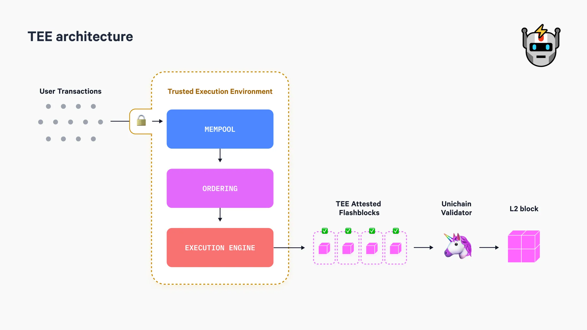

# Unichain

## Introducción a Unichain: Guía para Configurar tu Propio Nodo

El ecosistema blockchain continúa evolucionando, y **UniChain** representa un paso significativo hacia redes más eficientes, rápidas y adaptadas a las demandas actuales de las aplicaciones descentralizadas (**dApps**).

Este artículo está estructurado en **dos partes** para ofrecer una visión completa de UniChain:

1. **Aspectos Teóricos:** Exploraremos los fundamentos técnicos de la red, sus características clave, el funcionamiento de tecnologías y cómo estos elementos impactan en la experiencia del usuario final.
2. **Despliegue Práctico de un Nodo UniChain:** Una guía paso a paso para configurar y ejecutar un nodo UniChain utilizando **Docker**, permitiéndote participar activamente en la red, contribuir a su seguridad y aprovechar sus capacidades para diversas aplicaciones.

## 1.1. Introducción

El 10 de octubre de 2024, Uniswap anunció su rollup optimista de propósito general, _UniChain_, una L2 descentralizada. Su objetivo principal es extender las capacidades de _Ethereum_, al igual que cualquier otra L2, pero con un enfoque específico en mitigar algunos de los problemas mas comunes del ecosistema de L2, entre los que destacan:

* **Calidad de ejecución subóptima:** Las transacciones en las L2 no se procesan de la manera más eficiente, justa ni económica posible, lo que reduce la confianza y la eficiencia general del ecosistema.
* **Experiencia del usuario degradada:** La coexistencia de múltiples redes obliga a los usuarios a estar constantemente atentos a la red en la que operan, lo que añade complejidad al proceso de interacción con dApps y genera una experiencia menos intuitiva. Además, durante períodos de alta demanda, la red puede congestionarse, resultando en altas tarifas de transacción y un aumento significativo en la cantidad de transacciones fallidas o pendientes. Estos problemas no solo frustran a los usuarios, sino que también afectan directamente la confianza en la red y la adopción masiva de las aplicaciones construidas sobre ella.
* **Liquidez fragmentada:** La proliferación de múltiples L2 ha llevado a una dispersión de la liquidez entre diversas redes, dificultando las operaciones entre plataformas y aumentando los costos asociados al uso de bridges.

UniChain es una cadena diseñada con un propósito específico: hacer que el _trading on-chain sea lo mejor posible._ Dicho esto hay que aclarar que \*\*UniChain no es una _app-chain_, porque no está limitada a una sola aplicación. Sigue siendo EVM compatible, es Turing completo, y se pueden deployar contratos inteligentes con cualquier lógica.

## **1.2. Características fundamentales**

UniChain está construido sobre el OP Stack, diseñada para abordar estos problemas comunes mediante dos innovaciones clave:

* **Construcción verificable de bloques**: Un mecanismo de construcción de bloques desarrollado en colaboración con Flashbots, diseñado inicialmente para ofrecer:
  * Tiempos efectivos de bloque de 200-250 ms mediante la división de cada bloque en cuatro "Flashblocks".
  * Aplicación transparente del orden de prioridad dentro de cada Flashblock, permitiendo a las aplicaciones asignar parte de su Valor Máximo Extraíble (MEV) en beneficio de sus usuarios.
  * Protección contra reversiones de las transacciones sin necesidad de confiar en terceras partes.
* **Red de validación de UniChain**: Una red descentralizada de operadores de nodos de UniChain, diseñada para reducir riesgos clave en el proceso de secuenciación de bloques, permitiendo una finalidad económica más rápida, facilitando una liquidación ágil de transacciones entre cadenas y soportando posibles extensiones futuras.

Para comprender cómo funciona UniChain a continuación se explicarán cada uno de los siguientes temas de manera individual:

1. **Rollup-Boost**
2. **Construcción de Bloques en Entornos de Ejecución Confiable (TEE)**
3. **Flashblock**
4. **Red de Validación de UniChain**

Cada sección detallará el propósito, funcionamiento y beneficios clave de estos componentes, proporcionando una visión clara de cómo UniChain optimiza la experiencia en el ecosistema L2.

## **1.3. Rollup Boost**

Antes de continuar, recomiendo a aquellos que no están familiarizados con el concepto de MEV (_Maximal Extractable Value_) leer la sección sobre MEV disponible en nuestro GitBook oficial de SeedNode. Esto proporcionará una base sólida para comprender los mecanismos clave que se explicarán a continuación.


**MEV Boost** en Ethereum separó los roles de **constructores de bloques (block builders)** y **proponentes (block proposers)** mediante la introducción de un relayer. Este **relayer** se encarga de **agrupar las ofertas** de los constructores y enviar los bloques más rentables a los proponentes para que estos los firmen.




El concepto de Rollup Boost es similar al de MEV Boost.

Unichain separa el rol de construcción de bloques del secuenciador mediante el Constructor Verificable de Bloques, desarrollado en colaboración con Flashbots.

Para profundizar en los aspectos técnicos: ‣




_El MEV será extraído de una forma u otra. La única elección que tienen las cadenas es decidir cómo va a suceder._


Rollup-Boost beneficia al usuario final al optimizar la construcción de bloques mediante Flashblocks, con tiempos efectivos de bloque de 250 milisegundos, lo que reduce el impacto negativo en los proveedores de liquidez (LPs) al disminuir las pérdidas por fluctuaciones de precios no aprovechadas (_LVR_). Además, implementa un sistema de subastas explícitas de MEV, evitando las ineficiencias de las subastas implícitas, como el _spam on-chain_ y las subastas de latencia, donde millones de transacciones fallidas realizadas por _searchers (bots)_ saturan la red, elevan las tarifas y desperdician recursos. Al garantizar que solo las transacciones exitosas lleguen a la cadena, Rollup-Boost libera espacio en los bloques para transacciones legítimas, reduce los costos para los usuarios y asegura una experiencia más fluida y eficiente.

Con Rollup-Boost se logra crear un paradigma donde se puede mantener una UX rápida sin sacrificar la descentralización.

Pero para que esto sea creíble, la solución utilizada es que la lógica debe operar en un **Entorno de Ejecución Confiable**

## **1.4. Construcción de Bloques en Entornos de Ejecución Confiable (TEE)**

TEE son entornos seguros dentro de un procesador o hardware (por ejemplo Intel TDX) que proporcionan una privacidad mejorada al impedir que entidades no autorizadas puedan leer los datos almacenados en su interior.

Al mismo tiempo, los TEE garantizan un alto nivel de integridad, ya que el código dentro del TEE no puede ser modificado ni reemplazado. Esto asegura que las transacciones procesadas dentro de estos entornos sean inmutables y seguras.

Los TEE ofrecen dos garantías clave:

1. Integridad: puede garantizar exactamente, hasta el nivel del hash, qué código se está ejecutando dentro de él. Se puede verificar que un programa específico se está ejecutando, y, por lo tanto, conocer exactamente cómo se está procesando la información. En Unichain, esto significa que podemos estar seguro de que el secuenciador va a ordenar las transacciones de una manera específica y que no va a compartir esas transacciones con nadie más antes de incluirlas on-chain.
2. Privacidad: Proporcionan un nivel de privacidad incluso frente a la entidad que los opera. Incluso si alguien tiene acceso físico al TEE, no puede ver ni extraer la información que está dentro de él, a menos que el programa haya sido diseñado explícitamente para hacerlo. Esto permite descentralizar funciones que tradicionalmente dependían de la confianza social para garantizar la privacidad. En Unichain, esto es crucial, ya que los usuarios necesitan un entorno donde nadie pueda ver sus transacciones antes de que se publiquen on-chain. De esta forma, se elimina el riesgo de front-running.

Los TEE proporcionan integridad y privacidad, así como la capacidad de ejecutar código confiable en una máquina que no controlas directamente, lo que resulta extremadamente poderoso en el contexto de las subastas de MEV (Maximal Extractable Value). Estas subastas también requieren integridad y privacidad para funcionar de manera justa y eficiente. La integridad garantiza que el subastador:

* No inserte órdenes fraudulentas.
* No lea ni manipule las órdenes de los participantes.
* No censure ninguna orden
* Seleccione al ganador de manera justa, siguiendo un algoritmo conocido y transparente.

Por otro lado, la privacidad asegura que las órdenes presentadas en la subasta permanezcan ocultas tanto para el operador como para otros participantes, evitando así que alguien pueda leer una oferta y superarla ligeramente para ganar la subasta de forma desleal.

Estas características hacen de los TEE una herramienta esencial para crear un entorno de subastas MEV transparente, justo y eficiente.

Ademas hay que mencionar que todo esto es posible porque el uso de TEE en hardware especializado tiene un impacto casi nulo en el rendimiento.

## **1.5. Flashblock**

#### Tiempo de bloque en Unichain

El tiempo promedio de bloque en Ethereum es de 12 segundos, lo cual resulta demasiado lento para satisfacer una experiencia fluida. Esta lentitud no solo afecta la experiencia del usuario, sino que también aumenta las oportunidades de MEV (Máximo Valor Extraíble) y vuelve a la red más vulnerable a la congestión durante ataques de spam.

Las L2 surgieron para mejorar la escalabilidad de Ethereum, procesando múltiples transacciones _off-chain_ y enviando pruebas criptográficas para validarlas en la cadena principal. Sin embargo, para ofrecer una experiencia comparable a los sistemas financieros tradicionales, UniChain tiene como objetivo alcanzar un tiempo de bloque de 250 milisegundos (ms).

Este tiempo fue elegido estratégicamente, ya que representa un equilibrio entre rendimiento técnico, experiencia del usuario y viabilidad de descentralización futura. Desde el punto de vista técnico, bloques más cortos permiten capturar mejor la volatilidad del mercado, optimizando el rendimiento de los Proveedores de Liquidez (LPs) al aumentar las oportunidades de arbitraje y reducir el Liquidity Value at Risk (LVR). Además, 250 ms coincide con el tiempo de reacción promedio del ser humano, lo que proporciona una experiencia fluida y prácticamente instantánea para los usuarios.

Comparativamente, Solana ha logrado tiempos de bloque de aproximadamente 400 milisegundos gracias al paralelismo en el procesamiento de transacciones. Sin embargo, esto fue posible a costa de sacrificar cierto grado de descentralización, ya que sus nodos están centralizados en una región geográfica específica.

En este contexto, el tiempo de bloque de 250 ms en UniChain no solo es técnicamente alcanzable, sino que también establece un punto óptimo entre eficiencia, experiencia del usuario y la posibilidad de una futura descentralización del secuenciador, asegurando que la red pueda escalar sin perder sus valores fundamentales de transparencia y confianza.

#### Entonces, ¿Qué son los flashblocks?

<figure><figcaption><p><a href="https://writings.flashbots.net/introducing-rollup-boost">https://writings.flashbots.net/introducing-rollup-boost</a></p></figcaption></figure>

Flashblocks es una tecnología que redefine la construcción y transmisión de bloques en redes L2 como UniChain, proporcionando una experiencia de usuario casi instantánea, garantizando una validación parcial pero rápida de las transacciones, y optimizando la eficiencia para proveedores de liquidez (LPs) y usuarios finales.

El funcionamiento es el siguiente:

1.  **Transmisión Continua de Transacciones:**

    Las transacciones se envían a los constructores de bloques TEE (_Trusted Execution Environment_), quienes reciben, validan y preparan las operaciones para su ejecución.
2.  **Secuenciación y Separación (SBS):**

    Si la L2 está habilitada con SBS (Separación entre Constructor y Secuenciador), el constructor de bloques (block builder) trabaja de forma independiente al secuenciador (sequencer), permitiendo mayor flexibilidad y eficiencia.
3.  **Creación de Flashblocks:**

    Los constructores de bloques TEE generan bloques parciales (Flashblocks) cada 250 milisegundos, formando pre-confirmaciones incrementales que permiten una ejecución más rápida y eficiente.
4.  **Transmisión Continua:**

    Cada Flashblock es transmitido a otros nodos para su validación y sincronización, amortizando los costos de cálculo de raíces de estado (_state roots_) y reduciendo significativamente la latencia.

#### **Características Clave**

1.  **Validación Parcial pero Rápida:**

    Los Flashblocks permiten pre-confirmaciones incrementales, logrando una validación eficiente sin esperar la finalización de un bloque completo.
2.  **Reducción de Latencia:**

    Al calcular las raíces de estado y alcanzar consenso una sola vez para múltiples bloques parciales, Flashblocks elimina los cuellos de botella tradicionales en el procesamiento de bloques, optimizando los tiempos de respuesta.
3.  **Ejecución Incremental:**

    Los nodos pueden descargar y ejecutar transacciones continuamente, sin necesidad de esperar nuevos bloques completos.
4.  **Compatibilidad JSON-RPC de Ethereum:**

    Flashblocks proporciona un estado de ejecución anticipado que es accesible a través de la interfaz estándar JSON-RPC de Ethereum, facilitando la integración con billeteras (_wallets_) y aplicaciones frontend.

## **1.6. Red de Validación de UniChain (UVN)**

La mayoría de los secuenciadores en las L2 hoy son centralizados, y el comportamiento de un solo secuenciador puede afectar la equidad del MEV, la disponibilidad (liveliness) o la finalidad (finality) de los bloques, entre otros aspectos. Por ejemplo, si un secuenciador publica un bloque inválido y se presenta una prueba de fraude (_fraud proof_) para impugnarlo, la reversión de la cadena resultante podría afectar la velocidad de la misma.

Para combatir este punto único de falla en los secuenciadores, UniChain ha introducido la Red de Validación de UniChain (UVN).

La UVN agrega una capa adicional de finalidad al centrarse en verificar los bloques a través de validadores que atestiguan la cadena canónica a medida que se proponen los bloques.

Debido a la falta de detalles adicionales en la documentación oficial, es demasiado pronto para describir en detalle como será la validación.

#### **Token $UNI**

El token $UNI ahora será más que un token de gobernanza; se va a convertir en un token de utilidad.

Para convertirse en validador, un operador debe apostar (stake) $UNI como garantía en la mainnet. Un smart contract se encargará de rastrear el saldo y actualizar el estado a través de los puentes nativos de UniChain.

Al inicio de cada época (_epoch_), se tomará una instantánea (_snapshot_) de los saldos actuales en _staking_, y las tarifas se distribuirán proporcionalmente al peso de cada participación. Los validadores con mayor peso de $UNI apostado serán seleccionados como el conjunto activo (_active set_) y podrán publicar atestaciones para recibir una parte de las recompensas de validación.

Los validadores que no publiquen una atestación o que la omitan no recibirán la recompensa correspondiente, y esta será transferida a la siguiente época.

## **2. Tutorial para correr un Nodo de UniChain (TESTNET)**

#### Pre-requisitos

Antes de comenzar con la instalación y configuración de un nodo **UniChain**, asegúrate de cumplir con los siguientes requisitos:

* **Sistema Operativo Compatible**
  * **Ubuntu 20.04 LTS** o versiones posteriores.
  * Otras distribuciones de **Linux** son compatibles.
* **Privilegios de Usuario**
  * Asegúrate de utilizar una cuenta de usuario con **privilegios sudo**.
* **Requisitos de Hardware**
  * **CPU:** Procesador de al menos **4 núcleos**.
  * **RAM:** Mínimo **8 GB** de memoria RAM.
  * **Almacenamiento:** Al menos **100 GB de espacio libre** (se recomienda **SSD** para un mejor rendimiento).
  * **Red:** Conexión a **Internet estable** para garantizar la sincronización y el funcionamiento adecuado del nodo.


Para este tutorial se utilizo una VPS con las siguientes especificaciones: VPS2 SSD - 6 cores - 16 GB - 400 GB (100% SSD) - 400 Mbit/s

[VPS with the Best Price-to-Performance Ratio in the US | Contabo](https://contabo.com/en/vps/)


* **Docker**
  * **Docker** debe estar instalado en tu sistema para ejecutar contenedores de forma eficiente.
  * Si Docker no está instalado, sigue las instrucciones de este mismo tutorial.
* **Endpoint RPC de un Nodo Ethereum-SEPOLIA L1**

***

#### Docker

*   **Actualizar el Sistema**

    Primero, asegúrate de que tu sistema esté actualizado:

    ```bash
    sudo apt update && sudo apt upgrade -y
    ```
*   **Instalar Docker**

    Instala **Docker** desde los repositorios oficiales de Ubuntu:

    ```bash
    sudo apt install docker.io -y
    ```

    *   **Habilitar Docker al Iniciar el Sistema (opcional)**

        Para garantizar que Docker se inicie automáticamente después de reiniciar el sistema:

        ```bash
        sudo systemctl start docker
        sudo systemctl enable docker
        ```
    *   **Verificar Instalación de Docker (opcional)**

        Asegúrate de que Docker se instaló correctamente:

        ```bash
        docker --version
        ```

***

*   **Instalar Docker Compose**

    Docker Compose es una herramienta para definir y administrar aplicaciones Docker multicontenedor.

    *   **Descargar Docker Compose**

        Descarga la última versión estable de **Docker Compose**:

        ```bash
        sudo curl -L "<https://github.com/docker/compose/releases/download/v2.20.2/docker-compose-$>(uname -s)-$(uname -m)" -o /usr/local/bin/docker-compose
        ```
    *   **Asignar Permisos de Ejecución**

        Otorga permisos de ejecución al binario de Docker Compose:

        ```bash
        sudo chmod +x /usr/local/bin/docker-compose
        ```
    *   **Verificar Instalación de Docker Compose (opcional)**

        Confirma que Docker Compose está instalado correctamente:

        ```bash
        docker-compose --version
        ```
*   **Añadir tu Usuario al Grupo Docker (opcional)**

    Para evitar tener que usar `sudo` con cada comando de Docker, añade tu usuario al grupo de Docker:

    ```bash
    sudo usermod -aG docker $USER
    ```

    > ⚠️ Nota: Después de este paso, cierra sesión y vuelve a iniciarla para que los cambios surtan efecto.
*   **Probar Instalación (opcional)**

    Ejecuta un contenedor de prueba para validar que Docker y Docker Compose funcionan correctamente:

    ```bash
    sudo docker run hello-world
    ```

    Si todo está configurado correctamente, verás un mensaje confirmando que Docker funciona.

***

#### **Clonar el Repositorio de UniChain y Configurar Variables de Entorno**

*   **Clonar el Repositorio de UniChain**

    Primero, clona el repositorio oficial de **UniChain** desde GitHub:

    ```bash
    git clone <https://github.com/Uniswap/unichain-node>
    ```
*   **Acceder al Directorio del Repositorio**

    Una vez descargado el repositorio, navega al directorio correspondiente:

    ```bash
    cd unichain-node
    ```
*   **Editar el Archivo de Configuración `.env.sepolia`**

    El archivo `.env.sepolia` contiene las variables de entorno necesarias para conectar tu nodo UniChain a la red Sepolia.

    Abre el archivo con un editor de texto (por ejemplo, **nano**):

    ```bash
    nano .env.sepolia
    ```
*   **Configurar las Variables Clave**

    Busca las siguientes variables y actualízalas con la información adecuada:

    *   **OP\_NODE\_L1\_ETH\_RPC:** URL del nodo RPC de Ethereum L1.

        ```
        OP_NODE_L1_ETH_RPC = <https://ethereum-sepolia-rpc.publicnode.com>
        ```
    *   **OP\_NODE\_L1\_BEACON:** URL del nodo Beacon Chain.

        ```
        OP_NODE_L1_BEACON = <https://ethereum-sepolia-beacon-api.publicnode.com>
        ```

    > ⚠️ Importante: Asegúrate de que las URLs proporcionadas son correctas y que tu nodo RPC de Ethereum L1 y Beacon están activos y accesibles.
* **Guardar y Salir del Editor Nano**
  * **Guardar los cambios:** Presiona `Ctrl + O` y luego `Enter`.
  * **Salir del editor:** Presiona `Ctrl + X`.
*   **Verificar la Configuración (opcional)**

    Puedes verificar que los cambios se guardaron correctamente ejecutando:

    ```bash
    cat .env.sepolia
    ```

    Deberías ver las variables actualizadas con las URLs correctas.

***

#### **Iniciar y Probar el Nodo UniChain**

*   **Iniciar el Nodo UniChain**

    Inicia los contenedores de Docker utilizando **docker-compose**:

    ```bash
    docker-compose up -d
    ```

    * `d`: Ejecuta los contenedores en segundo plano (modo "detached").
*   **Probar el Nodo UniChain**

    Una vez que el nodo esté en funcionamiento, verifica su disponibilidad mediante un comando `curl`:

    ```bash
    curl -d '{"id":1,"jsonrpc":"2.0","method":"eth_getBlockByNumber","params":["latest",false]}' \\
      -H "Content-Type: application/json" <http://localhost:8545>

    ```

    * **Explicación del comando:**
      * `d`: Envía datos JSON al servidor.
      * `"eth_getBlockByNumber"`: Solicita el bloque más reciente.
      * `http://localhost:8545`: URL de la API RPC local de UniChain.

    Si todo está funcionando correctamente, recibirás una respuesta JSON con los detalles del último bloque.
*   **Detener el Nodo UniChain**

    Si necesitas detener el nodo, ejecuta el siguiente comando:

    ```bash
    docker-compose down
    ```

    Esto detendrá todos los contenedores asociados al nodo UniChain.
* **Revisar los Registros del Nodo**
  *   **Logs del Nodo OP-Node**

      Para verificar los registros del contenedor **op-node**, utiliza:

      ```bash
      docker logs unichain-node-op-node-1

      ```
  *   **Logs del Cliente de Ejecución**

      Para revisar los registros del contenedor **execution-client**, ejecuta:

      ```bash
      docker logs unichain-node-execution-client-1
      ```
*   **Obtener y Guardar tu Clave Privada**

    Visualiza y guarda tu clave privada generada para el nodo:

    ```bash
    cat geth-data/geth/nodekey
    ```

    * **Importante:** Guarda esta clave en un lugar seguro. Es esencial para la identificación y operación de tu nodo.

Hemos instalado y puesto en funcionamiento con éxito un nodo de **UniChain** en nuestro sistema utilizando **Docker** 🦄.

El nodo ahora forma parte activa de la red **UniChain**, aportando tanto a su **seguridad** como a su **descentralización**.
